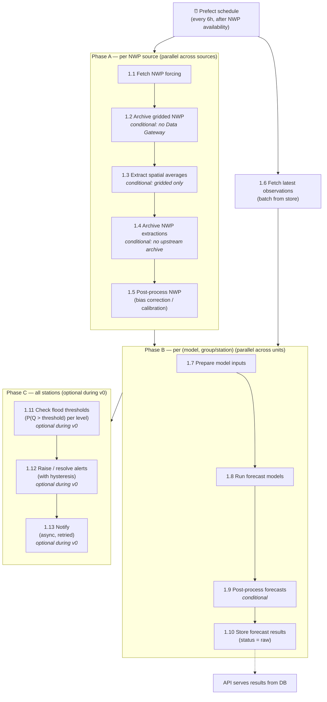
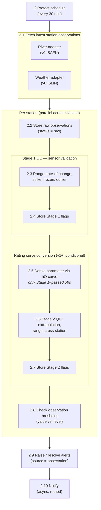
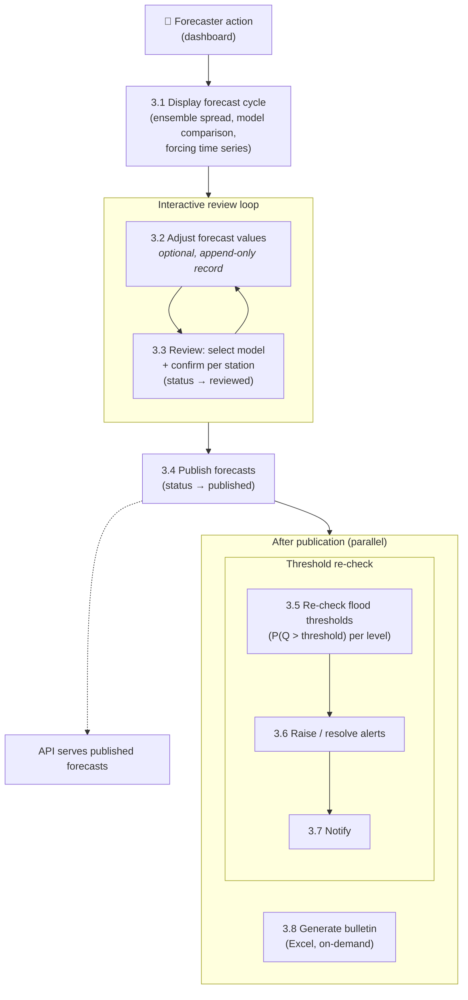
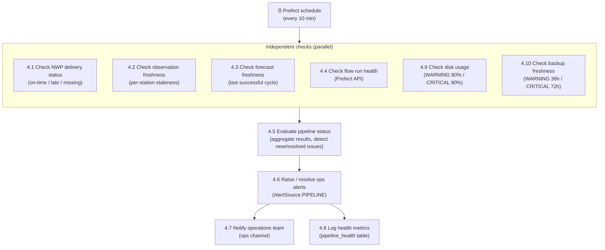
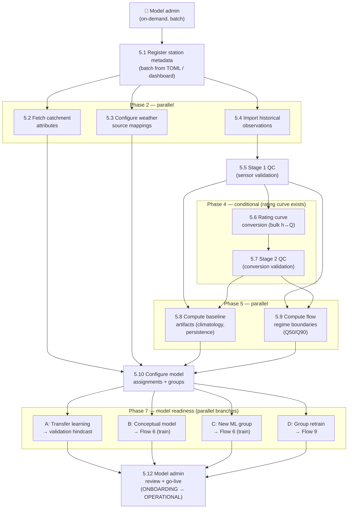

# Architecture Context

Read this first before working on any task.

## What SAPPHIRE Flow does

Operational hydrological forecasting system. Ingests historical and real-time weather forecasts and
weather station as well as river observations, runs ensemble forecast models, checks flood thresholds, and
serves results via REST API. Forecasters review and publish forecasts multiple 
times a day. Runs on Docker Compose on a single VM.

## Data flows

### Operational (recurring, scheduled)

1. **Weather ingest → post-process → forecast → alert**
   Fetch NWP forcing → [extract spatial averages] → [archive] → post-process → fetch QC'd observations → run forecast models → [bias-correct outputs] → store → check flood thresholds → raise/resolve alerts → notify

2. **Observation ingest → QC → observation alerts**
   Fetch latest station observations → quality control → check thresholds against observed values → raise/resolve alerts

3. **Forecast review → publish → bulletin**
   Dashboard shows forecasts + visualizations → forecaster optionally adjusts values → reviews (selects preferred model) → publishes → generate Excel bulletin on request

4. **Pipeline monitoring (watchdog)**
   Track each cycle's completion status → detect data source outages, late NWP deliveries, missing observations, stale forecasts → alert operations team (distinct from flood alerts) → log pipeline health metrics for diagnostics

### Initialization (on-demand)

5. **River station onboarding** (batch)
   Register stations → fetch catchment attributes → import historical observations → QC → rating curve conversion → compute baselines + flow regimes → configure models → train or validate → model admin confirms operational

5w. **Weather station onboarding** (batch)
   Register stations → import historical observations → QC → model admin confirms operational

6. **Model training** (initial) — unified with Flow 9, see "Flows 6 & 9 — Model training" below

7. **Hindcast generation**
   Run forecast models over a historical period for a given station (or station group for group-scoped models). Used for: onboarding validation, model comparison, post-retraining verification, ongoing skill tracking.

8. **Skill computation** (initial) — unified with Flow 10, see "Flows 8 & 10 — Skill computation" below

### Maintenance (yearly or on-demand)

9. **Model retraining** — unified with Flow 6, see "Flows 6 & 9 — Model training" below

10. **Skill recomputation** — unified with Flow 8, see "Flows 8 & 10 — Skill computation" below

11. **NWP gap recovery**
    Re-fetch missing NWP archive data when gaps are detected by Flow 4. Flag unrecoverable gaps permanently. Only needed when SAPPHIRE handles archiving (not when Data Gateway is upstream).

Other maintenance tasks:
- Database backup (scheduled Prefect task — see backup and disaster recovery)
- Data archival to cold storage (scheduled Prefect task — see data retention and cold storage)
- Observation gap-filling between operational cycles (TBD)
- Database partition management (TBD)

---

## Data flow refinements

### Flow 1 — Forecast cycle

```
Trigger:  Prefect schedule (after NWP availability, e.g. every 6 h)
Flow:     run_forecast_cycle
Layer:    flows/ — orchestration only, delegates to services/adapters
```

#### Steps

| # | Step | Grain | Layer | Input | Output |
|---|------|-------|-------|-------|--------|
| 1.1 | Fetch NWP forcing | per NWP source | `adapters/` | NWP source config, cycle time | `GriddedForecast` or `dict[StationId, WeatherForecastResult]` |
| 1.2 | Archive gridded NWP | per NWP source | `store/` | `GriddedForecast` | Persisted raw gridded data (e.g. GRIB2) to object store |
| 1.3 | Extract spatial averages | per NWP source (bulk) | `preprocessing/` | Raw grid + all station geometries | `dict[StationId, BasinAverageForecast \| ElevationBandForecast]` |
| 1.4 | Archive NWP extractions | per NWP source (bulk) | `store/` | All extractions for this source | Persisted to `weather_forecasts` |
| 1.5 | Post-process NWP | per NWP source (bulk) | `flows/` → `services/` + `preprocessing/` | Full dict + historical archive | Bias-corrected / calibrated `dict[StationId, ...]` |
| 1.6 | Fetch latest observations | batch | `store/` | Station configs, lookback window | Recent QC'd river + meteo observations |
| 1.7 | Prepare model inputs | per (model, group\|station) | `services/` | Post-processed NWP dict, observations, station configs | Group: `dict[StationId, ModelInputs]`. Station: individual `ModelInputs`. |
| 1.8 | Run forecast models | per (model, group\|station) | `models/` | Input bundles, model artifacts | Ensemble forecast values |
| 1.9 | Post-process forecasts | per station | `services/` | Raw forecast ensembles, historical archive | Bias-corrected forecast ensembles |
| 1.10 | Store forecast results | batch | `store/` | Forecast ensembles + model artifact version | Persisted to `forecasts` + `forecast_values` (status = `raw`) |
| 1.11 | Check flood thresholds | per station | `services/` | Forecast ensembles, threshold config | Exceedance flags per station/level |
| 1.12 | Raise / resolve alerts | per station | `services/` | Exceedance flags, existing alerts | New/updated alert records |
| 1.13 | Notify | batch | `services/` | New/changed alerts | Notifications dispatched |

Steps 1.2, 1.3, 1.4, and 1.9 are **conditional** — see notes.

#### Notes

- **1.1**: One fetch per NWP source. Gridded sources (e.g. ICON-CH2-EPS, ECMWF IFS) return a single `GriddedForecast`; pre-extracted sources (Data Gateway, point stations) return `dict[StationId, WeatherForecastResult]`. See "Weather forecast data flows" section and `WeatherForecastSource` Protocol in types-and-protocols.md.
- **1.2** *(conditional)*: Archives the raw gridded NWP data (e.g. GRIB2 files) to object storage before any extraction or post-processing. Only applies when 1.1 returns a `GriddedForecast` (i.e. gridded source, not pre-extracted). Skipped when the SAPPHIRE Data Gateway handles NWP archiving upstream. Enables reprocessing (re-extraction with changed station geometries, new variables) without re-fetching from the NWP provider. **Tiered retention**: raw grids stay in hot storage (local disk / object store, original format) for `weather_hot_days` (default 180). After that, a scheduled Prefect task compresses them (zstd) and moves them to cold storage (`cold/nwp_grids/{nwp_source}/{cycle_date}/`). Cold grids are deleted at `max_retention_days`. The archival task is idempotent (compress → verify → move → verify → delete hot copy).
- **1.3** *(conditional)*: Bulk extraction via `GridExtractor` Protocol. Receives the full grid + all `StationWeatherSource` configs, returns `dict[StationId, BasinAverageForecast | ElevationBandForecast]`. Mixed extraction types (basin-average and elevation-band) handled in one grid read. Skipped when 1.1 returns a pre-extracted dict. v0: GridExtractor on ICON-CH2-EPS.
- **1.4** *(conditional)*: Only needed when no upstream gateway handles archiving. Archives the full `dict[StationId, ...]` per NWP source in bulk. Archive happens *before* post-processing so raw extracted values are preserved. Tiered retention: hot (PostgreSQL) for `weather_hot_days` → cold (Parquet) → deleted at `max_retention_days`. Each archived row records `spatial_type` at archival time (from the adapter's spatial representation) — this is denormalized from `station_weather_sources.extraction_type` so archived data remains self-describing if a station's extraction config changes later.
- **1.5**: NWP post-processing. Operates on the full `dict[StationId, ...]` per NWP source. May include bias correction (quantile mapping), ensemble calibration, downscaling — configured per model per deployment. Preserves or transforms the spatial representation (see "Weather forecast data flows"). Pass-through until sufficient archive (6–12 months) for bias correction. Distinct from forecast output correction in 1.9.
- **1.6**: Reads QC'd observations from the store. Flow 2 (observation ingest + QC) runs on its own schedule (e.g. every 30 min) — this step reads the *result*, not raw station feeds. The two flows are decoupled. Future option: add a top-up QC call at the start of Flow 1 to guarantee freshness (trivial — reuses the same QC service function). **Staleness guard**: if the most recent observation for a station is older than a deployment-configurable threshold (e.g. 6h), the forecast proceeds with a warning flag on the forecast record (`observation_staleness_hours`) visible to forecasters in the API and dashboard. Flow 4 detects prolonged staleness independently.
- **1.7**: Groups stations by (model, artifact_scope). Group models: assembles `dict[StationId, ModelInputs]` for the entire group. Station models: assembles individual `ModelInputs` per station. Each model declares `required_features`, `spatial_input_type`, and `supported_time_steps` — input preparation validates that (a) all configured sources have been transformed to the correct spatial format and merged into a single forcing object, and (b) the `time_step` configured in `model_assignments` is in the model's `supported_time_steps` (see "Weather forecast data flows" and "Model Protocol"). **Orchestration note**: The **flow layer** (not the service) runs each weather source through its post-processing pipeline (step 1.5) and passes the merged result to the input preparation service. The service validates and assembles input bundles but does not fetch or transform weather data — this keeps the service pure. Two patterns:
  - *ML models*: concatenates historical weather with NWP forecast to fill the lookback window, which is typically longer than the NWP forecast horizon. The historical weather source is an open decision — see below.
  - *Conceptual models*: runs the model over a warm-up period using observations to derive internal state (soil moisture, snow, groundwater), then switches to NWP forecast forcing at the issue time. State is always observation-derived, never carried forward from a previous forecast.
  - **Fallback for conceptual models**: if the warm-up run fails, (1) use the last successfully saved state snapshot (staleness threshold is deployment-configurable and season-dependent — shorter during wet/monsoon season when catchment state changes rapidly, longer during dry season), or (2) if too stale, cold-start with extended warm-up from observations. Any forecast produced from a snapshot or cold-start records `warm_up_source: WarmUpSource` and `warm_up_state_age_hours` in the forecast metadata — visible to forecasters in the API and dashboard, and flagged by Flow 4.
- **1.8**: Dispatches on `artifact_scope`: GROUP → single `predict_batch()` call per (model, group) with `dict[StationId, ModelInputs]`; STATION → `predict()` per station. Parallelizable across (model, group) and (model, station) units. On model failure, falls back to next assigned model by priority (detail in future iteration).
- **1.9** *(conditional)*: Forecast *output* bias correction (discharge / water level). Distinct from NWP input correction in 1.5. Pass-through when not configured.
- **1.10**: Each forecast record links to the model artifact version that produced it.
- **1.11**: Probability-based: P(Q > threshold) for each danger level. See "Danger levels and threshold configuration" section below for the full config shape. Only evaluates levels where the station has a defined threshold value — undefined levels are skipped (no alert, no display). The exceedance probability that triggers an alert is deployment-configurable per danger level. Defaults must be set; hydromet operations staff confirm acceptable false alarm rates before production deployment.
- **1.12**: Deduplication via partial unique index. Auto-resolution uses hysteresis to prevent alert flapping: separate `trigger_probability` and `resolve_probability` thresholds per danger level (resolve threshold lower than trigger), and configurable minimum duration (`min_trigger_duration` / `min_resolve_duration`) before triggering or resolving. Time-based durations are schedule-independent — they work correctly for both 30-min observation cycles and 6-hourly forecast cycles. Without hysteresis, ensemble probability oscillation between NWP cycles causes fire-resolve-fire loops and alert fatigue.
- **1.11–1.13** *(v0 testing)*: Phase C is **optional during v0**. A deployment-level flag (`enable_alert_cycle`, default `false` for v0) controls whether these steps run. When enabled during testing, alerts are **informational only** — stored in the DB and logged, but notifications (1.13) are suppressed (no external push). This lets the team validate threshold logic and hysteresis tuning against real forecasts without operational consequences.
- **1.13**: Async. Failed notifications retried by sweep task (every 5 min).
- **API serving**: No explicit step — the API reads persisted results from the DB. Storing in 1.10 makes forecasts available; publishing happens via Flow 3 (forecast review). The API also serves archived forcing time series (precipitation, temperature, and other predictors) alongside forecasts — see API design notes.

#### Open decision: ML model lookback window forcing source

ML models (e.g. LSTM) require a lookback window (typically 365 days) of historical weather forcing concatenated with the NWP forecast. The historical portion can come from:
- **Station observations** (SMN for v0) — co-located weather stations. Simple, available, but introduces a train/operational mismatch if training uses the same source.
- **Gridded reanalysis** (ERA5-Land for v1) — spatially consistent, gap-free, but daily-only for some Swiss products.
- **Archived NWP extractions** — from the NWP archive (step 1.4). Only covers the operational period, not the full lookback window.

This choice affects model skill and must be consistent between training (Flows 6/9) and operational inference. To be resolved before v0 model training begins.

**ForcingType mapping**: Regardless of which source is chosen, it must map to one of the two `ForcingType` values for hindcast tagging (Flow 7 step H.2):
- Station observations (SMN) → categorized as `REANALYSIS` (pseudo-perfect forcing)
- Gridded reanalysis (ERA5-Land) → `REANALYSIS`
- Archived NWP extractions → `NWP_ARCHIVE`

#### Open decision: NWP lateness fallback

When NWP data is late (common — happens multiple times per month), the forecast cycle must decide:
- **Wait** up to a configurable maximum (e.g. 3h past expected delivery), then
- **Fall back** to the most recent available NWP cycle (e.g. use 18 UTC cycle if 00 UTC is late), or
- **Skip** if no NWP cycle is available within a configurable maximum age.

Every forecast record must store the NWP cycle reference time used as forcing — forecasters and the API must display which NWP cycle produced each forecast, not just the forecast issue time. Flow 4 monitors NWP delivery status independently.

#### Open decision: when to check thresholds

Threshold checking (1.10–1.12) can run:
- **On raw forecasts** (immediately after 1.9) — gives early warning before forecaster review.
- **On published forecasts** (after forecaster edits in Flow 3) — alerts reflect human-reviewed values.
- **Both** — initial check on raw, re-check after publication.

This is configurable. To be validated with hydromet operations staff. Flow 3 must support re-triggering 1.10–1.12 after edits regardless of chosen mode.

#### Sequencing

```
Phase A — per NWP source (parallel across sources):
  1.1 → [1.2] → [1.3 bulk] → [1.4 bulk] → 1.5 bulk

1.6 batch obs fetch (parallel with Phase A)

Phase B — per (model, group|station) (parallel across units):
  1.7 → 1.8 → [1.9] → 1.10

Phase C — all stations (optional during v0):
  [1.11] → [1.12] → [1.13]
```

Brackets denote conditional steps. Phases A and 1.5 run in parallel. Phase B starts when both complete. Phase C runs after all Phase B units complete. **Phase C is optional during v0 testing** — alert logic is implemented but disabled by default. When enabled, alerts are informational only (logged and stored, not pushed to external recipients).



### Flow 2 — Observation ingest + QC

```
Trigger:  Prefect schedule (e.g. every 30 min)
Flow:     ingest_observations
Layer:    flows/ — orchestration only, delegates to services/adapters
```

#### Steps

| # | Step | Layer | Input | Output |
|---|------|-------|-------|--------|
| 2.1 | Fetch latest station observations | `adapters/` | Station configs, last-seen timestamps | Raw river + meteo observations |
| 2.2 | Store raw observations | `store/` | Raw observations | Persisted to `observations` (status = `raw`) |
| 2.3 | Stage 1 QC — sensor validation | `services/` | Raw observations, QC rule config | QC flags per measured value |
| 2.4 | Store Stage 1 QC results | `store/` | QC flags | Updated flags/status on `observations` rows |
| 2.5 | Derive complementary parameter via rating curve | `services/` | Stage 1–passed observations, active rating curve + correction parameter | Derived observation (Q or h) stored alongside original |
| 2.6 | Stage 2 QC — conversion validation | `services/` | Derived observations, rating curve metadata | Conversion QC flags (extrapolation, range, consistency) |
| 2.7 | Store Stage 2 QC results | `store/` | Conversion QC flags | Updated flags on derived `observations` rows |
| 2.8 | Check observation thresholds | `services/` | QC-passed observations (measured + derived), threshold config | Exceedance flags per station/level |
| 2.9 | Raise / resolve alerts | `services/` | Exceedance flags, existing alerts | New/updated alert records |
| 2.10 | Notify | `services/` | New/changed alerts | Notifications dispatched |

#### Notes

- **2.1**: River and weather fetches are independent adapters — run in parallel. v0: BAFU (river) + SMN (weather). Incremental: uses last-seen timestamp per station to fetch only new data.
- **2.2**: Single `observations` table. Raw values are stored with `source = MEASURED` and `qc_status = RAW`. Raw values are never overwritten — QC is metadata on the observation, not a replacement. See "Quality control data model" section below for the full type definitions.

#### Two-stage QC design

QC runs in two stages with different purposes. This follows established practice at USGS, UK Environment Agency, and BOM Australia: quality flags accumulate through a linear pipeline rather than a single pass/fail gate. The key benefit is **attribution** — a Stage 1 failure means "sensor problem" (gap in the record), while a Stage 2 flag means "rating curve problem" (observation present but degraded quality). These have different operational responses and must not be conflated.

- **2.3 — Stage 1 QC (sensor validation)**: Operates on the raw measured value (water level or direct discharge). Catches instrument faults, transmission errors, and physically impossible values:
  - **Range check**: value within sensor installation bounds and historical flood of record.
  - **Rate-of-change check**: rise/fall rate exceeding physically possible rates (configured per station). Rate-of-change thresholds are physically meaningful on water level — a fixed cm/min limit is portable across stations, whereas the equivalent discharge threshold would be stage-dependent due to rating curve nonlinearity.
  - **Frozen sensor check**: identical value repeated for N consecutive intervals.
  - **Spike detection**: single-interval excursion that returns to previous value (telemetry corruption).
  - **Gross outlier**: value beyond K standard deviations from rolling climatological window.
  - QC rule version is stored with each flag — enables selective recomputation when rules change without losing the audit trail.
  - Hard failures → `qc_status = QC_FAILED`, observation stored but excluded from downstream use. No conversion attempted.

- **2.4**: Persists Stage 1 flags. Flagged values are excluded from conversion (2.5) and from downstream use (forecasting in Flow 1 step 1.6).

- **2.5** *(v1+, conditional)*: For stations where the source provides only one parameter (e.g. DHM provides water level but the model needs discharge), derives the complementary parameter using the active rating curve and its associated correction parameter. **Only runs on Stage 1–passed observations.** Key details:
  - **v0 (Switzerland)**: Skipped — BAFU provides discharge directly from well-maintained rating curves.
  - **v1 (Nepal)**: DHM provides real-time water level. Discharge must be derived. DHM will supply hQ rating tables plus a correction parameter (exact correction method TBD — to be clarified with DHM hydromet operations).
  - **Both original and derived values are stored**: the original as `source = MEASURED`, the derived as `source = RATING_CURVE_DERIVED`. Each derived observation references the `rating_curve_id` and correction parameter version used, so values can be recomputed if the curve or correction is updated.
  - **Bidirectional**: direction of conversion is configured per station (`forecast_target` on station config). Some stations may store both directions.
  - **Reprocessing**: Because Stage 1 QC runs on the raw measured value independently of the rating curve, the QC-clean h archive can be reprocessed through updated curves without re-running Stage 1. This is critical when DHM updates rating tables yearly.
  - **Open question**: The correction parameter from DHM and how it modifies the hQ conversion are not yet defined. This will be resolved during Flow 5 design (rating curve ingestion) and DHM data discussions.

- **2.6 — Stage 2 QC (conversion validation)** *(v1+, conditional — runs only when 2.5 ran)*: Operates on derived values. Catches rating curve problems, not sensor problems:
  - **Extrapolation flag**: water level exceeded the maximum calibrated point of the rating curve. The derived discharge is flagged as `EXTRAPOLATED`, not rejected — extrapolated flood values are operationally important even when uncertain. The calibration range is stored on the `rating_curves` record.
  - **Discharge range check**: derived Q against historical flow statistics (monthly Q1/Q99). Catches gross rating curve errors (e.g. wrong curve applied, order-of-magnitude extrapolation).
  - **Cross-station consistency** (v1+, later): discharge at a downstream station should be >= sum of upstream stations (minus known diversions) within a lag window. Only possible in discharge space — water levels are not comparable across stations.
  - Stage 2 flags are stored separately from Stage 1 flags. A value can be `stage1_qc = PASSED, stage2_qc = EXTRAPOLATED` — downstream consumers (forecast models, alert logic) decide their own quality thresholds.
  - **No observation is silently dropped by Stage 2.** Stage 2 flags degrade quality, they do not reject. This is essential given untrusted rating curves — a discharge that looks implausible may be correct, and discarding it loses exactly the extreme-event data that matters most.

- **2.7**: Persists Stage 2 flags on derived observation rows.

- **2.8**: Direct comparison of observed value against threshold — simpler than Flow 1's probability-based check. Runs on both measured and derived values where thresholds are defined.
- **2.9–2.10**: Same alerting service as Flow 1 but with `source = observation`. Deduplication and auto-resolution work identically.
- **Relationship to Flow 1**: Flow 1 step 1.6 reads QC-passed observations from the store. The two flows are decoupled — Flow 2's schedule drives observation freshness.

#### Future: manual observation correction (v1+, low priority)

Phase 1: Dashboard page where operators can manually flag individual observation values (mark as suspect/invalid). Phase 2: Operators can edit observation values with tracked changes — each edit recorded with editor ID, timestamp, and rationale (same pattern as forecast adjustments in Flow 3). Not in scope for v0.

#### Sequencing

```
2.1 → 2.2 → 2.3 → 2.4 → [2.5 → 2.6 → 2.7] → 2.8 → 2.9 → 2.10
```

Fully sequential at the step level. Within 2.1, river and weather fetches run in parallel. Steps 2.2–2.8 are parallelizable across stations. Brackets denote conditional steps (v1+ only, when station has a rating curve). In v0, the pipeline skips 2.5–2.7 entirely — Stage 1 QC feeds directly into threshold checking.



### Flow 3 — Forecast review + publish (not in v0 scope)

```
Trigger:  User-driven (forecaster action on dashboard)
Layer:    dashboard/ + api/ → services/ → store/
```

Not a Prefect flow — a sequence of user interactions via the dashboard, backed by API endpoints and services. Not in scope for v0 (no dashboard). Required from v1.

#### Steps

| # | Step | Actor | Input | Output |
|---|------|-------|-------|--------|
| 3.1 | Display forecast cycle | `dashboard/` | Cycle time, station list | Visualizations: ensemble spread, model comparison |
| 3.2 | Adjust forecast values | `api/` → `services/` | Forecaster edits + rationale | Adjustment record (append-only) |
| 3.3 | Review (select model + confirm) | `api/` → `services/` | Model choice per station | Forecast status → `reviewed` |
| 3.4 | Publish forecasts | `api/` → `services/` | Forecaster confirmation | Forecast status → `published` |
| 3.5 | Re-check flood thresholds | `services/` | Published (possibly adjusted) ensembles | Updated exceedance flags |
| 3.6 | Raise / resolve alerts | `services/` | Exceedance flags, existing alerts | New/updated alert records |
| 3.7 | Notify | `services/` | New/changed alerts | Notifications dispatched |
| 3.8 | Generate bulletin | `bulletin/` | Published forecasts | Excel file |

#### Notes

- **3.1**: Read-only. Shows all models that ran for a station so the forecaster can compare. Each model displays a skill evidence badge derived from `skill_scores` (see "Skill evidence display convention") — e.g. "Verified (hindcast)", "Transfer only", or "Unvalidated". Also displays forcing time series (precipitation, temperature by default) alongside the hydrograph. Model admin configures which predictors are shown per station — all archived predictors are available.
- **3.2**: Optional. Each adjustment is an immutable record (forecaster ID, timestamp, rationale). Original model output is never overwritten. Multiple adjustments can be made before publishing.
- **3.3**: Review combines model selection and confirmation into one action. Forecaster picks the preferred model per station; status moves to `reviewed`. Optimistic locking on status transitions.
- **3.4**: Publishes selected forecasts. Only `published` forecasts appear in the public API and bulletins.
- **3.5–3.7**: Re-triggers the same threshold/alert logic from Flow 1 (steps 1.11–1.13) on the published values. Always runs here regardless of whether Flow 1 also checked on raw (see Flow 1 open decision).
- **3.8**: On-demand — forecaster explicitly requests bulletin generation after publishing.
- **Status transitions**: `raw → reviewed → published`. Review combines model selection and optional adjustments into one action. Adjustments are append-only audit records independent of status.

#### Open decision

- **Batch vs per-station publish**: Does the forecaster publish one station at a time or an entire cycle at once? Assumed per-cycle (review all, then publish batch). Needs confirmation with hydromet operations staff.

#### Sequencing

```
3.1 → [3.2 ⇄ 3.3] → 3.4 → 3.5 → 3.6 → 3.7
                             ↘ 3.8
```

Steps 3.2 and 3.3 form an interactive loop — the forecaster may adjust and review multiple times before publishing (3.4). Steps 3.5–3.7 (threshold re-check) and 3.8 (bulletin) run in parallel after publication.



### Flow 4 — Pipeline monitoring (watchdog)

```
Trigger:  Prefect schedule (e.g. every 10 min)
Flow:     monitor_pipeline
Layer:    flows/ — orchestration only, delegates to services
```

Meta-flow — monitors the health of Flows 1 and 2 rather than processing data. Can start in v0 (basic); full implementation is a v1 deliverable.



**Prefect dependency limitation**: Flow 4 itself runs in Prefect. If the Prefect worker crashes, Flow 4 stops running and pipeline issues go undetected. Mitigation: the FastAPI `/api/v1/health` endpoint includes a `prefect_worker` status check (see DR plan) and the host-level cron watchdog (independent of Docker) polls this endpoint. This means Prefect worker failure is detected within 5 minutes even when Flow 4 is down.

#### Steps

| # | Step | Layer | Input | Output |
|---|------|-------|-------|--------|
| 4.1 | Check NWP delivery status | `services/` | Expected NWP schedule, `weather_forecasts` table | On-time / late / missing per NWP cycle |
| 4.2 | Check observation freshness | `services/` | Station configs, `observations` table | Per-station: last received, overdue flag |
| 4.3 | Check forecast freshness | `services/` | Expected forecast schedule, `forecasts` table | Last successful cycle, overdue flag |
| 4.4 | Check flow run health | `services/` | Prefect flow run API | Recent run statuses for Flows 1 & 2 |
| 4.5 | Evaluate pipeline status | `services/` | Results from 4.1–4.4 | Aggregated health status, new/resolved issues |
| 4.6 | Raise / resolve ops alerts | `services/` | Pipeline issues, existing ops alerts | New/updated ops alert records |
| 4.7 | Notify operations team | `services/` | New/changed ops alerts | Notifications dispatched (ops channel) |
| 4.8 | Log health metrics | `store/` | All check results | Persisted to pipeline health table |
| 4.9 | Check disk usage | `services/` | Filesystem mount points | Usage percentage per mount |
| 4.10 | Check backup freshness | `services/` | Backup metadata (last successful backup timestamp) | Backup age, ok/warning/critical |

#### Notes

- **Monitoring boundary**: Flow 4 monitors *application-level* pipeline health — data freshness, flow run status, and disk (a slow-building failure the app is well-positioned to detect). CPU and memory monitoring is deliberately excluded: spikes are transient and expected during forecast runs, meaningful alerting requires time-windowed baselines, and infrastructure monitoring tools (Prometheus, cAdvisor, cloud-native metrics) handle this far better. SAPPHIRE should not duplicate the infrastructure layer.
- **Distinct from flood alerts**: Ops alerts use `AlertSource.PIPELINE` in the same `alerts` table but go to the operations/engineering team, not flood forecasters. Different notification channel, different recipients, different urgency model. Queried separately via `fetch_active_alerts(source=PIPELINE)`.
- **4.1**: Each NWP source has an expected delivery schedule configured in `config.toml` adapter sections (see "Pipeline monitoring schedule config" below). Late = expected but not yet arrived. Missing = past the acceptable window. Also performs retrospective archive completeness audit — detects gaps in the NWP archive that weren't caught in real time. When recoverable gaps are found, triggers Flow 11 (NWP gap recovery).
- **4.2**: Per-station staleness based on per-adapter-type config (see "Pipeline monitoring schedule config" below). Not per-station — too tedious to configure.
- **4.3**: If the last forecast cycle is older than the configured `expected_interval_hours`, something in Flow 1 is broken.
- **4.4**: Queries Prefect's API for recent flow run states. Detects repeated failures, stuck runs.
- **4.8**: Health metrics over time enable diagnostics (e.g. "NWP has been consistently late for a week").
- **4.9**: Monitors `/data/` mount points (PostgreSQL data, cold storage, model artifacts). WARNING at 80% usage, CRITICAL at 90%. Thresholds are deployment-configurable. Exposed in `/api/v1/health/detail` under the `disk` component.
- **4.10**: Checks the age of the last successful backup. WARNING if older than 36 hours (missed one daily backup), CRITICAL if older than 72 hours (missed three). Reads backup metadata from a marker file written by the backup task, not from the backup target directly (avoids dependency on backup storage connectivity).

#### Sequencing

```
4.1 ──┐
4.2 ──┤
4.3 ──┤
4.4 ──┼→ 4.5 → 4.6 → 4.7
4.9 ──┤          ↘ 4.8
4.10 ─┘
```

Steps 4.1–4.4, 4.9, and 4.10 are independent checks — run in parallel. They join at 4.5 for evaluation. Notifications (4.7) and metric logging (4.8) run in parallel after 4.6.

#### Pipeline monitoring schedule config

Flow 4 needs expected schedules to determine "late" vs "on time." These live in `config.toml` adapter sections (per-source, not per-station):

```toml
[adapters.weather_forecast]
type = "meteoswiss_nwp"
# ... existing adapter config ...

[adapters.weather_forecast.monitoring]
expected_delivery_offset_hours = 5.0   # e.g. ICON-CH2-EPS available ~5h after cycle
expected_cycles_per_day = 4            # e.g. 00, 06, 12, 18 UTC

[adapters.weather_stations.monitoring]
expected_interval_hours = 0.17         # SMN: every 10 min

[adapters.river_stations.monitoring]
expected_interval_hours = 0.17         # BAFU: every 10 min

[monitoring.forecast_cycle]
expected_interval_hours = 6.0          # how often Flow 1 should complete
```

The monitoring service reads these from loaded adapter config at runtime. Not part of `DeploymentConfig` — these are per-adapter and per-deployment.

### Flow 5 — River station onboarding

```
Trigger:  On-demand (model admin)
Flow:     onboard_river_stations
Layer:    flows/ — orchestration only, delegates to services/adapters
Mode:     Batch — one TOML file or dashboard submission for N stations
```

Stations enter with `station_status = ONBOARDING`. They become visible in Flow 1 and on the forecaster dashboard only after the model admin explicitly transitions them to `OPERATIONAL`.

#### Steps

| # | Step | Layer | Input | Output | Restartable? |
|---|------|-------|-------|--------|-------------|
| 5.1 | Register station metadata | `services/` + `store/` | Station definitions (batch) | Station records in DB (`status = ONBOARDING`) | Idempotent (upsert on `code`) |
| 5.2 | Fetch catchment attributes | `adapters/` + `services/` | Basin geometries | Static features per basin stored | Idempotent |
| 5.3 | Configure weather source mappings | `services/` + `store/` | Station, NWP source config, basin/band geometries | Weather source ↔ station linkage | Idempotent |
| 5.4 | Import historical observations | `adapters/` + `store/` | Station, historical source config, date range | Raw observations persisted | Idempotent (upsert on station + timestamp + parameter) |
| 5.5 | Stage 1 QC on historical obs | `services/` + `store/` | Raw observations, QC rule config | QC flags per measured value | Idempotent (recomputable) |
| 5.6 | Rating curve conversion | `services/` + `store/` | Stage 1–passed obs, active rating curve | Derived observations (h→Q or Q→h) | Conditional + idempotent |
| 5.7 | Stage 2 QC on derived values | `services/` + `store/` | Derived observations, rating curve metadata | Conversion QC flags | Conditional + idempotent |
| 5.8 | Compute baseline artifacts | `services/` + `store/` | QC'd historical obs | Climatology quantiles + persistence forecast per station | Idempotent |
| 5.9 | Compute flow regime boundaries | `services/` + `store/` | QC'd historical obs | Q50/Q90 percentiles per station in `flow_regime_configs` | Idempotent |
| 5.10 | Configure model assignments | `services/` + `store/` | Station, available models | Model ↔ station mappings, group membership | Idempotent |
| 5.11 | Model readiness | → Flows 6/9 or validation | Station, assigned models | Trained/validated artifacts | See branches below |
| 5.12 | Model admin review + go-live | dashboard / API | Onboarding checklist status | `station_status` → `OPERATIONAL` | Manual gate |

#### Notes

- **5.1**: Station metadata includes location (GeoCoord), station type (`river`), basin assignment, measured parameters, IANA timezone (e.g. `Asia/Kathmandu`, `Europe/Zurich`), forecast target parameter (discharge, water level, or both), and regulation type (`unregulated`, `reservoir`, `irrigation_diversion`, `run_of_river_hydro`, or `None` if unknown). Regulation type is used for model selection guidance and forecaster warnings — regulated stations produce systematically different forecast errors during operator-driven release changes. Initial rating curve may be uploaded here (see rating curve management). Flood thresholds are part of station metadata but may come from a different source or be added later — not required for onboarding to proceed. Source: TOML bootstrap file (v0) or dashboard input (v1+).
  - **Minimum required fields**: `code`, `name`, `location`, `station_kind`, `timezone`, `basin_id`, `measured_parameters`. Everything else nullable / deferrable.
  - **Batch mode**: A single TOML file can define multiple stations. Each station is upserted independently — partial failures don't block other stations.

- **5.2**: Fetches static catchment attributes for each station's basin. These are required as input features for ML models (EA-LSTM, delta-HBV) and for transfer learning to new sites. See `basins.attributes` JSONB column. Sources: global datasets (HydroATLAS, MERIT DEM), national GIS data (swisstopo for v0, Nepal DHM GIS for v1). For v0 this can be a one-time bulk computation; for v1 it must run per basin as stations are added.

- **5.3**: Maps the station to its NWP forcing source(s). For basin-average models: which basin geometry. For elevation-band models: which bands. For point models: which grid cell(s). Determines what Flow 1 steps 1.1/1.3 fetch for this station.

- **5.4**: Bulk import — could be large (decades of hourly data). Adapter-specific: CSV upload, API fetch, or database migration. Handles source-specific parameter name mapping to canonical names. **Idempotent**: re-importing the same date range upserts rather than duplicates (keyed on station + timestamp + parameter). Observation source is configured at the adapter level in `config.toml [adapters.observation]`, not per-station — the adapter knows how to map station codes to external source identifiers.
  - **Historical–operational gap**: There will typically be a gap between the end of historical data and the start of real-time ingest (Flow 2). This is accepted — the gap is inconsequential for training and the real-time pipeline will fill forward from its start time.

- **5.5**: Same QC service as Flow 2 step 2.3, applied to the historical batch. Flagged values excluded from training data (Flows 6/9) and from baseline/flow regime computation (5.8–5.9).

- **5.6** *(conditional)*: Mirrors Flow 2 steps 2.5–2.6 applied to the historical batch. Only runs when: (a) station has an active rating curve, AND (b) `forecast_target` requires a derived variable (e.g. station measures water level but needs discharge for forecasting). If no rating curve is available, the station cannot forecast the missing variable — a warning is logged and the station proceeds without it. Models that require the missing variable will simply not run for this station (Flow 1 skips stations with insufficient data). The rating curve can be uploaded later; when it arrives, 5.6–5.7 can be re-run on the existing QC'd historical data without re-importing.

- **5.7** *(conditional — runs only when 5.6 ran)*: Same as Flow 2 step 2.6. Catches rating curve problems on historical data — extrapolation flags, range checks.

- **5.8**: Computes baseline reference artifacts from QC'd historical observations:
  - **Climatology quantiles**: per-station, per-parameter, per-calendar-day (or per-season). Distribution of historical values used as the "no-skill" reference for CRPSss.
  - **Persistence forecast**: trivial model that predicts "current value stays constant." Used as baseline for BSS.
  - These baselines are **required** for skill computation in Flows 8/10. Without them, skill scores cannot be contextualized.

- **5.9**: Computes per-station flow regime boundaries from QC'd historical observations. Default percentiles: Q50 (low/high boundary) and Q90 (high/flood boundary), configurable via `DeploymentConfig.flow_regime_q50_percentile` and `flow_regime_q90_percentile`. Stored in `flow_regime_configs` (versioned). Required for stratified skill computation in Flows 8/10 step S.4. Minimum observation count should be enforced (e.g. 5 years of data) — if insufficient, log a warning and proceed with approximate values flagged as `low_confidence`.

- **5.10**: Which models run for this station — model admin decision. For group-scoped models, the station is added to the appropriate station group (or a new group is created). Model assignments still record per-station priority. Can be updated independently later.

- **5.11**: Model readiness — branches by scenario:

  | Branch | Scenario | Action | Duration |
  |--------|----------|--------|----------|
  | A | **Pre-trained group model (transfer learning)** | Add station to existing group. Run validation hindcast using existing artifact. Compute skill for the new station (stored with `skill_source = TRANSFER_VALIDATION`). Model admin reviews skill report. | Hours |
  | B | **New conceptual model** (station-scoped, e.g. HBV) | Full training cycle: train → hindcast → skill → auto-promote (Flow 6 initial mode). | Days |
  | C | **New ML model / new group** | Full training cycle (Flow 6 initial mode). | Days |
  | D | **Group model needs retraining** (new station changes the group composition) | Triggers Flow 9 (retraining). Requires model admin approval. Old artifact still serves other stations in the group; new station waits until new artifact is promoted. | Days + async approval |

  Multiple branches can run in parallel for the same station (e.g. branch A for the LSTM + branch B for HBV). The model admin restarts individual branches on failure — the orchestrator does not auto-retry training.

- **5.12**: Model admin explicitly transitions station from `ONBOARDING` to `OPERATIONAL`. Precondition: at least one `model_artifact` with `status = ACTIVE` must exist for this station (enforced by the system). The dashboard shows an onboarding checklist:
  - ✅ Station metadata registered
  - ✅ Catchment attributes available
  - ✅ Weather source mapped
  - ✅ Historical observations imported + QC'd
  - ⬜ Rating curve (optional — required only if forecast target needs derived variable)
  - ✅ Baseline artifacts computed
  - ✅ Flow regime boundaries computed
  - ✅ At least one model artifact active
  - ⬜ Flood thresholds defined (optional — alerting won't work without them)

  The model admin can promote to `OPERATIONAL` even with optional items missing — the system warns but does not block. Once operational, Flow 1 includes the station and Flow 2's real-time observation adapter picks it up.

#### Sequencing

```
Phase 1:  5.1 (register)
Phase 2:  5.2 (catchment attrs) ∥ 5.3 (weather sources) ∥ 5.4 (import historical obs)
Phase 3:  5.5 (Stage 1 QC) — depends on 5.4
Phase 4:  5.6 (hQ conversion, conditional) → 5.7 (Stage 2 QC, conditional) — depends on 5.5 + rating curve
Phase 5:  5.8 (baselines) ∥ 5.9 (flow regimes) — depends on 5.5 (or 5.7 if 5.6 ran)
Phase 6:  5.10 (model assignments) — depends on 5.2, 5.3, and Phase 5
Phase 7:  5.11 (model readiness) — depends on 5.10; branches may run for days
Phase 8:  5.12 (go-live) — manual, after 5.11 completes for at least one model
```

Within each phase, steps parallelize across stations in the batch. Phases 2–5 form the per-station data pipeline; Phase 6–7 require model admin decisions.



#### Orchestration and monitoring

The flow runs as a Prefect flow with sub-flows per phase. Long-running steps (5.4 import, 5.11 training) are individual Prefect task runs with their own retry/failure handling.

- **Progress tracking**: Each step updates a per-station onboarding progress record. The dashboard shows real-time status per station in the batch.
- **Failure handling**: On step failure, the model admin is notified (pipeline alert). They can inspect logs and restart individual steps or the entire phase for specific stations — not the full batch.
- **Parallelism**: Steps within a phase run in parallel across stations. Resource-intensive steps (5.4 bulk import, 5.11 training) may be rate-limited to avoid overwhelming the database or compute resources.
- **Idempotency**: All data-writing steps are idempotent (upsert semantics). Re-running a step after failure picks up where it left off without duplicating data.

#### Station status lifecycle

```
StationStatus enum: ONBOARDING | OPERATIONAL | SUSPENDED | DECOMMISSIONED

Transitions:
  ONBOARDING → OPERATIONAL      model admin confirms (5.12). Precondition: ≥1 active model artifact.
  OPERATIONAL → SUSPENDED       model admin action (sensor issues, maintenance). Forecasting pauses.
  SUSPENDED → OPERATIONAL       model admin action. Precondition: ≥1 active model artifact still exists.
  OPERATIONAL → DECOMMISSIONED  model admin action. Permanent — data retained, forecasting stops.
  ONBOARDING → DECOMMISSIONED   abandoned onboarding.
```

Flow 1 filters to `station_status = OPERATIONAL` only. Flow 4 monitors for stations stuck in `ONBOARDING` (no progress for configurable duration). All status transitions are audit-logged.

### Flow 5w — Weather station onboarding

```
Trigger:  On-demand (model admin)
Flow:     onboard_weather_stations
Layer:    flows/ — orchestration only, delegates to services/adapters
Mode:     Batch
```

Simplified variant of Flow 5 for weather stations. No rating curves, baselines, flow regimes, or model assignments — weather stations provide forcing data, they don't receive forecasts.

#### Steps

| # | Step | Layer | Input | Output |
|---|------|-------|-------|--------|
| 5w.1 | Register station metadata | `services/` + `store/` | Station definitions (`station_kind = weather`) | Station records in DB (`status = ONBOARDING`) |
| 5w.2 | Import historical observations | `adapters/` + `store/` | Station, historical source config, date range | Raw observations persisted |
| 5w.3 | Stage 1 QC on historical obs | `services/` + `store/` | Raw observations, QC rule config | QC flags per measured value |
| 5w.4 | Model admin confirms go-live | dashboard / API | — | `station_status` → `OPERATIONAL` |

#### Notes

- **5w.1**: Minimum fields: `code`, `name`, `location`, `station_kind = weather`, `timezone`, `measured_parameters`. Basin assignment optional (weather stations may not belong to a hydrological basin).
- **5w.2–5w.3**: Same import and QC services as Flow 5 steps 5.4–5.5. Idempotent.
- **5w.4**: No model artifact precondition — weather stations are operational once they have QC'd historical data and the real-time adapter is configured to fetch them. Model admin confirms.
- **Observation source**: Configured at the adapter level in `config.toml [adapters.observation]`. The adapter maps station codes to the external source system (e.g. SMN station IDs for v0).

#### Sequencing

```
5w.1 → 5w.2 → 5w.3 → 5w.4 (manual)
```

Fully sequential per station, parallelized across stations in the batch.

### Flows 6 & 9 — Model training (unified)

```
Trigger:  On-demand (model admin, or from Flow 5 step 5.11) or scheduled (e.g. yearly)
Flow:     train_models
Layer:    flows/ — orchestration only, delegates to models/services
```

Flows 6 (initial training) and 9 (retraining) are the same flow. If no existing artifact → initial training (auto-promote). If existing artifact → retraining (compare + approval).

#### Artifact scope

Models declare an `artifact_scope` that determines training and artifact granularity:

- **`STATION`**: one artifact per (station, model). Training uses single-station data. Used for conceptual models (GR4J, HBV) where each station has independently calibrated parameters.
- **`GROUP`**: one artifact per (station_group, model). Training uses data from all stations in the group. Used for ML models (LSTM, transformer) that learn shared representations across stations. The model receives `station_id` as a feature and uses it for station embeddings.

Station groups (`station_groups` table) are named sets of stations grouped by shared hydrological characteristics (e.g. "swiss_alpine", "swiss_lowland", "nepal_koshi_basin"). A deployment-wide group containing all stations is valid for deployments with homogeneous hydrology or models robust enough to handle heterogeneity.

**Priority convention**: Within a station's `model_assignments`, priority order is: linear regression (simplest, most robust) > ML model > conceptual model. This ensures the simplest defensible model runs first; more complex models serve as alternatives for forecaster comparison and fallback.

#### Steps

| # | Step | Layer | Input | Output |
|---|------|-------|-------|--------|
| T.1 | Determine scope | `services/` | Request params (models, stations/groups, training period) or "all" | Station-scoped: list of `(station, model, period)` tuples. Group-scoped: list of `(group, model, period)` tuples. |
| T.2 | Gather training data | `store/` | Station/group configs, training period | Station-scoped: single-station `TrainingData`. Group-scoped: `GroupTrainingData` (keyed by `StationId`). |
| T.3 | Run training | `models/` | Training data, model hyperparameters | New model artifact (versioned) |
| T.4 | Run hindcast | → Flow 7 | New artifact, hindcast period | Hindcast forecast ensembles |
| T.5 | Compute skill | → Flows 8/10 | Hindcast results | Skill scores for new artifact |
| T.6 | Compare against current | `services/` | New skill scores, current model's skill scores | Comparison report |
| T.7 | Request approval | `services/` | Comparison report | Pending approval record, notification to model admin |
| T.8 | Promote or reject | `services/` + `store/` | Model admin decision | Updated model registry (or rejection logged) |

Using `T.*` prefix since this flow serves both Flow 6 and Flow 9.

**Initial training (Flow 6)**: T.1 → T.2 → T.3 → T.4 → T.5 → auto-promote. Steps T.6–T.8 skipped (nothing to compare against).

**Retraining (Flow 9)**: All steps. T.6–T.8 require existing artifact for comparison and model admin approval.

#### Notes

- **T.1**: Default training period is all available data. Optionally specify date ranges (model-specific — some models benefit from a rolling window, others from full history). Cross-validation strategy is model-specific. For group-scoped models, T.1 resolves the station group membership to produce a single training unit per (group, model) rather than per (station, model).
- **T.2**: Two paths depending on `artifact_scope`:
  - *Station-scoped*: gathers single-station `TrainingData` (forcing, observations, targets for one station).
  - *Group-scoped*: gathers data for all stations in the group, assembles `GroupTrainingData` — a `dict[StationId, TrainingData]` plus group metadata. The model receives all stations' data in one call.
- **T.3**: Models are separate packages. Training interface is part of the model Protocol. Station-scoped models receive `TrainingData`; group-scoped models receive `GroupTrainingData`. Compute-intensive — may need different resource allocation than operational flows.
- **T.4–T.5**: Composes Flow 7 (hindcast) and Flows 8/10 (skill computation). Training is not complete without validation. For group-scoped models, hindcast uses `predict_batch()` across all stations in the group at each time step — skill is always evaluated per-station.
- **T.6** *(retraining only)*: Automated comparison on the same hindcast period. Generates a report (skill deltas per metric, per lead time, per season). For group-scoped models, the report covers all stations in the group with aggregate and per-station breakdowns.
- **T.7–T.8** *(retraining only)*: Human-in-the-loop. Model admin reviews comparison report and approves or rejects. Async — flow pauses until admin acts (via dashboard or API).
- **T.8**: Promotion = new artifact becomes the active version. Old artifact retained (never deleted). Rejection logged with comparison report. For group-scoped models, promotion updates the single artifact; all stations in the group immediately use the new version.
- **Parallelizable**: Station-scoped models parallelize across `(station, model)` pairs at T.2–T.7. Group-scoped models parallelize across `(group, model)` pairs — within a group, T.2 gathers all stations' data, T.3 trains once, then T.4–T.5 use `predict_batch()` per hindcast step (all stations in one call).

#### Sequencing

```
Initial:    T.1 → T.2 → T.3 → T.4 → T.5 → promote
Retraining: T.1 → T.2 → T.3 → T.4 → T.5 → T.6 → T.7 ... T.8
```

Sequential per training unit (station/model or group/model). Units are independent and run in parallel. Async pause between T.7 and T.8 (awaiting model admin approval, retraining only).

### Flow 7 — Hindcast generation

```
Trigger:  On-demand (from Flows 6/9, or standalone by model admin)
Flow:     run_hindcast
Layer:    flows/ — orchestration only, delegates to models/services
```

#### Steps

| # | Step | Layer | Input | Output |
|---|------|-------|-------|--------|
| H.1 | Determine scope | `services/` | Station (or station group), model, model artifact version, hindcast period, time step | List of (station, hindcast time step) pairs |
| H.2 | Gather historical forcing | `store/` | Station, weather source mappings, hindcast period | Historical weather forecasts or reanalysis per time step |
| H.3 | Gather historical observations | `store/` | Station, hindcast period, lookback window | QC-passed observations per time step |
| H.4 | Assemble per-step inputs | `services/` | Forcing + observations, model input requirements | Input bundle per hindcast time step (respecting data availability cutoff) |
| H.5 | Run model per time step | `models/` | Input bundles, model artifact | Forecast ensembles per hindcast step |
| H.6 | Store hindcast results | `store/` | Hindcast forecast ensembles + model artifact version | Persisted to hindcast tables |

Using `H.*` prefix since hindcast is referenced from multiple flows.

#### Notes

- **H.1**: Hindcast period and time step are caller-specified. Time step matches the operational forecast frequency (e.g. daily or 6-hourly).
- **H.2**: Historical weather forcing — two distinct categories that must not be conflated:
  - **`NWP_ARCHIVE`**: archived NWP forecasts that would have been available operationally at each hindcast time step. This is the only valid basis for computing operational skill scores — it correctly captures NWP error and lead-time degradation.
  - **`REANALYSIS`** (or station observations used as pseudo-perfect forcing): assesses model capability given near-perfect forcing. Useful for diagnosing whether errors come from the hydrology or the NWP, but produces optimistic skill scores that overestimate real-world operational performance.
  Every hindcast result (H.6) must carry a `forcing_type` tag (`ForcingType` enum — DB values `"nwp_archive"`, `"reanalysis"` per conventions.md casing rule). v0: forcing product TBD — may initially use station observations (producing diagnostic-only skill scores) until sufficient NWP archive accumulates for operational skill assessment.
- **H.4**: Critical — must simulate operational conditions. Each time step only sees data that would have been available at that point in time (no future leakage). The lookback window per step matches what the model expects operationally. For conceptual models, each hindcast step runs a fresh warm-up from historical observations up to the simulated issue time — no state is carried forward between hindcast steps (matching the operational convention from Flow 1 step 1.7). Snapshot fallback is not used in hindcast mode since observations are always available for the historical period.
- **H.5**: Same model code as operational Flow 1 step 1.8. Group models use `predict_batch()` across all stations at each hindcast time step. Parallelizable across time steps (each is independent given its input bundle).
- **H.6**: Hindcast results stored in dedicated tables, separate from operational forecasts — different volumes and access patterns. Each record links to the model artifact version used. As operational history grows, older operational forecasts may be archived to hindcast storage for long-term skill tracking.
- **Consumers**: Flows 8/10 (skill computation), Flows 6/9 (training validation), model admin (standalone comparison).

#### Sequencing

```
H.1 → H.2 ─┐
  ↘         ├→ H.4 → H.5 → H.6
  H.3 ──────┘
```

H.2 and H.3 run in parallel (both are store reads). They join at H.4. Steps H.4–H.5 are parallelizable across time steps.

### Flows 8 & 10 — Skill computation (unified)

```
Trigger:  On-demand (after hindcast, after retraining) or scheduled (yearly refresh)
Flow:     compute_skills
Layer:    flows/ — orchestration only, delegates to services
```

Flows 8 (initial) and 10 (recomputation) are the same flow with different scope. Flow 8 = narrow (one station/model after hindcast). Flow 10 = broad (all stations/models, yearly or after retraining).

#### Steps

| # | Step | Layer | Input | Output |
|---|------|-------|-------|--------|
| S.1 | Determine scope | `services/` | Request params (stations/groups, models, period) or "all" | List of (station, model, period) tuples to evaluate (always per-station — skill is station-level) |
| S.2 | Fetch forecast results | `store/` | Scope from S.1 | Hindcast and/or operational forecast ensembles |
| S.3 | Fetch corresponding observations | `store/` | Matching station/period pairs | QC-passed observed values |
| S.4 | Compute verification metrics | `services/` | Forecast ensembles + observations | Per-station, per-model, per-lead-time, per-season skill scores |
| S.5 | Aggregate metrics | `services/` | Station-level scores | Cross-station summaries (by model, by region, overall) |
| S.6 | Store skill results | `store/` | Computed metrics | Persisted to skill tables (versioned) |

Using `S.*` prefix since this flow serves both Flow 8 and Flow 10.

#### Notes

- **S.4**: Standard metric set, extensible over time:
  - Ensemble: CRPS, CRPS skill score (CRPSss against persistence and climatology baselines), reliability diagram data, spread-skill ratio
  - Threshold-specific: Brier Skill Score (BSS) at each configured danger level threshold — directly measures the skill of probability forecasts that drive the alert system. ROC curve data per threshold (stored for display).
  - Deterministic (on ensemble median/mean): NSE, KGE, PBIAS, MAE
  - All metrics computed per lead time — skill degrades with lead time and this must be visible.
  - Seasonal breakdown with configurable season definitions (e.g. monsoon Jun–Sep, dry Oct–May for Nepal; or equal quarters for Switzerland). Season config is per-deployment, not per-station.
  - Flow-regime stratification: scores computed separately for low flow (<Q50), high flow (Q50–Q90), and flood range (>Q90). Percentile thresholds are deployment-configurable and computed from historical observations during station onboarding. Flood-range BSS and CRPS are the primary operational metrics for model promotion decisions.
  - Baseline artifacts (climatology quantiles, persistence forecast) must be computed and stored during station onboarding (Flow 5) — required as reference for CRPSss and BSS.
  - Interpretation thresholds (e.g. NSE > 0.75 = "Very good") are timestep-dependent. Standard literature thresholds (Moriasi et al. 2007) apply to daily streamflow; sub-daily forecasts require separate, typically more lenient, classification schemes. The deployment-configurable classification must include a `timestep` field.
- **S.4 — skill sources**: Skill can be computed on both hindcasts and operational forecasts. Every skill result carries a `skill_source` tag:
  - **`HINDCAST_NWP_ARCHIVE`**: hindcast forced with archived NWP. Gold standard — reflects true operational conditions including NWP error.
  - **`HINDCAST_REANALYSIS`**: hindcast forced with reanalysis or observations. Diagnostic — isolates hydrology model skill from NWP error. Optimistic.
  - **`OPERATIONAL`**: computed on accumulated real-time forecasts. Reflects actual production performance but may be season-biased or short-record.
  - **`TRANSFER_VALIDATION`**: pre-trained group model applied to a station it was not trained on (Flow 5 step 5.11 branch A). Reflects transfer learning generalization — weaker evidence than in-sample hindcast but better than nothing. Distinct from `HINDCAST_NWP_ARCHIVE` to help forecasters calibrate trust.
- **S.4 — model promotion skill priority**: The promotion comparison (T.6) uses the best available evidence, not rigidly `HINDCAST_NWP_ARCHIVE`. Priority order:
  1. `HINDCAST_NWP_ARCHIVE` — preferred
  2. `OPERATIONAL` — real performance, but may be season-biased
  3. `HINDCAST_REANALYSIS` — optimistic, but better than nothing
  4. `TRANSFER_VALIDATION` — transfer learning, not trained on this station

  "Sufficient data" thresholds are deployment-configurable: `min_skill_samples: int` (e.g. 100 forecast-observation pairs), `min_skill_seasons: int` (e.g. 2 — must cover wet + dry). The promotion report (T.6) shows which source was used, why, sample size, and season coverage. The model admin (T.8) sees this context.
- **S.4 — storage schema**: See "Skill score storage schema" section for table definition.
- **S.5**: Two audiences: developers comparing models across stations, and hydrologists choosing models in Flow 3.
- **S.6**: Versioned — recomputation creates a new record, doesn't overwrite. Enables tracking skill evolution over time.
- **Consumers**: Flow 3 dashboard (model selection), developer tools, API.

#### Sequencing

```
S.1 → S.2 ─┐
       ↘    ├→ S.4 → S.5 → S.6
      S.3 ─┘
```

S.2 and S.3 run in parallel (both are store reads scoped by S.1), then join at S.4. Steps S.4–S.5 are parallelizable across stations.

### Flow 11 — NWP gap recovery

```
Trigger:  Triggered by Flow 4 step 4.1 when recoverable gaps detected
Flow:     recover_nwp_gaps
Layer:    flows/ — orchestration only, delegates to adapters/store
```

Slim recovery flow — gap *detection* lives in Flow 4 (watchdog). This flow only handles the re-fetch.

#### Steps

| # | Step | Layer | Input | Output |
|---|------|-------|-------|--------|
| 11.1 | Attempt re-fetch | `adapters/` | Missing cycle list, NWP source config | Recovered data or permanent failure per cycle |
| 11.2 | Store recovered data | `store/` | Recovered NWP extractions | Persisted to `weather_forecasts`, gaps marked as filled |
| 11.3 | Flag unrecoverable gaps | `store/` | Permanently failed cycles | Gaps flagged in archive (permanent record) |

#### Notes

- **Conditional flow**: Only relevant when SAPPHIRE handles NWP archiving (Flow 1 step 1.4). Not needed when a Data Gateway manages the archive.
- **11.1**: Many NWP providers only retain recent data (days to weeks), so recovery is time-sensitive. Flow 4 should trigger this promptly when gaps are detected.
- **11.3**: Unrecoverable gaps are permanently flagged. They affect hindcast quality (Flow 7 step H.2) and post-processing calibration (Flow 1 step 1.5). Skill computation (Flows 8/10) should account for gap periods.
- **Tiered retention**: Extracted NWP values follow `weather_hot_days` (hot) → Parquet (cold) → delete at `max_retention_days`. Raw gridded NWP follows the same lifecycle (compressed with zstd in cold). Gap recovery (step 11.1) must complete well before data ages out — NWP providers retain data for days/weeks, so recovery is already time-sensitive.

#### Sequencing

```
11.1 → 11.2
  ↘ 11.3
```

11.2 (store recovered) and 11.3 (flag unrecoverable) run in parallel — each cycle is either recovered or flagged.

### Scheduled maintenance — Database backup

```
Trigger:  Prefect schedule (e.g. daily)
Flow:     backup_database
Layer:    flows/ — infrastructure task
```

Scheduled `pg_dump` to local disk (same backup target as cold storage). Static Parquet files (cold storage) included in the backup procedure. Not a data flow — an infrastructure task managed by Prefect for scheduling, retry, and failure notification.

---

## Ensemble generation

Ensemble generation is **model-internal** — the system stores ensembles/quantiles regardless of how they were produced. Two strategies coexist:

1. **ML-native uncertainty**: Model directly outputs prediction intervals or quantiles (e.g. quantile regression, MC dropout, mixture density networks).
2. **NWP ensemble propagation**: Each NWP ensemble member run through a deterministic model → ensemble of forecast traces.

A student thesis will compare these approaches. Both must work within the same framework. The model Protocol outputs a consistent ensemble format; the generation method is opaque to the rest of the system.

### Ensemble representation

The system supports two canonical representations, tagged with a discriminator:

- **Members** (`EnsembleRepresentation.MEMBERS`): N member traces × H timesteps. Typical for NWP ensemble propagation (e.g. ICON-CH2-EPS = 21 members) and some ML experiments. Minimum member count: 1 for storage/hindcast (a single member = deterministic forecast). Operational threshold evaluation requires `min_operational_ensemble_size` (deployment-configurable, default 20).
- **Quantiles** (`EnsembleRepresentation.QUANTILES`): Q quantile levels × H timesteps. Typical for ML models (quantile regression, mixture density networks) and downscaled weather forecasts. Minimum quantile levels: 7 for operational use, with required tail coverage (at least one quantile >= 0.95 and one <= 0.05).

Every `ForecastEnsemble` carries a `representation` tag (see `docs/spec/types-and-protocols.md` — ForecastEnsemble). Downstream consumers (threshold checking, CRPS, BSS) handle both:

- **Threshold exceedance probability**: members → `count(exceeding) / N`. Quantiles → CDF interpolation (with documented accuracy caveat for tail probabilities where flood thresholds typically sit). Quantile CDF interpolation accuracy degrades in the tails. To mitigate: operational quantile sets must include at least one level >= 0.95, ensuring meaningful interpolation near flood thresholds. Models producing fewer than 7 quantile levels or lacking tail coverage skip threshold evaluation and are flagged in forecast metadata.
- **CRPS**: members → standard CRPS formula. Quantiles → quantile-weighted CRPS approximation (Laio & Tamea 2007).
- **BSS**: derived from exceedance probability regardless of representation.

**Storage**: `forecast_values` table uses `member_id INT NULL` and `quantile DOUBLE PRECISION NULL` columns with a CHECK constraint that exactly one is non-null. The parent `forecasts` row carries `representation` (`"members"` or `"quantiles"`).

This applies to both weather forecast ensembles (NWP) and runoff/water level forecast ensembles (model output). The same representation and storage pattern is used throughout.

### Model Protocol

All forecast models satisfy a single `ForecastModel` Protocol. Models are pure functions — no DB, no I/O. Artifact serialization is the model's responsibility; artifact *persistence* (reading/writing files) is the caller's.

**Full Protocol signature, supporting types (`ModelInputs`, `TrainingData`, `ModelParams`, `ModelArtifact`), and behavioral contracts:** see `docs/spec/types-and-protocols.md` — ForecastModel.

Key points:
- **`required_features`**: class-level declaration of canonical parameter names. Input preparation (Flow 1 step 1.7) validates completeness before calling `predict()` / `predict_batch()`.
- **`spatial_input_type`**: class-level declaration of the expected spatial representation (`SpatialRepresentation`). Input preparation validates that the final post-processed forcing matches this type.
- **`supported_time_steps`**: class-level declaration of time steps the model can operate on (e.g. `{timedelta(hours=1), timedelta(days=1)}`). The `model_assignments` table configures which time step to use per station — input preparation validates the configured step is in the model's supported set.
- **`train()`**: receives historical data + hyperparameters, returns opaque artifact. `rng` ensures reproducibility.
- **`predict()` / `predict_batch()`**: Station models use `predict()` per station — receives pre-loaded artifact + prepared inputs + optional prior state, returns `tuple[ForecastEnsemble, bytes | None]`. The second element is the model's internal state at `issue_time` (opaque bytes, model serializes internally). Conceptual and hybrid models return state for snapshotting; `prior_state: bytes | None` allows the orchestrator to pass a previously saved state — the service layer decides based on `warm_up_snapshot_max_age_hours` whether to pass it or `None`. Group models use `predict_batch()` — receives `dict[StationId, ModelInputs]`, returns `dict[StationId, tuple[ForecastEnsemble, bytes | None]]`. ML models are stateless (no `prior_state` input, return `None` for state). Deterministic models ignore the `rng`.
- **`serialize_artifact()` / `deserialize_artifact()`**: model-specific. Caller handles file I/O — models never touch the filesystem.

### Model registry schema

Two distinct entities: **model types** (the installed Python packages) and **model artifacts** (trained instances). Artifacts are scoped per-station (conceptual models) or per-group (ML models) — see `artifact_scope`.

#### `models` table (model type registry)

```
models:
  id: TEXT PK                            # entry point name, e.g. "lstm_daily" — stable across versions
  display_name: TEXT                     # human-readable, e.g. "LSTM Daily"
  artifact_scope: TEXT                   # ArtifactScope: station | group
  description: TEXT NULL
  created_at: TIMESTAMPTZ
```

Populated at startup by `ModelRegistry` scanning entry points (see conventions.md "Model discovery"). The `artifact_scope` value comes from the model class attribute and determines training granularity and artifact lookup strategy.

#### `station_groups` table (station groups for group-scoped models)

```
station_groups:
  id: UUID PK
  name: TEXT UNIQUE                      # e.g. "swiss_alpine", "nepal_koshi_basin"
  description: TEXT NULL
  created_at: TIMESTAMPTZ
```

#### `station_group_members` table (group membership)

```
station_group_members:
  group_id: UUID FK → station_groups.id
  station_id: UUID FK → stations.id
  created_at: TIMESTAMPTZ
  PK: (group_id, station_id)
```

A station can belong to multiple groups (e.g. one group per ML model trained on different subsets). Group membership is managed during station onboarding (Flow 5 step 5.5) and can be updated independently.

#### `model_artifacts` table (trained instances)

```
model_artifacts:
  id: UUID PK
  model_id: TEXT FK → models.id
  station_id: UUID FK → stations.id NULL # non-null for station-scoped models
  group_id: UUID FK → station_groups.id NULL  # non-null for group-scoped models
  status: TEXT                           # ModelArtifactStatus enum
  artifact_path: TEXT                    # relative path to serialized artifact file
  training_period_start: TIMESTAMPTZ
  training_period_end: TIMESTAMPTZ
  trained_at: TIMESTAMPTZ
  promoted_at: TIMESTAMPTZ NULL          # when status changed to ACTIVE
  promoted_by: UUID NULL                 # model admin who approved (NULL for initial auto-promote)
  superseded_at: TIMESTAMPTZ NULL        # when a newer artifact replaced this one
  created_at: TIMESTAMPTZ
```

CHECK constraint: exactly one of `station_id` or `group_id` is non-null — enforced by `CHECK ((station_id IS NOT NULL) != (group_id IS NOT NULL))`.

#### `model_assignments` table (which models run for which stations)

```
model_assignments:
  station_id: UUID FK → stations.id
  model_id: TEXT FK → models.id
  time_step: INTERVAL                    # configured time step for this assignment, e.g. '1 hour', '1 day'
  is_active: BOOL DEFAULT TRUE           # can be deactivated without deleting
  priority: INT DEFAULT 0                # fallback order: 0 = primary, 1 = first fallback, 2 = second fallback, etc.
  created_at: TIMESTAMPTZ
  PK: (station_id, model_id)
```

Assignments are always per-station regardless of `artifact_scope`. A group-scoped ML model assigned to 50 stations = 50 rows in `model_assignments`, all referencing the same `model_id`. The artifact lookup differs: station-scoped → `model_artifacts WHERE station_id = ?`, group-scoped → `model_artifacts WHERE group_id = (SELECT group_id FROM station_group_members WHERE station_id = ? ...) AND model_id = ?`. Priority convention: linear regression (0) > ML (1) > conceptual (2). One time step per (station, model) — if the same model is needed at multiple time steps (uncommon), register it as a separate model entry (e.g. `lstm_hourly`, `lstm_daily`).

#### `model_states` table (warm-up state snapshots)

```
model_states:
  id: UUID PK
  station_id: UUID FK → stations.id
  model_id: TEXT FK → models.id
  issue_time: TIMESTAMPTZ               # the issue time this state corresponds to
  state_bytes: BYTEA                    # opaque serialized model state
  created_at: TIMESTAMPTZ
```

Index: `(station_id, model_id, issue_time DESC)` for "most recent state" queries. Only the latest N snapshots per station/model are retained (deployment-configurable, e.g. 10). Older snapshots are pruned by the archival task — they have no long-term value since re-warm-up from observations is always possible. Only used by station-scoped conceptual/hybrid models — group-scoped ML models return `None` for state and have no entries here.

#### Model artifact status and transitions

```
ModelArtifactStatus enum: TRAINING | PENDING_APPROVAL | ACTIVE | SUPERSEDED | REJECTED
Transitions:
  TRAINING → PENDING_APPROVAL (training complete, retraining mode)
  TRAINING → ACTIVE (training complete, initial mode — auto-promote)
  PENDING_APPROVAL → ACTIVE (model admin approves)
  PENDING_APPROVAL → REJECTED (model admin rejects)
  ACTIVE → SUPERSEDED (newer artifact promoted for same scope)
```

Two partial unique indexes enforce at most one active artifact per scope:
- Station-scoped: `(station_id, model_id) WHERE status = 'active' AND station_id IS NOT NULL`
- Group-scoped: `(group_id, model_id) WHERE status = 'active' AND group_id IS NOT NULL`

---

## Weather forecast data flows

### Spatial representations

Four types, representing how weather data is spatially organized:

```
SpatialRepresentation enum: POINT | BASIN_AVERAGE | ELEVATION_BAND | GRIDDED
```

- **`POINT`**: per-station scalar value per parameter per timestep. From point weather stations (e.g. SMN) or single grid-cell extraction.
- **`BASIN_AVERAGE`**: per-station single value per parameter per timestep, spatially averaged over a basin polygon. From Data Gateway (basin mode) or GridExtractor.
- **`ELEVATION_BAND`**: per-station, per-band value per parameter per timestep. Multiple elevation bands per basin. From Data Gateway (band mode) or GridExtractor with band geometries.
- **`GRIDDED`**: full 2D spatial grid per parameter per timestep. From raw NWP (e.g. ICON-CH2-EPS GRIB2, ECMWF IFS). Represented as `xarray.Dataset`.

Basin-average and elevation-band are both **tabular** — representable as `polars.DataFrame` (elevation-band has more columns, one per band per parameter). Gridded is structurally different (`xarray.Dataset` with spatial dimensions).

### Source types

| Source | Returns | Example |
|--------|---------|---------|
| SAPPHIRE Data Gateway (basin mode) | `BasinAverageForecast` | Nepal v1 — ECMWF IFS pre-extracted per basin |
| SAPPHIRE Data Gateway (band mode) | `ElevationBandForecast` | Nepal v1 — ECMWF IFS pre-extracted per elevation band |
| Point weather forecast stations | `PointForecast` | SMN stations with uncertainty (members or quantiles). These provide point-value *forcing* for forecast models — distinct from observation stations in Flow 2 which provide river/meteo measurements for QC and alerts. |
| Raw gridded NWP | `GriddedForecast` | ICON-CH2-EPS GRIB2, ECMWF IFS GRIB2 |

Each adapter returns one concrete type. Gridded sources return `GriddedForecast` (a single raw grid); pre-extracted sources return `dict[StationId, WeatherForecastResult]` (station-keyed, fetched in bulk). `GriddedForecast` is separate from `WeatherForecastResult` — it is the input to `GridExtractor`, not a result of extraction. The adapter implementation is determined by the deployment config (see conventions.md "Adapter registration").

### Post-processing pipeline

NWP post-processing (Flow 1 step 1.5) is a **configurable chain of transforms** per model per deployment. Each transform may preserve or change the spatial representation:

| Transform | Input spatial type | Output spatial type | Example |
|-----------|-------------------|--------------------|---------|
| Bias correction (quantile mapping) | any | same | Correct systematic NWP bias |
| Ensemble calibration | any | same | Adjust spread/reliability |
| Downscaling | GRIDDED | GRIDDED | Increase spatial resolution |
| Spatial extraction (basin-avg) | GRIDDED | BASIN_AVERAGE | `GridExtractor` Protocol — bulk: one grid read, all station geometries processed |
| Spatial extraction (elevation-band) | GRIDDED | ELEVATION_BAND | `GridExtractor` Protocol — bulk: one grid read, all band geometries processed |
| Spatial interpolation | POINT | GRIDDED | Interpolate station network to grid (rare) |

Transforms are chained. Example pipeline for a basin-average LSTM model using raw ICON-CH2-EPS:
```
GriddedForecast → [downscale] → GriddedForecast → [extract_basin_avg] → BasinAverageForecast
```

The final output spatial type **must match the model's declared `spatial_input_type`**.

### Model weather source configuration

Configured **per model per deployment**, with per-station geometry.

**Deployment-level** (configured once per model) — lives in **config.toml**, not in the database. This is deployment-level configuration that changes rarely and applies to all stations running a given model. The per-station `station_weather_sources` table (in DB) provides the geometry; this config defines which sources and post-processing pipeline a model uses.

```toml
[models.lstm_daily.weather]
sources = [
  {nwp_source = "icon_ch2_eps", parameters = ["precipitation", "temperature", "snow_depth"], pipeline = ["extract_basin_avg"]},
]
```

Conceptual schema (parsed from TOML into typed config):
```
model_weather_config:
  model_id: TEXT                           # e.g. "lstm_daily"
  sources: list[WeatherSourceConfig]       # one or more sources per model

WeatherSourceConfig:
  nwp_source: TEXT                         # e.g. "icon_ch2_eps", "ecmwf_ifs"
  parameters: list[str]                    # canonical names from this source
  pipeline: list[str]                      # ordered post-processing steps
```

**Per-station** (inherits deployment default):
```
station_weather_sources:
  station_id: UUID FK
  nwp_source: TEXT
  extraction_type: SpatialRepresentation   # BASIN_AVERAGE, ELEVATION_BAND, or POINT only — GRIDDED is not valid here (gridded data is either consumed raw by the model or extracted into one of these three tabular types)
  basin_geometry: GEOMETRY(MULTIPOLYGON, 4326) NULL  # for BASIN_AVERAGE: single basin polygon
  band_geometries: JSONB NULL              # for ELEVATION_BAND: list of {"band_id": int, "geometry": GeoJSON, "min_elevation_m": float, "max_elevation_m": float}
  active: BOOL DEFAULT TRUE
  PK: (station_id, nwp_source)
  CHECK: (extraction_type = 'point' AND basin_geometry IS NULL AND band_geometries IS NULL)
      OR (extraction_type = 'basin_average' AND basin_geometry IS NOT NULL AND band_geometries IS NULL)
      OR (extraction_type = 'elevation_band' AND basin_geometry IS NULL AND band_geometries IS NOT NULL)
```

Most stations inherit the deployment default extraction type. Per-station override is available for special cases (e.g. one station needs elevation-band extraction while the rest use basin-average).

### Input preparation and merging

When a model uses multiple weather sources, input preparation (Flow 1 step 1.7):
1. Runs each source through its configured post-processing pipeline
2. Transforms all sources to the model's declared `spatial_input_type`
3. Merges all parameters into a single forcing object (`polars.DataFrame` for tabular, `xarray.Dataset` for gridded)
4. Validates that all `required_features` are present

The model receives one merged forcing input. It does not know about sources — it sees parameters.

For the rare case where a model needs mixed spatial types (e.g. gridded precipitation + basin-average snow), the model declares `GRIDDED` and basin-average values are broadcast to spatially uniform grid fields. This is physically meaningful and lossless.

---

## Forecast storage schema

### Operational vs hindcast forecasts

Two distinct domain types with different metadata, storage tables, and lifecycles:

**`OperationalForecast`** — produced in real time by Flow 1. Has a publication lifecycle (`raw → reviewed → published`), forecaster adjustments, and operational metadata (`warm_up_source`, `nwp_cycle_reference_time`, `observation_staleness_hours`). Stored in `forecasts` + `forecast_values`.

**`HindcastForecast`** — produced retroactively by Flow 7. No publication lifecycle. Carries `forcing_type` (`NWP_ARCHIVE` or `REANALYSIS`) and `hindcast_step` (the simulated issue time). Stored in `hindcast_forecasts` + `hindcast_values`.

Both share the ensemble payload (member traces or quantiles) and can be used for skill computation. The skill service accepts either via a common verification interface — both provide ensemble values, issue time, station, and model needed for metric computation.

### `forecasts` table (operational)

Two tables: `forecasts` (one row per station/cycle/model) and `forecast_values` (one row per timestep per member or quantile).

### `forecasts` table

```
forecasts:
  id: UUID PK
  station_id: UUID FK
  model_id: TEXT FK                          # entry point name → models.id
  model_artifact_id: UUID FK → model_artifacts.id  # which trained artifact produced this forecast
  issued_at: TIMESTAMPTZ                     # forecast issue time
  nwp_cycle_reference_time: TIMESTAMPTZ      # which NWP cycle produced the forcing
  nwp_cycle_is_fallback: BOOL DEFAULT FALSE  # true when a non-current NWP cycle was used
  representation: TEXT                       # "members" or "quantiles"
  status: TEXT DEFAULT 'raw'                 # ForecastStatus: raw | reviewed | published
  version: INT DEFAULT 1                    # optimistic locking
  warm_up_source: TEXT NULL                  # WarmUpSource: fresh | snapshot | cold_start (NULL for ML models)
  warm_up_state_age_hours: DOUBLE PRECISION NULL  # hours since last state snapshot (NULL when fresh or ML)
  observation_staleness_hours: DOUBLE PRECISION NULL  # age of most recent observation used
  created_at: TIMESTAMPTZ
  updated_at: TIMESTAMPTZ
```

Indexes: `(station_id, issued_at DESC)` for latest-forecast queries. `(issued_at DESC, station_id)` for cycle-first queries (Flow 3 dashboard, bulk alert re-checks). Partial unique: `(station_id, model_id, issued_at)` to prevent duplicate forecasts per cycle.

### `forecast_values` table

```
forecast_values:
  id: UUID PK
  forecast_id: UUID FK → forecasts.id
  issued_at: TIMESTAMPTZ NOT NULL            # denormalized from forecasts.issued_at — partition key
  valid_time: TIMESTAMPTZ                    # the forecasted timestep
  lead_time_hours: INT                       # hours from issued_at to valid_time (INT sufficient for hourly/daily; migrate to lead_time_minutes if sub-hourly steps added)
  member_id: INT NULL                        # non-null for member representation
  quantile: DOUBLE PRECISION NULL            # non-null for quantile representation
  value: DOUBLE PRECISION                    # forecasted value
```

CHECK constraint: exactly one of `member_id` or `quantile` is non-null.
Partitioned monthly by `issued_at` (denormalized column — set by the store on insert, not by callers). Composite index: `(forecast_id, valid_time)`.

Tiered retention: hot (PostgreSQL) for `forecast_hot_days` → cold (Parquet) → deleted at `max_retention_days`. See "Data retention and cold storage" section.

### Status enum and transitions

```
ForecastStatus enum: RAW | REVIEWED | PUBLISHED
Transitions: RAW → REVIEWED → PUBLISHED (forward only, enforced server-side)
```

### Metadata enums

```
WarmUpSource enum: FRESH | SNAPSHOT | COLD_START
EnsembleRepresentation enum: MEMBERS | QUANTILES
```

### Hindcast tables

`hindcast_forecasts` and `hindcast_values` mirror the operational tables structurally, minus the publication lifecycle fields.

#### `hindcast_forecasts` table

```
hindcast_forecasts:
  id: UUID PK
  station_id: UUID FK
  model_id: TEXT FK
  model_artifact_id: UUID FK → model_artifacts.id
  hindcast_step: TIMESTAMPTZ               # the simulated issue time
  forcing_type: TEXT                        # ForcingType: nwp_archive | reanalysis
  representation: TEXT                      # members | quantiles
  hindcast_run_id: UUID                    # groups all steps of one hindcast execution
  created_at: TIMESTAMPTZ
```

No `status`, `version`, `warm_up_source`, or `nwp_cycle_is_fallback` — hindcasts have no publication lifecycle or operational metadata.

Index: `(station_id, model_id, hindcast_step)`. Partitioned monthly by `hindcast_step`.

Tiered retention: hot (PostgreSQL) for `forecast_hot_days` → cold (Parquet) → deleted at `max_retention_days`. Deleting hindcast data prevents recomputation from scratch, but stored skill scores remain unaffected. See "Data retention and cold storage" section.

**Partition pre-creation**: For multi-year hindcast runs, ensure `pg_partman` has pre-created all required monthly partitions before the run starts. The hindcast flow should call `partman.run_maintenance_proc()` with a sufficient `premake` interval, or verify partition existence before writing.

#### `hindcast_values` table

```
hindcast_values:
  id: UUID PK
  hindcast_forecast_id: UUID FK → hindcast_forecasts.id
  hindcast_step: TIMESTAMPTZ NOT NULL        # denormalized from hindcast_forecasts.hindcast_step — partition key
  valid_time: TIMESTAMPTZ
  lead_time_hours: INT                       # INT sufficient for hourly/daily; migrate to lead_time_minutes if sub-hourly steps added
  member_id: INT NULL
  quantile: DOUBLE PRECISION NULL
  value: DOUBLE PRECISION
```

Same CHECK constraint as `forecast_values`. Partitioned monthly by `hindcast_step` (denormalized column — set by the store on insert, not by callers).

### Skill source enum

```
SkillSource enum: HINDCAST_NWP_ARCHIVE | HINDCAST_REANALYSIS | OPERATIONAL | TRANSFER_VALIDATION
```

Every skill result carries a `skill_source` tag. See Flows 8/10 notes for the promotion priority.

- **`TRANSFER_VALIDATION`**: skill computed when a pre-trained group model is applied to a new station it was **not** trained on (Flow 5 step 5.11 branch A). Distinct from `HINDCAST_NWP_ARCHIVE` because the model has never seen this station's data during training — the scores reflect transfer learning generalization, not in-sample performance. Important for forecaster trust calibration.

### Skill evidence display convention

The dashboard and API derive a station-model's **skill evidence level** from the `skill_scores` table at query time (no denormalized field). Priority order, best to weakest:

1. `HINDCAST_NWP_ARCHIVE` — gold standard
2. `OPERATIONAL` — real performance
3. `HINDCAST_REANALYSIS` — optimistic
4. `TRANSFER_VALIDATION` — transfer learning, not trained on this station
5. No rows → **unvalidated**

The API includes a `skill_summary` in station-model forecast responses:

```json
{
  "evidence": "hindcast_nwp_archive",
  "best_nse": 0.82,
  "sample_count": 1200,
  "season_coverage": ["monsoon", "dry"]
}
```

When `evidence` is `null`, the forecast is **unvalidated** — the model has no skill assessment for this station. The dashboard shows a clear visual distinction (e.g. "Unvalidated" badge, amber warning). Unvalidated forecasts are publishable — the model admin made the go-live decision, but the forecaster sees a confirmation dialog ("This forecast has no skill assessment — publish anyway?").

Whether a minimum skill evidence level should be required before a station can go operational is a **v1 decision** to be discussed with hydromet operations staff. For now, the model admin's judgment in step 5.12 is sufficient.

### Skill score storage schema

Narrow/tall design — one row per metric per stratum. Uniform Protocol methods regardless of metric set.

#### `skill_scores` table

```
skill_scores:
  id: UUID PK
  station_id: UUID FK
  model_id: TEXT FK
  model_artifact_id: UUID FK → model_artifacts.id  # which model artifact was evaluated
  skill_source: TEXT                       # SkillSource: hindcast_nwp_archive | hindcast_reanalysis | operational | transfer_validation
  forcing_type: TEXT NULL                  # ForcingType (NULL for operational). For transfer_validation: the forcing used in the validation hindcast (nwp_archive or reanalysis).
  computation_version: INT                 # monotonically increasing per (station, model, artifact) — enables "latest" queries
  computed_at: TIMESTAMPTZ
  lead_time_hours: INT                     # forecast lead time this score applies to
  season: TEXT NULL                        # e.g. "monsoon", "dry", NULL = all-season
  flow_regime: TEXT NULL                   # FlowRegime: low | high | flood | NULL = all-regime
  flow_regime_config_id: UUID NULL         # FK → flow_regime_configs.id (NULL when flow_regime is NULL)
  metric: TEXT                             # e.g. "crps", "nse", "kge", "bss_danger_1"
  score: DOUBLE PRECISION
  sample_size: INT                         # number of forecast-observation pairs
  created_at: TIMESTAMPTZ
```

Index: `(station_id, model_id, computation_version, metric, lead_time_hours)` for the common query "latest skill for model X at station Y." The `computation_version` pattern avoids expensive `GROUP BY MAX(computed_at)` — instead `WHERE computation_version = (SELECT MAX(...))`.

#### `skill_diagrams` table

Stores structured data for reliability diagrams and ROC curves — too large for the scalar `skill_scores` table.

```
skill_diagrams:
  id: UUID PK
  station_id: UUID FK
  model_id: TEXT FK
  model_artifact_id: UUID FK → model_artifacts.id
  skill_source: TEXT
  computation_version: INT
  lead_time_hours: INT
  season: TEXT NULL
  flow_regime: TEXT NULL                   # FlowRegime: low | high | flood | NULL = all-regime
  flow_regime_config_id: UUID NULL         # FK → flow_regime_configs.id (NULL when flow_regime is NULL)
  diagram_type: TEXT                       # "reliability" | "roc"
  threshold_level: TEXT NULL               # danger level name (for ROC/BSS diagrams)
  data: JSONB                              # diagram-specific structure (see below)
  created_at: TIMESTAMPTZ
```

JSONB `data` structures:
- **Reliability diagram**: `{"bins": [{"forecast_prob": 0.1, "observed_freq": 0.08, "count": 45}, ...]}`
- **ROC curve**: `{"points": [{"fpr": 0.0, "tpr": 0.0}, {"fpr": 0.05, "tpr": 0.3}, ...], "auc": 0.85}`

#### Supporting enums

```
FlowRegime enum: LOW | HIGH | FLOOD
  LOW = below Q50, HIGH = Q50–Q90, FLOOD = above Q90
  Percentile thresholds are deployment-configurable, computed during station onboarding.
```

---

## Weather forecast (NWP) archive schema

Stores extracted NWP values (basin-average, elevation-band, or point — never raw GRIB2). Archived in Flow 1 step 1.4 before post-processing, so raw extracted values are preserved.

### `weather_forecasts` table

```
weather_forecasts:
  id: UUID PK
  station_id: UUID FK                   # station this extraction is for
  nwp_source: TEXT                      # e.g. "icon_ch2_eps", "ecmwf_ifs"
  cycle_time: TIMESTAMPTZ               # NWP model run time (e.g. 2026-03-10T00:00Z)
  valid_time: TIMESTAMPTZ               # forecast valid time
  parameter: TEXT                        # canonical name (precipitation, temperature, snow_depth, ...)
  spatial_type: TEXT                    # SpatialRepresentation at archival time (point, basin_average, elevation_band)
  band_id: INT NULL                     # elevation band identifier; non-null when spatial_type = 'elevation_band'
  member_id: INT NULL                    # NULL for deterministic NWP. Assumes member-based NWP — if a future source delivers quantile-based forecasts, add a `quantile` column + CHECK analogous to `forecast_values`.
  value: DOUBLE PRECISION
  is_gap: BOOL DEFAULT FALSE            # true if this cycle was originally missing. Denormalized from `gap_status IS NOT NULL` for indexing convenience (partial index below uses `is_gap = TRUE`).
  gap_status: TEXT NULL                  # NULL = not a gap, "recovered" = re-fetched, "unrecoverable" = permanently lost
  created_at: TIMESTAMPTZ
  CHECK: (spatial_type = 'elevation_band' AND band_id IS NOT NULL)
      OR (spatial_type != 'elevation_band' AND band_id IS NULL)
```

Partitioned monthly by `cycle_time`. Indexes:
- `(station_id, nwp_source, cycle_time, valid_time)` — primary archive index, used by `fetch_weather_forecasts` and `fetch_received_cycles`.
- `(station_id, nwp_source, valid_time, cycle_time DESC)` — lookback index, used by `fetch_lookback` in Flow 1 step 1.7 and Flow 7 step H.2 (picks most recent cycle per valid_time across the lookback window).
- Partial index on `is_gap = TRUE` for Flow 11 recovery queries.

Tiered retention: hot (PostgreSQL) for `weather_hot_days` → cold (Parquet) → deleted at `max_retention_days`. See "Data retention and cold storage" section.

### Gap recovery fields

Used by Flow 11 (NWP gap recovery). Gap detection (Flow 4 step 4.1) identifies missing NWP cycles by the absence of rows for expected cycle times — there is no "pending recovery" flag. Rows are only created when recovery succeeds or is permanently abandoned:
- `is_gap = FALSE, gap_status = NULL`: normal data, no gap.
- `is_gap = TRUE, gap_status = 'recovered'`: was missing, successfully re-fetched by Flow 11.
- `is_gap = TRUE, gap_status = 'unrecoverable'`: permanently lost. Affects hindcast quality (Flow 7) and post-processing calibration (Flow 1 step 1.5).

---

## Danger levels and threshold configuration

### Deployment-level configuration

Danger levels are **fixed per deployment** — the set of level names and their display order is defined once in deployment config. Examples:

- Switzerland (5 levels per FOEN): `low_or_none` (1), `moderate` (2), `considerable` (3), `high` (4), `very_high` (5)
- Nepal (TBD with DHM): likely 3–4 levels

Each danger level has deployment-wide alert parameters (see `docs/spec/types-and-protocols.md` — DangerLevelDefinition for `__new__` invariants):

```
DangerLevelDefinition:
  name: str                    # e.g. "significant" — unique within deployment
  display_order: int           # for dashboard sorting
  trigger_probability: float   # P(exceedance) to trigger alert, e.g. 0.50
  resolve_probability: float   # P(exceedance) to resolve alert (< trigger), e.g. 0.30
  min_trigger_duration: timedelta  # minimum exceedance duration before triggering, e.g. timedelta(hours=12)
  min_resolve_duration: timedelta  # minimum below-threshold duration before resolving, e.g. timedelta(hours=6)
```

### Per-station thresholds

Each station has threshold *values* for a subset of the deployment's danger levels. Not all levels need to be defined for every station — undefined levels are **skipped** (no evaluation, no alert, not displayed on dashboard).

```
StationThreshold:
  station_id: UUID
  danger_level: str            # references DangerLevelDefinition.name
  parameter: str               # "discharge" or "water_level"
  value: float                 # threshold value in parameter units
  source: ThresholdSource      # enum: AUTHORITY | INFERRED
```

- **`AUTHORITY`**: defined by the national agency (e.g. BAFU, DHM). Configured during station onboarding.
- **`INFERRED`**: computed from flood frequency analysis on historical data. **Deferred to v1** — requires sufficient historical record (20+ years), distribution fitting (GEV/log-Pearson III), and hydrologist review before operational use. The data model supports it from v0; the computation does not exist yet.

Deployment config includes `infer_missing_thresholds: bool` (default `false`). When `true` and the flood frequency analysis service is available (v1+), missing thresholds are inferred during onboarding and flagged with `source = INFERRED`. Forecasters see the source flag on the dashboard.

### Observation alerts

Observation alerts use the same danger levels and per-station threshold values as forecast alerts. The check is a direct value comparison (`observed_value > threshold_value`) rather than probability-based. Same hysteresis parameters apply (`min_trigger_duration` / `min_resolve_duration`), which are schedule-independent and work correctly across different ingest frequencies.

**Hysteresis fields used by observation alerts**: Observation alerts use only the duration-based hysteresis fields from `DangerLevelDefinition` — `min_trigger_duration` and `min_resolve_duration`. The probability-based fields (`trigger_probability`, `resolve_probability`) are **forecast-only** and ignored for observation alerts. The direct value comparison (`observed_value > threshold_value`) replaces the probability check. The alert service selects which `DangerLevelDefinition` fields to use based on `AlertSource`.

---

## Quality control data model

### QC status

Observations carry an aggregate QC status:

```
QcStatus enum: RAW | QC_PASSED | QC_FAILED | QC_SUSPECT
```

- **`RAW`**: just ingested, QC has not run yet.
- **`QC_PASSED`**: all rules passed. Available for downstream use (forecasting, training).
- **`QC_SUSPECT`**: at least one rule flagged the value as suspect but not definitively wrong. Excluded from downstream use by default but visible to operators.
- **`QC_FAILED`**: at least one rule flagged the value as invalid. Excluded from downstream use.

Aggregate status is the worst flag: `QC_FAILED` > `QC_SUSPECT` > `QC_PASSED`. An observation with no flags after QC completes is `QC_PASSED`. See `docs/spec/types-and-protocols.md` — QcFlag and `aggregate_qc_status()` for the implementation contract.

### QC flags

Each observation can have multiple QC flags — one per rule that evaluated it. Flags are stored in a JSONB column on the `observations` table.

```
QcFlag:
  rule_id: str               # e.g. "range_check", "rate_of_change"
  rule_version: str           # e.g. "1.0.0" — enables selective recomputation
  status: QcStatus            # QC_PASSED, QC_SUSPECT, or QC_FAILED (not RAW)
  detail: str | None          # human-readable explanation, e.g. "value 500 exceeds max 200"
```

### Observations table columns

```
observations:
  id: UUID PK
  station_id: UUID FK
  timestamp: TIMESTAMPTZ
  parameter: TEXT              # canonical name (e.g. "discharge", "precipitation")
  value: DOUBLE PRECISION      # the observed value (never overwritten by QC)
  qc_status: TEXT              # aggregate QcStatus enum value
  qc_flags: JSONB              # list[QcFlag], empty list when status = RAW
  qc_rule_version: TEXT NULL   # version of the QC ruleset (set of rules + config) that last evaluated this row; individual per-rule versions are in qc_flags[].rule_version
  created_at: TIMESTAMPTZ
```

Partitioned yearly by `timestamp`. Indexes:
- `(station_id, timestamp)` — base index for all observation fetches.
- Partial: `(station_id, timestamp) WHERE qc_status = 'qc_passed'` — optimized for the hot path in Flow 1 step 1.6. ~75% smaller than a full three-column index (excludes raw/failed/suspect rows).

### Manual observation correction (v1+)

Not in v0 scope. When implemented, adds `overridden_by: UUID NULL`, `overridden_at: TIMESTAMPTZ NULL`, `override_rationale: TEXT NULL` columns. A manual override changes `qc_status` to `QC_PASSED` or `QC_FAILED` regardless of automated flags, with full audit trail.

---

## Rating curve management

Real-time station data is typically water level. Discharge is derived via rating curves. Rating curves change over time (especially after major flood events).

- **Storage**: Per-station, versioned. Each curve is a list of (water level, discharge) pairs with interpolation. Includes a valid-from date and version identifier.
- **Upload**: Initial curve during station onboarding (Flow 5 step 5.1). Updated periodically (e.g. yearly by DHM) via API or dashboard.
- **Bidirectional conversion**: Water level → discharge and discharge → water level, using the active rating curve for that station.
- **Temporal versioning**: Forecasts and hindcasts reference the rating curve version valid at the time of production. Historical forecasts are never retroactively re-converted.
- **Forecast target flexibility**: Some stations forecast discharge, others water level, potentially both. Model admin configures this per station.
- **Retroactive reprocessing risk**: Many national services (including BAFU) retroactively reprocess historical discharge series with updated rating curves. If training data uses reprocessed discharge but operational data uses the current rating curve, a mismatch arises when a major flood shifts channel geometry. The data ingestion adapter for historical observations should record whether discharge series are retrospectively reprocessed. For Nepal v1, confirm with DHM before data ingestion whether historical discharge was reprocessed and with which curve versions.
- **v0 (Switzerland)**: BAFU provides real-time discharge directly (well-maintained rating curves). Rating curve storage may not be needed for v0 but the data model should support it.
- **v1 (Nepal)**: DHM provides real-time water level + historical discharge. Rating curves available for daily data but not sub-hourly. DHM will upload updated rating tables yearly.

### Rating curve schema

```
rating_curves:
  id: UUID PK
  station_id: UUID FK
  version: INT                             # monotonically increasing per station
  valid_from: TIMESTAMPTZ
  valid_to: TIMESTAMPTZ NULL               # NULL = currently active
  points: JSONB                            # list of {"water_level": float, "discharge": float}
  interpolation: TEXT DEFAULT 'linear'     # "linear" or "log-linear"
  uploaded_by: UUID NULL
  created_at: TIMESTAMPTZ
```

Index: `(station_id, valid_from DESC)` for temporal lookup. Partial unique index: `(station_id) WHERE valid_to IS NULL` — enforces at most one active curve per station.

---

## Authentication schemas

v0 defers auth — these tables are created but unused until v1. See `docs/standards/security.md` for authentication flows, authorization matrix, and bootstrap process.

### `users` table

```
users:
  id: UUID PK
  username: TEXT UNIQUE                  # email address
  display_name: TEXT
  role: TEXT                             # UserRole: org_admin | it_admin | model_admin | forecaster — one role per user; role hierarchy grants cumulative permissions downward (model_admin ⊃ forecaster)
  password_hash: TEXT                    # bcrypt
  totp_secret: TEXT                      # Fernet-encrypted TOTP seed (see security.md § TOTP secret encryption)
  is_active: BOOLEAN DEFAULT true        # org admin can deactivate without deleting
  force_password_change: BOOLEAN DEFAULT false
  failed_login_count: INT DEFAULT 0
  locked_until: TIMESTAMPTZ NULL         # NULL = not locked
  created_at: TIMESTAMPTZ
  updated_at: TIMESTAMPTZ
```

Index: `(username)` unique. `(role)` for role-based queries.

### `access_tokens` table

API keys for external consumers. See security.md § API key authentication for lifecycle rules.

```
access_tokens:
  id: UUID PK
  consumer_name: TEXT                    # human-readable label, e.g. "Bipad Portal"
  token_hash: TEXT                       # bcrypt hash of the bearer token
  scope: JSONB                           # AccessTokenScope: {"stations": [...], "parameters": [...], "boundary": {...}}
  created_by: UUID FK → users.id         # org admin who created the key
  created_at: TIMESTAMPTZ
  last_used_at: TIMESTAMPTZ NULL         # updated by API middleware on each authenticated request
  revoked_at: TIMESTAMPTZ NULL           # NULL = active; non-NULL = revoked
```

Index: `(token_hash)` for lookup on each request. Partial index: `(revoked_at) WHERE revoked_at IS NULL` for active-key queries.

Usage tracking: `last_used_at` is updated by the API middleware on each authenticated request (lightweight single-column UPDATE). Historical usage counts (e.g. requests per 30 days) are derived from `audit_log` entries with `event_type = 'api_key_request'` — no separate counter or aggregation table.

### `refresh_tokens` table

```
refresh_tokens:
  id: UUID PK
  user_id: UUID FK → users.id
  token_hash: TEXT                       # SHA-256 hash of the opaque refresh token
  expires_at: TIMESTAMPTZ
  created_at: TIMESTAMPTZ
  revoked_at: TIMESTAMPTZ NULL           # NULL = active; set on logout or rotation
```

Index: `(token_hash)` for lookup. `(user_id, revoked_at)` for active-token queries. `(expires_at)` for cleanup job.

Refresh token rotation: each use invalidates the current token (`revoked_at = now()`) and issues a new one. A scheduled cleanup job deletes expired/revoked tokens older than 30 days.

### `audit_log` table

Append-only. INSERT only for `sapphire_api` — no UPDATE or DELETE. See security.md § Audit logging for recorded event categories.

```
audit_log:
  id: BIGSERIAL PK
  event_type: TEXT                       # AuditEventType: login | logout | login_failed | password_changed |
                                         #   user_created | user_deactivated | api_key_created | api_key_revoked |
                                         #   api_key_request | forecast_status_change | forecast_adjusted |
                                         #   model_promoted | model_rejected | station_status_change
  actor_id: UUID NULL                    # user or NULL for system events
  actor_type: TEXT                       # "user" | "api_key" | "system"
  target_type: TEXT NULL                 # entity type affected, e.g. "forecast", "user", "access_token"
  target_id: TEXT NULL                   # entity ID (TEXT for flexibility across UUID/BIGSERIAL PKs)
  detail: JSONB NULL                     # event-specific payload (IP address, rationale, etc.)
  ip_address: INET NULL                  # client IP for auth events
  created_at: TIMESTAMPTZ
```

Indexes: `(event_type, created_at DESC)` for event-type queries. `(actor_id, created_at DESC)` for per-user audit trail. `(target_type, target_id, created_at DESC)` for entity history.

Retention: permanent. Included in database backup. Not partitioned (moderate volume — auth events, not per-observation).

---

## Operational support schemas

### `alerts` table

```
alerts:
  id: UUID PK
  station_id: UUID FK NULL                   # non-null for flood/observation alerts; null for system-wide pipeline alerts (e.g. NWP delivery, disk usage, backup freshness)
  source: TEXT                             # AlertSource: forecast | observation | pipeline
  alert_level: TEXT                        # for flood alerts (source = forecast | observation): references DangerLevelDefinition.name;
                                           # for pipeline alerts (source = pipeline): check-type identifier (e.g. "nwp_delivery", "observation_freshness", "dead_letter_queue")
  status: TEXT                             # AlertStatus: raised | acknowledged | resolved
  trigger_probability: DOUBLE PRECISION NULL  # NULL for observation alerts
  trigger_value: DOUBLE PRECISION NULL     # observed or forecast value that triggered
  triggered_at: TIMESTAMPTZ
  acknowledged_at: TIMESTAMPTZ NULL
  acknowledged_by: UUID NULL
  resolved_at: TIMESTAMPTZ NULL
  first_detected_at: TIMESTAMPTZ NULL         # when exceedance first detected (before min_trigger_duration elapsed); alert service computes duration as now - first_detected_at vs min_trigger_duration
  notified_at: TIMESTAMPTZ NULL            # NULL = notification pending
  created_at: TIMESTAMPTZ
```

Deduplication: two partial unique indexes to handle nullable `station_id`:
- Station-scoped: `(station_id, alert_level, source) WHERE status IN ('raised', 'acknowledged') AND station_id IS NOT NULL`
- System-wide: `(alert_level, source) WHERE status IN ('raised', 'acknowledged') AND station_id IS NULL`

Index: `(station_id, triggered_at DESC)` for alert history queries (API, Bipad portal).

```
AlertStatus enum: RAISED | ACKNOWLEDGED | RESOLVED
AlertSource enum: FORECAST | OBSERVATION | PIPELINE
```

Pipeline alerts use `source = 'pipeline'` with `alert_level` set to the check type (e.g. `"nwp_delivery"`, `"observation_freshness"`). `trigger_probability` is NULL (not probability-based). Ops alerts go to the operations team, not flood forecasters — routed by `source` in notification config.

### `forecast_adjustments` table

Append-only audit trail. Original model output is never overwritten.

```
forecast_adjustments:
  id: UUID PK
  forecast_id: UUID FK → forecasts.id
  forecaster_id: UUID FK
  adjusted_at: TIMESTAMPTZ
  rationale: TEXT
  adjustments: JSONB                       # list of {"valid_time": str (ISO 8601 UTC),
                                           #          "lead_time_hours": int,
                                           #          "adjustment_type": "shift"|"scale"|"cap"|"floor",
                                           #          "value": float}
                                           # Envelope operations applied to all members/quantiles.
                                           # CHECK: adjustment_type in ('shift','scale','cap','floor')
```

INSERT only for `sapphire_api` — no UPDATE or DELETE.

### `pipeline_health` table

Low-volume operational monitoring table. Not partitioned.

```
pipeline_health:
  id: BIGSERIAL PK
  check_type: TEXT                         # nwp_delivery | observation_freshness | forecast_freshness | flow_run_health | disk_usage | backup_freshness | backup_restore_test
  checked_at: TIMESTAMPTZ
  status: TEXT                             # ok | warning | critical
  subject: TEXT                            # station code or NWP source name
  detail: JSONB                            # check-type-specific payload (see below)
  cycle_time: TIMESTAMPTZ NULL             # relevant NWP or forecast cycle
  created_at: TIMESTAMPTZ
```

JSONB `detail` structures per `check_type`:
- **`nwp_delivery`**: `{"nwp_source": str, "expected_cycle": str (ISO 8601), "last_received_cycle": str | null, "delay_hours": float | null, "status_detail": str}`
- **`observation_freshness`**: `{"station_code": str, "parameter": str, "last_received": str (ISO 8601) | null, "age_hours": float, "expected_interval_hours": float}`
- **`forecast_freshness`**: `{"station_code": str, "model_id": str, "last_issued_at": str (ISO 8601) | null, "age_hours": float, "expected_interval_hours": float}`
- **`flow_run_health`**: `{"flow_name": str, "run_id": str, "state": str, "started_at": str (ISO 8601) | null, "error_message": str | null}`
- **`backup_restore_test`**: `{"backup_snapshot_id": str, "restore_path": str, "schema_ok": bool, "forecasts_queryable": bool, "artifacts_present": bool, "error_message": str | null}`
- **`disk_usage`**: `{"mount_point": str, "usage_percent": float, "available_gb": float, "threshold_warning": float, "threshold_critical": float}`
- **`backup_freshness`**: `{"last_backup_at": str (ISO 8601) | null, "age_hours": float, "backup_type": str, "expected_interval_hours": float}`

Indexes: `(check_type, checked_at DESC)` for "last N checks of type X" queries. `(subject, check_type, checked_at DESC)` for "last check of type X for subject Y" (per-station freshness in Flow 4 step 4.2). Retention: 90 days (handled by archival task).

### `dead_letter_queue` table

Receives rows that fail to insert into partitioned tables (typically due to a missing partition — see `PartitionMissingError` in conventions.md). Low-volume under normal operation; sustained depth indicates a partition management failure.

```
dead_letter_queue:
  id: BIGSERIAL PK
  source_table: TEXT                       # target table that rejected the insert, e.g. "forecast_values", "observations"
  payload: JSONB                           # the row that failed to insert (full column set)
  error: TEXT                              # error message, e.g. "no partition for key 2026-04-01"
  created_at: TIMESTAMPTZ
  resolved_at: TIMESTAMPTZ NULL            # NULL = pending resolution
  resolved_by: TEXT NULL                   # "auto_drain" or operator identifier
  resolution: TEXT NULL                    # "replayed" | "discarded" | NULL
```

Not partitioned (low volume). Index: `(resolved_at) WHERE resolved_at IS NULL` for the drain query.

**Drain procedure**: A scheduled Prefect task (hourly) processes unresolved entries:
1. For each entry, check if the target partition now exists.
2. If yes: replay the insert, set `resolved_at = now()`, `resolved_by = 'auto_drain'`, `resolution = 'replayed'`.
3. If no and entry age > 7 days: escalate — raise a `CRITICAL` pipeline alert (`source = 'pipeline'`, `alert_level = 'dead_letter_queue'`).

Replays are idempotent — the payload includes natural keys and uses upsert semantics. Flow 4 step 4.5 checks DLQ depth and raises a `WARNING` ops alert when unresolved count exceeds a configurable threshold (default: 10 rows).

**`pg_partman` maintenance**: Partition creation runs as a PostgreSQL-level cron job (`pg_cron` extension, `SELECT partman.run_maintenance_proc()` every hour) inside the PostgreSQL container — not as a Prefect task. This ensures partitions are created even when the Prefect worker is down, which is the most likely cause of a DLQ spike.

### `stations` table

Central entity — referenced by observations, forecasts, alerts, model assignments, weather sources, and thresholds.

```
stations:
  id: UUID PK
  code: TEXT UNIQUE                        # human-readable reference, e.g. "ABC-001"
  name: TEXT
  location: GEOMETRY(POINT, 4326)          # PostGIS point (lon, lat)
  altitude_masl: DOUBLE PRECISION NULL     # meters above mean sea level; NULL if unknown
  station_kind: TEXT                        # StationKind: weather | river
  basin_id: UUID FK → basins.id NULL       # NULL for weather stations without basin assignment
  timezone: TEXT                            # IANA timezone, e.g. "Asia/Kathmandu", "Europe/Zurich"
  regulation_type: TEXT NULL               # RegulationType: unregulated | reservoir | irrigation_diversion | run_of_river_hydro | NULL if unknown
  forecast_target: TEXT NULL               # "discharge", "water_level", or "both" (NULL for weather stations)
  measured_parameters: TEXT[]              # canonical parameter names this station reports, e.g. {"discharge", "water_level"}
  station_status: TEXT DEFAULT 'onboarding'  # StationStatus: onboarding | operational | suspended | decommissioned
  created_at: TIMESTAMPTZ
  updated_at: TIMESTAMPTZ
```

Index: `GIST (location)` for spatial queries. `station_kind` filter index for typed listing. `station_status` filter index for Flow 1 (`WHERE station_status = 'operational'`).

### `station_thresholds` table

Per-station flood threshold values. Separate from `stations` because thresholds may be added later or come from a different source. Not all danger levels need to be defined for every station — undefined levels are skipped.

```
station_thresholds:
  station_id: UUID FK → stations.id
  danger_level: TEXT                       # references DangerLevelDefinition.name
  parameter: TEXT                          # "discharge" or "water_level"
  value: DOUBLE PRECISION                  # threshold value in parameter units
  source: TEXT                             # ThresholdSource: authority | inferred
  created_at: TIMESTAMPTZ
  updated_at: TIMESTAMPTZ
  PK: (station_id, danger_level, parameter)
```

### `basins` table

```
basins:
  id: UUID PK
  code: TEXT UNIQUE                        # human-readable reference, e.g. "BASIN-01"
  name: TEXT
  geometry: GEOMETRY(MULTIPOLYGON, 4326)   # PostGIS
  area_km2: DOUBLE PRECISION NULL
  attributes: JSONB NULL                   # static catchment attributes (mean elevation, slope, soil type,
                                           #   land use fractions, climate indices, etc.). Required for ML models
                                           #   (EA-LSTM, delta-HBV) as input features and for transfer learning.
                                           #   Populated during station onboarding (Flow 5 step 5.2).
                                           #   Schema: deployment-specific — v0 uses HydroATLAS/MERIT DEM attributes,
                                           #   v1 adds Nepal DHM GIS data. Validated at model training time.
  created_at: TIMESTAMPTZ
```

Spatial index: `GIST (geometry)` for spatial queries in station onboarding (Flow 5 step 5.3).

### `flow_regime_configs` table

Per-station flow regime boundaries, computed from historical observations during station onboarding. Required for stratified skill computation (Flows 8/10 step S.4).

```
flow_regime_configs:
  id: UUID PK
  station_id: UUID FK
  q50: DOUBLE PRECISION                    # 50th percentile discharge (m³/s)
  q90: DOUBLE PRECISION                    # 90th percentile discharge (m³/s)
  computed_at: TIMESTAMPTZ
  observation_count: INT                   # number of observations used
  version: INT                             # monotonically increasing per station
  created_at: TIMESTAMPTZ
```

Versioned — recomputation with new data creates a new record. Skill computation references a specific version for reproducibility.

---

## Skill metric interpretation

Skill scores are accompanied by human-readable interpretation labels. Configured as dictionaries mapping score ranges to labels per metric:

```
NSE: (0.75, 1.0) → "Very good", (0.65, 0.75) → "Good", (0.50, 0.65) → "Satisfactory", (-∞, 0.50) → "Unsatisfactory"
```

Classification schemes are deployment-configurable (different agencies may use different standards) and must include a `timestep` field — daily and sub-daily forecasts require different thresholds (see S.4 notes). Skill scores are computed per lead time (Flows 8/10 step S.4) — lead time degradation is a display concern, not an architectural one. The API and dashboard use per-lead-time skill data to communicate forecast reliability.

---

## Timezone handling

- **Storage**: UTC always. `UtcDatetime` NewType enforced at boundaries (see `docs/spec/types-and-protocols.md` — UtcDatetime).
- **Station metadata**: Each station has an IANA timezone identifier (e.g. `Asia/Kathmandu`, `Europe/Zurich`). Not a fixed offset — handles DST transitions correctly via `zoneinfo`.
- **Display**: API and dashboard convert UTC → local timezone for presentation.
- **Daily aggregation**: Uses the station's local timezone to define day boundaries. A hydrological day in Nepal (00:00–00:00 NPT) differs from a UTC day. This affects cold storage aggregation and dashboard display.
- **No data loss from UTC storage**: UTC timestamps uniquely identify each observation regardless of DST shifts. Spring-forward and fall-back transitions are handled correctly.
- **Calendar system**: Deployment-configurable (`gregorian` or `bikram_sambat`). Nepal uses BS for official reporting — DHM forecasters, government bulletins, and the Bipad portal expect BS dates. When `calendar = bikram_sambat`, the API supports a `?calendar=bs` query parameter, the dashboard displays BS dates, and the bulletin generator uses BS formatting. Internal storage and computation remain Gregorian/UTC. Conversion via `nepali-datetime` library.

---

## Data retention and cold storage

All time-series data follows a unified tiered lifecycle: **hot (PostgreSQL / object store) → cold (compressed Parquet) → delete at `max_retention_days`**. `max_retention_days` is a single deployment-configurable value — the total lifetime from creation. Each data class has its own hot window; after that, data moves to cold storage and is deleted when it reaches `max_retention_days` old.

### Per-data-class retention

| Data class | Hot window | Cold format | Delete at | Tables / paths |
|---|---|---|---|---|
| Observations | `forecast_hot_days` (548) | Parquet | `max_retention_days` | `observations` |
| Extracted NWP values | `weather_hot_days` (180) | Parquet | `max_retention_days` | `weather_forecasts` |
| Raw gridded NWP | `weather_hot_days` (180) | zstd-compressed GRIB2 | `max_retention_days` | `/data/nwp_grids/` → `cold/nwp_grids/` |
| Runoff forecasts | `forecast_hot_days` (548) | Parquet | `max_retention_days` | `forecasts` + `forecast_values` |
| Hindcast forecasts | `forecast_hot_days` (548) | Parquet | `max_retention_days` | `hindcast_forecasts` + `hindcast_values` |
| Daily aggregates | **permanent** (PostgreSQL) | — | **never** | in-place |

Constraint: `max_retention_days` must be > `forecast_hot_days` (validated at config load time).

### Observations are re-ingestible

Observations are sourced from permanent external databases (BAFU, DHM). They do not require permanent local retention — if data beyond `max_retention_days` is needed (e.g. for retraining with extended lookback), it can be re-ingested from the external source.

### Archival process

One scheduled Prefect task (monthly) with two sweeps:

1. **Hot → cold**: Per table, export rows older than the data class's hot window to Parquet, verify file integrity, then delete from PostgreSQL. For raw grids: compress (zstd), move to cold path (`cold/nwp_grids/{nwp_source}/{cycle_date}/`), verify, delete hot copy.
2. **Cold → delete**: Scan cold directories, delete Parquet/compressed files where data age > `max_retention_days`.

Both sweeps are idempotent — export/compress first, verify, then delete.

### Warnings

- **Training data**: `max_retention_days` must cover the training lookback period (observations + weather data). If it doesn't, observations can be re-ingested from external sources, but weather forecast data cannot be recovered once deleted.
- **Hindcast recomputation**: Deleting hindcast data beyond `max_retention_days` prevents recomputation from scratch. Stored skill scores remain unaffected.
- **NWP gap recovery (Flow 11)**: NWP providers retain data for days/weeks. Gap recovery must complete well before `max_retention_days` — this is already time-sensitive by nature.

### Storage details

- **Daily aggregates**: Retained permanently in PostgreSQL (small footprint). Aggregated using local timezone day boundaries.
- **Recovery**: When Flows 6/9 (training) or Flow 7 (hindcast) need historical data beyond the hot window, cold Parquet files are read on demand via Polars (native Parquet support). No permanent re-import needed.
- **Cold storage layout**: Path pattern `cold/{table}/{station_code}/{year}/{parameter}.parquet`. Columns identical to the hot table. Schema version in Parquet metadata key `sapphire_schema_version`.
- **Hot/cold dispatch**: Time-range store methods (`ObservationStore.fetch_observations`, `WeatherForecastStore.fetch_lookback`) transparently dispatch to cold Parquet when the requested range extends beyond the hot window. The hot window boundary is `now() - {data_class}_hot_days` (from `DeploymentConfig`). Contract: (1) callers never see the boundary — they get a unified result regardless of data source; (2) for ranges spanning the boundary, the store merges PostgreSQL results with Parquet results; (3) Parquet schema matches the hot table columns (guaranteed by the archival process). Implementation detail: store implementations compute `_is_cold(dt)` internally and read from `cold/{table}/{station_code}/{year}/{parameter}.parquet` via Polars when needed.
- **Retention windows are deployment-configurable** (e.g. different hot windows and max retention for Nepal vs Switzerland).
- **Backup**: Parquet files are static once written — included in the backup procedure alongside database dumps. Incremental backups are efficient (only new files).
- **Risks and mitigations**:
  - Disk failure → mitigated by including Parquet in backups to external storage
  - Schema drift → store schema version in Parquet metadata, handle migration in read path
  - Archival job failure → idempotent design (export → verify → delete)
  - Retraining/hindcast jobs slower when reading cold data → acceptable for infrequent operations (yearly retraining)

---

## Backup and disaster recovery

Current scope: disaster recovery (DR), not high availability (HA).

- **HA (High Availability)**: Redundant systems with automatic failover. Out of scope for current phase — requires replicated infrastructure. Can be added later; the architecture is stateless at the application layer (all state in PostgreSQL), so migration to Docker Swarm/Kubernetes with replicated DB is feasible without redesign.
- **DR (Disaster Recovery)**: Ability to restore the system after failure from backups.

### DR plan

1. **Backup system** (automated, daily at 02:00 UTC via Prefect scheduled task)

   **Backup contents** — what is backed up:
   - PostgreSQL database (`pg_dump --format=custom` of the `sapphire` database)
   - Cold storage Parquet directory (`/data/cold/`), including compressed NWP grids (`/data/cold/nwp_grids/`)
   - Raw NWP grids in hot storage (`/data/nwp_grids/`) — if present (only when step 1.2 is active)
   - Model artifacts directory (`/data/artifacts/`). Filesystem layout: `/data/artifacts/{model_id}/{station_code}/{artifact_id}.bin`. The `model_artifacts` table stores the metadata; the artifact files themselves live on disk at these paths.
   - NOT the Prefect database — Prefect server state is reconstructible from flow definitions; schedule and deployment config is in code.

   **Transport and encryption**:
   - Tool: `restic` (handles deduplication, encryption, and retention in one tool)
   - Target: deployment-configurable — local backup disk, S3-compatible endpoint, or SFTP. For Nepal v1 bare-VM: local external disk or SFTP to a second server.
   - Encryption: `restic` encrypts at rest by default (AES-256). Repository password stored separately from backup (not on the same VM — printed and stored offline, or in a password manager). See `docs/standards/security.md` for encryption key management details.

   **Retention policy**:
   - 7 daily, 4 weekly, 12 monthly snapshots
   - Enforced by `restic forget --keep-daily 7 --keep-weekly 4 --keep-monthly 12 --prune`

   **Backup ordering** (ensures consistency):
   (a) Snapshot Parquet and artifacts first (rsync to staging area) — captures cold storage files before corresponding PostgreSQL rows are deleted by archival.
   (b) `pg_dump --format=custom` the database.
   (c) `restic backup` the staging area (DB dump + Parquet + artifacts).

   **Restore rehearsal** (monthly, automated Prefect scheduled task):
   - Restore latest backup to a temporary directory
   - Start a temporary PostgreSQL instance from the dump
   - Verify: schema exists, latest forecasts queryable, model artifact files present on disk
   - Log result to `pipeline_health` table with `check_type = 'backup_restore_test'`
   - On failure: raise CRITICAL pipeline alert via the standard notification channel

2. **Health endpoint**: Two-tier design.

   **Public** — `GET /api/v1/health` (unauthenticated):
   ```json
   {"status": "ok | degraded | down"}
   ```
   Returns HTTP 200 when `ok`, HTTP 503 when `degraded` or `down`. External uptime monitors and load balancers poll this. No operational detail exposed.

   **Detailed** — `GET /api/v1/health/detail` (requires IT admin or org admin role):
   ```json
   {
     "status": "ok | degraded | down",
     "components": {
       "database": {"status": "ok | down", "latency_ms": 4},
       "prefect_worker": {"status": "ok | stale | down", "last_heartbeat_ago_seconds": 12},
       "nwp_ingest": {"status": "ok | warning | critical", "last_cycle": "ISO 8601", "age_hours": 7.2},
       "observation_ingest": {"status": "ok | warning", "stations_stale": 0, "stations_total": 42},
       "forecast_cycle": {"status": "ok | warning | critical", "last_issued_at": "ISO 8601", "age_hours": 1.1},
       "dead_letter_queue": {"status": "ok | warning | critical", "unresolved_count": 0},
       "disk": {"status": "ok | warning | critical", "usage_percent": 61, "available_gb": 142.5}
     }
   }
   ```
   Aggregate `status` = worst component status. Component thresholds are deployment-configurable. External monitoring systems poll the public endpoint; on-call operators and dashboards use the detailed endpoint for triage.

   **Independent monitoring**: The `/api/v1/health` endpoint runs in the FastAPI process, independent of Prefect. If Prefect is down, the endpoint still responds (with `prefect_worker: "down"`). For out-of-band monitoring when the entire VM or Docker stack is degraded, a cron job or systemd timer on the host polls the health endpoint every 5 minutes and sends a notification (email/SMS) directly if the response is non-200 or unreachable. This is the last-resort watchdog — it runs outside Docker and outside Prefect.
3. **Recovery procedure** (step-by-step, for restoring on a fresh VM):
   1. Provision fresh VM, install Docker + Compose
   2. Clone repo at tagged release version
   3. Copy secrets (`.env` or Docker secrets) from secure backup
   4. Restore cold storage Parquet from restic to `/data/cold/`
   5. Restore model artifacts from restic to `/data/artifacts/`
   6. `docker compose up postgres` — wait for healthy
   7. `pg_restore` the database dump
   8. Run `alembic upgrade head` (should be no-op; confirms schema matches)
   9. `SELECT partman.run_maintenance_proc()` — ensure partitions exist
   10. `docker compose up` all services
   11. Verify `/api/v1/health` returns `ok`
   12. Wait for next Flow 4 run — confirm no stale forecast alerts

### Capacity planning

- **Estimated growth**: ~1.5 GB/day for a 500-station deployment with 21-member NWP. Worked example: 500 stations × 21 members × 4 cycles/day × 120 timesteps × ~60 bytes/row ≈ 1.5 GB/day raw, plus Parquet cold storage and model artifacts.
- **Minimum disk**: 1 TB SSD recommended for v1. Review quarterly against actual growth.
- **Monitoring**: Flow 4 step 4.5 checks disk usage and writes to `pipeline_health` with `check_type = 'disk_usage'`. Thresholds: WARNING at 80%, CRITICAL at 90%. Exposed in `/api/v1/health/detail` under the `disk` component (already present in the health endpoint schema above).

Communication to hydromet: database backups are automated and recovery procedures are documented. HA (automatic failover) is not included in this project phase but can be added later if required.

---

## External consumers

API-first data export confirmed. Known consumers for v1 (Nepal):

- **DHM forecast dashboard** — full access to all stations and parameters
- **Nepal DRRMA Bipad portal** — flood alerts and forecast data
- **Other government authorities** — scoped access per agency
- **Hydropower agencies** — specific stations relevant to operations
- **Neighbouring countries** — border-relevant stations

All consumers pull from the REST API. API keys are scoped per consumer (per authority or state). No push-based integrations. The API supports JSON (default) and CSV export.

---

## Notification channels

Three notification channels, extensible per deployment:

```
NotificationChannel enum: EMAIL | SMS | WEBHOOK
```

- **Email** — standard, reliable
- **SMS** — critical for areas with limited internet connectivity (Nepal)
- **Webhook** — for integration with external systems (e.g. Bipad portal)

Architecture supports pluggable notification adapters — one adapter per channel. Channel selection is per-alert-type and per-recipient configurable. Exact provider integrations are deployment-specific (pending DHM input for v1 Nepal).

### Alert categories

Three categories of alerts, each with different recipients and urgency:

| Category | Recipients | Examples |
|---|---|---|
| **Flood alerts** | Forecasters, downstream consumers | Threshold exceedance, observation-based alerts |
| **Pipeline alerts** | IT admin, model admin (ops team) | NWP delivery late, observation stale, flow run failed |
| **Administrative alerts** | Org admin | API key unused 90 days, API key age >1 year, usage spike |

Administrative alerts are low-volume, non-urgent notifications delivered via EMAIL only. They are triggered by a scheduled Prefect task (daily) that checks `access_tokens.last_used_at` and queries `audit_log` for usage patterns. See security.md § API key lifecycle management for trigger thresholds.

### Notification routing config (TBD)

Conceptual schema — detailed implementation deferred.

```
notification_routing:
  alert_category: TEXT           # "flood" | "pipeline" | "administrative"
  channel: TEXT                  # "sms" | "email" | "webhook" | "dashboard"
  PK: (alert_category, channel)

notification_recipients:
  alert_category: TEXT FK → notification_routing.alert_category
  recipient_id: UUID             # FK → users or external contact
  channel: TEXT                  # channel for this recipient
  active: BOOL DEFAULT TRUE
  PK: (alert_category, recipient_id, channel)
```

Per-alert-category channel selection and per-recipient configuration. Schema will be refined when notification service is implemented.

---

## Component map

```
src/sapphire_flow/
├── types/          # Domain NamedTuples
├── schemas/        # Pydantic models (system boundary validation only)
├── protocols/      # Store, adapter, model, notification Protocols
├── adapters/       # External data source implementations
├── models/         # Forecast model implementations (separate packages)
├── store/          # PostgreSQL store implementations
├── services/       # Business logic (alerting, QC, skill, forecast prep)
├── flows/          # Prefect flow definitions (orchestration only)
├── api/            # FastAPI routes (JSON + CSV export)
├── bulletin/       # Excel bulletin generation
├── dashboard/      # HTMX review dashboard (review, adjust, visualize)
├── config/         # Settings (config.toml + env vars)
└── preprocessing/  # NWP spatial extraction (GridExtractor)
```

## Layering rule

```
flows/ and api/  →  services/  →  store/
                 →  adapters/
                 →  preprocessing/
```

- **flows/ and api/**: orchestration and HTTP. No business logic. May call `services/`, `adapters/`, and `preprocessing/` directly.
- **services/**: all business logic. Receives stores via dependency injection. Does not call adapters or preprocessing.
- **store/**: data access behind Protocols. No business logic.
- **adapters/**: external data source I/O. Does not call services or stores — returns domain types to the caller.
- **preprocessing/**: transforms adapter output (e.g. GridExtractor). Same constraints as adapters.
- **models/**: pure functions. No DB, no I/O. Model artifact loading/saving is handled by the flow or service layer — models receive a pre-loaded artifact object (for inference) or return an artifact object (from training). The I/O is external to the model package.

### Test layer mapping

Follows from the layering rule. See CLAUDE.md for test writing conventions.

| Layer | Test type | Strategy |
|-------|-----------|----------|
| `types/`, `protocols/` | Unit | Pure validation logic. Known-answer tests for `__new__` invariants. |
| `models/` | Unit | Pure functions — deterministic input/output. Known-answer tests from literature or reference implementations for numerical correctness. |
| `preprocessing/` | Unit | Pure spatial transforms. Known-answer tests with synthetic `xr.Dataset` inputs: (1) uniform grid → basin average equals constant, (2) gradient grid → analytically verifiable average for rectangular basins, (3) elevation-band extraction with 2-3 bands summing to full basin. No real NWP files needed. |
| `services/` | Unit | Bulk of test coverage. Fake stores injected via Protocols. No DB, no I/O. |
| `store/` | Integration | Thin tests against real PostgreSQL (test container). Verify SQL correctness, not business logic. |
| `adapters/` | Integration | Recorded responses (VCR-style) for external APIs. Contract tests to detect upstream format changes. |
| `flows/` | Integration | Lightweight orchestration tests. Verify task wiring, not business logic (already covered in `services/`). |
| `api/` | Integration | FastAPI test client. Verify routing, serialization, status codes. Business logic tested via `services/`. |
| End-to-end | E2E | Small reference dataset through full ingest → forecast → alert cycle. Few tests, slow, run in CI not locally. |

### Cross-cutting standards

Detailed in separate documents under `docs/standards/`. Each standards doc is an **extension** of this architecture doc — it adds implementation detail (specific tools, configurations, procedures) without redefining foundational decisions. The source-of-truth boundary:

- **This document owns**: roles (Access management), DB service users and permissions (conventions.md), API route patterns (conventions.md), tech stack choices, data flow definitions, and schema designs.
- **Standards docs own**: implementation detail for how those decisions are realized in production.

#### `docs/standards/security.md`

Covers: authentication mechanism (JWT sessions, MFA), API key lifecycle and scoping, role-to-endpoint authorization matrix, secrets management (Docker secrets, rotation), backup encryption, rate limiting and brute-force protection (Caddy config), CORS policy, container privilege model, OWASP top 10 mitigations.

References (does not redefine): access roles from this doc, DB service users from conventions.md, API routes from conventions.md.

#### `docs/standards/cicd.md`

Covers: Docker Compose service topology (containers, dependencies, health checks, restart policies), database migration strategy (Alembic), first-boot sequence, named volume layout (PostgreSQL data, model artifacts, cold storage), log management (structured logging, rotation, retention), Prefect work pool separation (operational vs training), systemd integration, upgrade/rollback procedures.

References (does not redefine): tech stack from this doc, DB connection patterns from conventions.md, partitioning strategy from conventions.md, cold storage layout from this doc, backup/DR plan from this doc.

## Tech stack

| Component | Choice |
|-----------|--------|
| Language | Python 3.11+ |
| Data frames | Polars |
| Database | PostgreSQL 16 + PostGIS |
| Connection pool | PgBouncer (transaction mode) |
| Orchestration | Prefect 3 |
| API | FastAPI |
| Dashboard | HTMX + Jinja2 |
| Reverse proxy | Caddy |
| Type checker | pyright --strict |
| Linter/formatter | ruff |

## Key design decisions

| Decision | Summary |
|----------|---------|
| Types in this package | All Protocols and domain types in `protocols/` and `types/`. No separate SDK. |
| NamedTuple domain types | Pydantic only at system boundaries. |
| Entity-based store Protocols | One Protocol per entity, not a generic repository. See `docs/spec/types-and-protocols.md`. |
| Station config in DB | TOML is bootstrap import only. Runtime config in database. |
| Ensemble-first | All forecasts are ensembles or quantiles. Models reduce internally. |
| UTC everywhere | `UtcDatetime` NewType. Naive datetimes rejected at boundaries. |
| Parse, don't validate | Raw → Pydantic at boundary → domain NamedTuple. |
| Clock injection | No `datetime.now()` in business logic. |
| Models as separate packages | Discovered via Python entry points. |
| Forecast adjustments tracked | Every manual adjustment recorded with forecaster ID, timestamp, and rationale. |
| Ensemble generation is model-internal | ML-native uncertainty and NWP ensemble propagation coexist. Model Protocol outputs a consistent ensemble format. |
| Rating curves versioned per station | Bidirectional water level ↔ discharge conversion. Temporal versioning for hindcast consistency. |
| Tiered data retention | Per-class hot windows (`weather_hot_days`, `forecast_hot_days`) in PostgreSQL → cold Parquet → delete at `max_retention_days`. Daily aggregates permanent. Deployment-configurable. |
| IANA timezone per station | UTC storage, local display. Daily aggregation uses local day boundaries. |
| DR, not HA | Automated DB backups, `/health` endpoint, documented recovery. No automatic failover in current phase. |
| QC rules versioned | Rule version stored with each QC flag. Enables recomputation when rules change. |
| API-first data export | External consumers (Nepal authorities, international) ingest our API. JSON default, CSV export supported. No push-based export. |
| Forcing time series served via API | Dashboard displays precipitation + temperature by default alongside forecasts. Model admin configures which predictors are shown. |
| Hindcast forcing type tagged | Every hindcast carries `forcing_type` (`NWP_ARCHIVE` or `REANALYSIS`). Operational skill metrics computed only on NWP-archive-forced hindcasts. |
| Snow depth as required input | Snow depth (`H_SNOW`) extracted alongside P and T for snow-dominated catchments. Required for Alpine and high-elevation forecasting. |
| Alert hysteresis | Separate trigger/resolve probability thresholds per danger level, with time-based duration parameters (`min_trigger_duration` / `min_resolve_duration`) that are schedule-independent. Prevents alert flapping from ensemble probability oscillation. |
| Forecast metadata transparency | Every forecast records NWP cycle reference time, `warm_up_source`, and `observation_staleness_hours`. Visible to forecasters. |
| Envelope forecast adjustments | Forecasters adjust the ensemble envelope (shift, scale, cap, floor), not individual members. Preserves ensemble calibration and rank statistics. |
| Minimum operational ensemble size | Storage allows 1-member ensembles; operational threshold evaluation requires `min_operational_ensemble_size` (default 20). Undersized ensembles skip alert logic. |
| Bikram Sambat calendar support | Deployment-configurable calendar system. Nepal uses BS for official reporting; API, dashboard, and bulletins convert on display. Internal storage remains Gregorian UTC. |
| Two-tier health endpoint | Public `/health` exposes only aggregate status. Detailed `/health/detail` requires auth. Independent host-level watchdog polls health outside Docker/Prefect. |
| Dead letter queue with auto-drain | Partition-missing writes go to DLQ. Hourly auto-drain replays when partition exists. `pg_partman` maintenance via `pg_cron`, not Prefect. |
| Backup via restic | Encrypted, deduplicated backups of DB + Parquet + model artifacts. Monthly automated restore rehearsal. 12-step recovery procedure documented. |

## Access management

Five roles (v1, Nepal deployment):

- **Org admin**: creates/deletes user accounts, assigns read/write permissions per user, manages API keys (scoped per authority or state)
- **IT admin**: responsible for deployment, integration with external systems, monitoring production workflows, infrastructure
- **Model admin**: hydrological domain expert. Station onboarding, model configuration (which models run for which stations, hyperparameters, training schedules), approves/rejects model promotions after retraining
- **Forecaster**: reviews, adjusts, and publishes forecasts via dashboard
- **API consumer**: read-only access via API key

v0 defers auth — single-user, no access control.

## v0 scope

Swiss public data. Three sub-phases:

- **v0a**: Core daily pipeline — CAMELS-CH catchments as reference basins, SwissMetNet weather observations, ICON-CH2-EPS NWP forecasts, BAFU river observations
- **v0b**: Sub-daily algorithm R&D (CAMELS generic, LSTM/transformer models)
- **v0c**: Swiss sub-daily operational validation

Between v0 and v1, the pipeline will be validated with additional public datasets (candidates: UK, Germany, US, New Zealand — not yet defined) to stress-test adapter generality before Nepal deployment.

v1 adds Nepal (ECMWF IFS, DHM stations, elevation-band NWP extraction, ERA5-Land).
