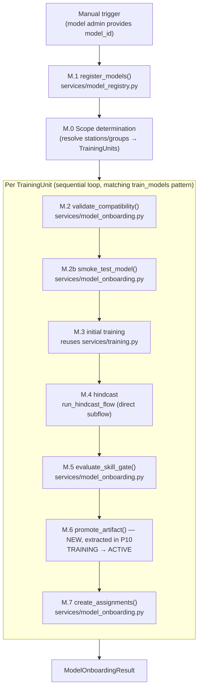

# v0 Flow 13 — Model Onboarding

> Design for the model onboarding pipeline: the end-to-end process of introducing a new forecast
> model class into the system, validating it, training it, evaluating its skill, and assigning it
> to stations. Distinct from Flow 6 (initial training), which operates on already-onboarded models.

---

## 1. Scope and simplifications (v0)

Per `v0-scope.md` §A7:

| Aspect | Full design (architecture-context.md) | v0 simplification |
|--------|---------------------------------------|-------------------|
| Approval gate | `PENDING_APPROVAL` status between training and promotion | Deferred. v0 auto-promotes (TRAINING → ACTIVE). The PostgreSQL enum has all 5 values (`training`, `active`, `superseded`, `pending_approval`, `rejected`) for forward compatibility — **already implemented** in `types/enums.py` (`ModelArtifactStatus`, line 46). v0 only wires 3 transition paths (TRAINING→ACTIVE, ACTIVE→SUPERSEDED, TRAINING stays on gate rejection). `promote_artifact()` goes directly TRAINING → ACTIVE. `v0-scope.md` §C already states 5 values / 3 transition paths — no change needed to §C enum row. **Justification for keeping 5**: PostgreSQL `ALTER TYPE ... ADD VALUE` for enums cannot run inside a transaction, making future additions painful. The codebase already defines the full enum. Restricting to 3 values in the DB would require removing working code for no operational benefit. |
| Cloud training | Dedicated training work pool with GPU resource labels | Single `default` pool. Work pool routing annotation is in place; execution is local. |
| Group assignment | `GroupModelAssignment` persisted via dedicated store method | Persisted as `group_model_assignments` table rows via `StationGroupStore` (table created in P7a). |
| Compatibility check | Protocol conformance + feature availability + time step | Full compatibility check. No hardware checks. |
| Skill gate thresholds | Per-deployment configuration | Stored in `DeploymentConfig`. Numeric thresholds only (no percentile-relative gates in v0). |
| Multi-target predictions | `predict()` returns `dict[str, ForecastEnsemble]` | Implemented. Single-target models return a one-entry dict. |
| `forecast_targets` on station | `Literal["discharge", "water_level", "both"] \| None` | Replaced with `frozenset[str] \| None` (open set, not a fixed Literal). |

### What v0 implements

```
M.1 Registration → M.0 Scope determination → [per unit: M.2 Compatibility check →
M.2b Smoke test → M.3 Initial training → M.4 Hindcast → M.5 Skill gate →
M.6 Promotion → M.7 Station/group assignment]
```



---

## 2. What already exists

| Layer | Status | Key files |
|-------|--------|-----------|
| Types (core model) | Partial — new input containers exist, `StationModelInputs` missing | `types/model.py` (`StationInputData`, `GroupModelInputs`, `ModelDataRequirements`, `ModelRecord`, `ModelRegistryEntry`, `ModelArtifactRecord`). Old `TrainingData` (with `forcing`/`observations`/`targets` fields) still present — **rename to `StationTrainingData` pending** (§3c). **`StationModelInputs` not yet created** — add in P9. |
| Types (training) | Complete | `types/training.py` (`TrainingUnit`, `TrainingScope`, `TrainingResult`, `HindcastStepResult`) |
| Types (station) | Complete — `forecast_targets` already migrated | `types/station.py` (`ModelAssignment`, `StationGroup`, `StationConfig` with `forecast_targets: frozenset[str] \| None`). **`GroupModelAssignment` defined in spec but not yet in code** (§3e, P3a adds it). |
| Types (ensemble) | Complete | `types/ensemble.py` (`ForecastEnsemble` with `parameter: str` field) |
| Protocols (model) | Partially updated — **needs type migration** | `protocols/forecast_model.py` — `data_requirements: ModelDataRequirements` is in place, `predict()` returns `tuple[dict[str, ForecastEnsemble], bytes \| None]`, `predict_batch()` takes `GroupModelInputs`. **But** `train()` still accepts old `TrainingData`/`GroupTrainingData` and `predict()` still accepts old `ModelInputs` — update signatures when §3c rename lands (§5a/5b). |
| Protocols (stores) | Exists — **needs extension** | `protocols/stores.py` — needs `store_group_model_assignment` + `fetch_group_model_assignments` on `StationGroupStore`; needs `fetch_skill_scores(model_id, model_artifact_id, parameter=None)` on `SkillStore` (note: the field name is `model_artifact_id` per `SkillScore` type in `types/skill.py`, not `artifact_id`). Existing `SkillStore` methods (`fetch_latest_scores`, `fetch_scores_by_regime`) are station-scoped and don't accept `model_artifact_id` — the new method adds an artifact-scoped query path. **Additionally**, `ModelArtifactStore.store_artifact()` currently has no `status` parameter — it implicitly creates artifacts in `TRAINING` status (confirmed in `FakeModelArtifactStore`). P6a must add an explicit `status: ModelArtifactStatus = ModelArtifactStatus.TRAINING` keyword parameter to the Protocol to make this contract explicit (required by the skill-gate interposition pattern in §6d). |
| DB schema | Partial — needs migration + hash column | `db/metadata.py` — `group_model_assignments` table not yet created (P7a). `model_artifacts` table missing `sha256_hash` column required by `security.md` §OWASP A08 (P7e). |
| Services (registry) | Complete — already uses `data_requirements` | `services/model_registry.py` |
| Services (training) | Complete — **needs type migration** | `services/training.py` — still accepts old `TrainingData`/`GroupTrainingData`; update when §3c rename lands |
| Services (hindcast) | Complete — **needs type migration** | `services/hindcast.py` — still constructs old `ModelInputs`; update to `StationModelInputs` when §3c lands |
| Services (scope) | Complete | `services/scope.py` — `determine_training_scope` (distinct from the new `determine_onboarding_scope` in `services/model_onboarding.py`) |
| Services (skill) | Complete | `services/skill/` |
| Fakes (models) | **Partially updated** — `data_requirements` and multi-target `predict()` return types in place, but `train()` and `predict()` still accept old `TrainingData`/`ModelInputs` parameter types | `tests/fakes/fake_models.py` — `train(data: TrainingData)` and `predict(inputs: ModelInputs)` signatures still use old types. Update with §3c/P9. |
| Fakes (stores) | Exists — **needs extension** | `tests/fakes/fake_stores.py` — `FakeStationGroupStore` has `seed_group_model_assignment(group_id, model_id)` (backdoor seeder, not Protocol-conforming) with storage `dict[ModelId, set[StationGroupId]]` — stores no assignment metadata (time_step, status, priority, created_at). P7d must **completely replace** the internal storage structure to `dict[tuple[StationGroupId, ModelId], GroupModelAssignment]` and add public Protocol-conforming methods. `FakeSkillStore` needs `fetch_skill_scores`. |
| Factories | Exists — **needs extension** | `tests/conftest.py` |
| Config | Exists — **needs extension** | `config/deployment.py` (`DeploymentConfig`) — `min_skill_samples` exists but **`skill_gate_thresholds` not yet added** (§6b). |
| Types (model onboarding) | **Missing** | `types/model_onboarding.py` — `CompatibilityReport`, `SkillGateResult`, `OnboardingUnitResult`, `ModelOnboardingResult` |
| Enums (onboarding) | **Missing** | `types/enums.py` — `OnboardingOutcome` not yet added |
| Config (skill gate) | **Missing** | `config/deployment.py` — `skill_gate_thresholds` not yet added (§6b) |
| Services (model onboarding) | **Missing** | `services/model_onboarding.py` — distinct from `services/onboarding.py` (station onboarding / CAMELS-CH) |
| Flow (model onboarding) | **Missing** | `flows/onboard_model.py` — distinct from `flows/onboard.py` (station onboarding) |
| Sample model | **Missing** | No model implementations |

---

## 3. New types needed

### 3a. `StationInputData` and `StationModelInputs` (types/model.py — replaces `ModelInputs`)

The 4-slot input container. See §4 for full rationale.

```python
@dataclass(frozen=True, kw_only=True, slots=True)
class StationInputData:
    past_targets: pl.DataFrame      # wide: [timestamp, param1, param2, ...]
    past_dynamic: pl.DataFrame      # wide: [timestamp, precip, temp, ...]
    future_dynamic: pl.DataFrame    # wide: [timestamp, precip, temp, ...]
    static: pl.DataFrame | None     # single-row: [attr1, attr2, ...]


@dataclass(frozen=True, kw_only=True, slots=True)
class StationModelInputs:
    station_id: StationId
    data: StationInputData
    issue_time: UtcDatetime
    forecast_horizon_steps: int
    time_step: timedelta
```

**Migration note**: `ModelInputs.warm_up_steps` is dropped. Models that require warmup should encode the warmup period in `ModelDataRequirements.lookback_steps` — the warmup window is a model-internal concern that the orchestrator satisfies by providing sufficient lookback data. `services/hindcast.py` callers that currently set `warm_up_steps` are updated in P10 to omit it.

### 3b. `GroupModelInputs` (types/model.py)

Stacked format for group models. Carries all stations in a single set of DataFrames (batch-efficient). The `.for_station()` accessor extracts single-station slices for per-station operations.

```python
@dataclass(frozen=True, kw_only=True, slots=True)
class GroupModelInputs:
    group_id: StationGroupId
    station_ids: tuple[StationId, ...]
    past_targets: pl.DataFrame      # [timestamp, station_id, param1, ...]
    past_dynamic: pl.DataFrame      # [timestamp, station_id, precip, temp, ...]
    future_dynamic: pl.DataFrame    # [timestamp, station_id, precip, temp, ...]
    static: pl.DataFrame | None     # [station_id, attr1, attr2, ...] — N rows
    issue_time: UtcDatetime
    forecast_horizon_steps: int
    time_step: timedelta

    def for_station(self, station_id: StationId) -> StationInputData:
        """Extract single-station slices from stacked DataFrames."""
```

### 3c. `StationTrainingData` and `GroupTrainingData` (types/model.py — replaces `TrainingData` and `GroupTrainingData`)

Training data mirrors the input container structure.

```python
@dataclass(frozen=True, kw_only=True, slots=True)
class StationTrainingData:
    past_targets: pl.DataFrame      # wide: [timestamp, param1, param2, ...]
    past_dynamic: pl.DataFrame      # wide: [timestamp, precip, temp, ...]
    future_dynamic: pl.DataFrame    # wide: [timestamp, precip, temp, ...]
    static: pl.DataFrame | None     # single-row: [attr1, attr2, ...]
    time_step: timedelta
    val_start: UtcDatetime | None


@dataclass(frozen=True, kw_only=True, slots=True)
class GroupTrainingData:
    group_id: StationGroupId
    station_ids: tuple[StationId, ...]
    past_targets: pl.DataFrame      # [timestamp, station_id, param1, ...]
    past_dynamic: pl.DataFrame      # [timestamp, station_id, precip, temp, ...]
    future_dynamic: pl.DataFrame    # [timestamp, station_id, precip, temp, ...]
    static: pl.DataFrame | None     # [station_id, attr1, attr2, ...] — N rows
    time_step: timedelta
    val_start: UtcDatetime | None

    def for_station(self, station_id: StationId) -> StationTrainingData:
        """Extract single-station slices from stacked DataFrames."""
```

**Migration note**: The existing `TrainingData` and `GroupTrainingData` (with `forcing`, `observations`, `targets` fields) are replaced by these types. All existing callers — `services/training_data.py`, `services/hindcast.py`, `protocols/forecast_model.py` — are updated as part of this work.

**Breaking**: `GroupTrainingData` field names change entirely (`station_data: dict[StationId, TrainingData]` → stacked DataFrame fields). All constructor call sites must be rewritten — grep for `GroupTrainingData(` to find them. Affected files: `services/training_data.py` (line 195), `tests/unit/services/test_training.py` (line 52). This is a name-preserving structural change — existing code will fail at runtime (TypeError on unknown kwargs), not at import time.

### 3d. `ModelDataRequirements` (types/model.py)

Replaces the four separate Protocol attributes (`required_features`, `required_static_attributes`, `spatial_input_type`, `supported_time_steps`) with a single composable requirements object.

```python
@dataclass(frozen=True, kw_only=True, slots=True)
class ModelDataRequirements:
    target_parameters: frozenset[str]           # e.g. frozenset({"discharge"})
    past_dynamic_features: frozenset[str]       # e.g. frozenset({"precipitation", "temperature"})
    future_dynamic_features: frozenset[str]     # e.g. frozenset({"precipitation", "temperature"})
    static_features: frozenset[str]             # e.g. frozenset({"area", "slope_mean"})
    supported_time_steps: frozenset[timedelta]
    lookback_steps: int
    spatial_input_type: SpatialRepresentation    # POINT, BASIN_AVERAGE, ELEVATION_BAND, or GRIDDED
```

**Rationale**: Previously `ModelRegistryEntry` repeated four fields from the Protocol. `ModelDataRequirements` makes the contract explicit, keeps the registry entry and Protocol in sync, and gives services a single object to validate against station/group data availability.

### 3e. `GroupModelAssignment` (types/station.py)

Parallel to `ModelAssignment` (per-station), this covers group-scoped model assignments.

```python
@dataclass(frozen=True, kw_only=True, slots=True)
class GroupModelAssignment:
    group_id: StationGroupId
    model_id: ModelId
    time_step: timedelta
    status: ModelAssignmentStatus
    priority: int
    created_at: UtcDatetime
```

### 3f. Model onboarding result types (types/model_onboarding.py — new file)

```python
@dataclass(frozen=True, kw_only=True, slots=True)
class CompatibilityReport:
    model_id: ModelId
    station_id: StationId | None               # set for per-station reports
    group_id: StationGroupId | None            # set for merged group reports
    protocol_conforms: bool
    missing_target_parameters: frozenset[str]   # params station needs but model can't provide
    missing_past_dynamic: frozenset[str]         # features model needs but station lacks
    missing_future_dynamic: frozenset[str]
    missing_static_features: frozenset[str]
    time_step_compatible: bool

    def __post_init__(self) -> None:
        if self.station_id is not None and self.group_id is not None:
            raise ValueError("Exactly one of station_id or group_id must be set, not both")
        if self.station_id is None and self.group_id is None:
            raise ValueError("Exactly one of station_id or group_id must be set")

    @property
    def is_compatible(self) -> bool:
        return (
            self.protocol_conforms
            and not self.missing_target_parameters
            and not self.missing_past_dynamic
            and not self.missing_future_dynamic
            and not self.missing_static_features
            and self.time_step_compatible
        )


@dataclass(frozen=True, kw_only=True, slots=True)
class SkillGateResult:
    model_artifact_id: ArtifactId     # matches SkillScore.model_artifact_id naming
    metric_scores: tuple[tuple[str, float], ...]   # metric_name → score (worst across strata)
    thresholds: tuple[tuple[str, float, bool], ...]  # metric_name, threshold, higher_is_better
    failing_metrics: frozenset[str]                 # metrics that did not meet threshold

    def __post_init__(self) -> None:
        score_keys = {k for k, _ in self.metric_scores}
        if len(score_keys) != len(self.metric_scores):
            raise ValueError("Duplicate metric name in metric_scores")
        thresh_keys = {k for k, _ in self.thresholds}
        if len(thresh_keys) != len(self.thresholds):
            raise ValueError("Duplicate metric name in thresholds")

    @property
    def passed(self) -> bool:
        return not self.failing_metrics


# OnboardingUnit has been dropped — use TrainingUnit from types/training.py instead.
# TrainingUnit is structurally identical (same fields, same XOR invariant).
# NOTE (review finding): TrainingUnit.__post_init__ should also validate station_ids:
#   - station-scoped: station_ids == frozenset({station_id})
#   - group-scoped: len(station_ids) > 0
# Without this, an empty station_ids on a group unit causes the per-station
# hindcast/skill loop to silently process zero stations → SKIPPED_INSUFFICIENT_EVAL.
# Fix in P4 (types/training.py __post_init__ extension).


# Module-level constants (avoid slots=True class variable conflict)
ONBOARDING_FAILED_OUTCOMES = frozenset({
    OnboardingOutcome.FAILED_SMOKE_TEST,
    OnboardingOutcome.FAILED_TRAINING,
    OnboardingOutcome.FAILED_HINDCAST,
    OnboardingOutcome.FAILED_SKILL,
    OnboardingOutcome.FAILED_ASSIGNMENT,
})
ONBOARDING_SKIPPED_OUTCOMES = frozenset({
    OnboardingOutcome.SKIPPED_COMPAT,
    OnboardingOutcome.SKIPPED_NO_DATA,
    OnboardingOutcome.SKIPPED_INSUFFICIENT_EVAL,
})


@dataclass(frozen=True, kw_only=True, slots=True)
class OnboardingUnitResult:
    unit: TrainingUnit                          # replaces OnboardingUnit (D1)
    outcome: OnboardingOutcome
    compatibility: CompatibilityReport
    artifact_id: ArtifactId | None
    hindcast_steps: tuple[HindcastStepResult, ...]  # convert from list (TrainingResult) to tuple
    skill_gate: SkillGateResult | None
    error: str | None = None


@dataclass(frozen=True, kw_only=True, slots=True)
class ModelOnboardingResult:
    model_id: ModelId
    units: tuple[OnboardingUnitResult, ...]

    def __len__(self) -> int:
        return len(self.units)

    def promoted_count(self) -> int:
        return sum(1 for u in self.units if u.outcome == OnboardingOutcome.PROMOTED)

    def failed_count(self) -> int:
        return sum(1 for u in self.units if u.outcome in ONBOARDING_FAILED_OUTCOMES)

    def skipped_count(self) -> int:
        return sum(1 for u in self.units if u.outcome in ONBOARDING_SKIPPED_OUTCOMES)

    def gate_rejected_count(self) -> int:
        return sum(1 for u in self.units if u.outcome == OnboardingOutcome.GATE_REJECTED)
```

`OnboardingOutcome` enum (defined in `types/enums.py`):

```python
class OnboardingOutcome(Enum):
    PROMOTED = "promoted"
    GATE_REJECTED = "gate_rejected"
    SKIPPED_COMPAT = "skipped_compat"
    SKIPPED_NO_DATA = "skipped_no_data"
    SKIPPED_INSUFFICIENT_EVAL = "skipped_insufficient_eval"  # zero strata survived min_skill_samples
    FAILED_SMOKE_TEST = "failed_smoke_test"
    FAILED_TRAINING = "failed_training"
    FAILED_HINDCAST = "failed_hindcast"
    FAILED_SKILL = "failed_skill"
    FAILED_ASSIGNMENT = "failed_assignment"
```

### 3g. `StationConfig.forecast_targets` (types/station.py)

The `forecast_target: Literal["discharge", "water_level", "both"] | None` field is replaced:

```python
forecast_targets: frozenset[str] | None
```

This aligns with `ModelDataRequirements.target_parameters` (also `frozenset[str]`) and removes the artificial constraint that only two named parameters are forecastable. `None` means "no forecast targets configured" — the station is not yet set up for forecasting and will fail compatibility checks (§6a step 2). **Already migrated** — the DB column is `forecast_targets: JSONB, nullable=True` (per `db/metadata.py` line 85); Python `None` maps to SQL NULL, and a non-null JSON array maps to `frozenset[str]`.

**v0 convention**: Valid target parameter names are `"discharge"` and `"water_level"` (matching CAMELS-CH adapter output). No runtime validation against a canonical list in v0 — models and stations must use consistent strings. v1 should consider a `ForecastParameter` enum or a deployment-level canonical parameter registry to catch typos.

---

## 4. Generalized input container design

### Rationale

The existing `ModelInputs` type conflates three distinct data roles:

- `forcing`: past weather (lookback) merged with future weather (forecast horizon) in one DataFrame
- `observations`: past observed values (the target signal)
- `static_attributes`: time-invariant basin attributes

This conflation forces models to re-split forcing into past/future inside their `predict()` implementations. NeuralHydrology, PyTorch Forecasting, and Darts all converge on the same 4-slot contract because it maps directly to how sequence models consume data: lookback encoder (past_targets + past_dynamic), horizon decoder (future_dynamic), and static context (static).

### 4-slot contract

| Slot | Role | Temporal extent | Notes |
|------|------|----------------|-------|
| `past_targets` | Observed target values (discharge, water level, …) | `[issue_time - lookback_steps*dt, issue_time]` | Wide: one column per parameter |
| `past_dynamic` | Historical weather covariates | Same lookback window | Wide: one column per feature |
| `future_dynamic` | NWP forecast covariates | `(issue_time, issue_time + horizon*dt]` | Wide: one column per feature |
| `static` | Time-invariant basin attributes | N/A (single row) | None if model has no static features |

### Stacked format for group models

`GroupModelInputs` uses the same 4 slots but with a `station_id` column prepended to every DataFrame. All stations share the same timestamp range — data gaps are NaN rows rather than missing rows.

**Tensor creation path** (for ML models):

```python
# Sort consistently before tensor ops
df = inputs.past_dynamic.sort(["timestamp", "station_id"])
arr = df.select(feature_cols).to_numpy()           # (n_stations * seq_len, n_features)
tensor = arr.reshape(n_stations, seq_len, n_features)  # zero-copy reshape
```

One `.to_numpy()` call, one reshape. No per-station loops in the hot path.

### `.for_station()` accessor

`GroupModelInputs.for_station(station_id)` filters each stacked DataFrame to rows matching `station_id`, drops the `station_id` column, and returns a `StationInputData`. Used by:

- Station-level diagnostics and logging
- Single-station prediction fallback when batch fails
- Test assertions

---

## 5. Protocol changes

### 5a. `StationForecastModel` (protocols/forecast_model.py)

```python
@runtime_checkable
class StationForecastModel(Protocol):
    artifact_scope: ArtifactScope          # must equal ArtifactScope.STATION
    data_requirements: ModelDataRequirements

    def train(
        self,
        data: StationTrainingData,
        params: ModelParams,
        rng: random.Random,
    ) -> ModelArtifact: ...

    def predict(
        self,
        artifact: ModelArtifact,
        inputs: StationModelInputs,
        rng: random.Random,
        prior_state: bytes | None = None,
    ) -> tuple[dict[str, ForecastEnsemble], bytes | None]: ...

    def serialize_artifact(self, artifact: ModelArtifact) -> bytes: ...
    def deserialize_artifact(self, raw: bytes) -> ModelArtifact: ...
```

**Key changes vs current**:
- `data_requirements: ModelDataRequirements` — already in place (no change needed)
- `predict()` already returns `tuple[dict[str, ForecastEnsemble], bytes | None]` (no change needed)
- `train(data: TrainingData, ...)` → `train(data: StationTrainingData, ...)` — **pending** (P5, after P9 type rename)
- `predict(inputs: ModelInputs, ...)` → `predict(inputs: StationModelInputs, ...)` — **pending** (P5, after P9 type rename)

### 5b. `GroupForecastModel` (protocols/forecast_model.py)

```python
@runtime_checkable
class GroupForecastModel(Protocol):
    artifact_scope: ArtifactScope          # must equal ArtifactScope.GROUP
    data_requirements: ModelDataRequirements

    def train(
        self,
        data: GroupTrainingData,
        params: ModelParams,
        rng: random.Random,
    ) -> ModelArtifact: ...

    def predict_batch(
        self,
        artifact: ModelArtifact,
        inputs: GroupModelInputs,
        rng: random.Random,
    ) -> dict[StationId, tuple[dict[str, ForecastEnsemble], bytes | None]]: ...

    def serialize_artifact(self, artifact: ModelArtifact) -> bytes: ...
    def deserialize_artifact(self, raw: bytes) -> ModelArtifact: ...
```

**Key changes vs current**:
- `data_requirements: ModelDataRequirements` — already in place (no change needed)
- `predict_batch(inputs: GroupModelInputs, ...)` — already in place (no change needed)
- `predict_batch()` already returns `dict[StationId, tuple[dict[str, ForecastEnsemble], bytes | None]]` (no change needed)
- `train(data: GroupTrainingData, ...)` — signature unchanged, but `GroupTrainingData` is restructured (stacked format) in P9

### 5c. `ModelRegistryEntry` (types/model.py)

`required_features`, `required_static_attributes`, `spatial_input_type`, and `supported_time_steps` are replaced by `data_requirements: ModelDataRequirements`. All consumers update accordingly.

---

## 6. Service layer design

### Layering principle

Same as the training pipeline design: services are pure Python with injected dependencies. Only `flows/` imports Prefect.

```
flows/onboard_model.py     ← Prefect @flow/@task, dependency wiring
  ↓
services/model_onboarding.py  ← Pure Python, composes existing services
  ↓
services/{registry, training, hindcast, skill/}  ← existing services
  ↓
protocols/  ← injected
```

### 6a. Compatibility validation (services/model_onboarding.py)

```python
def validate_compatibility(
    model: ForecastModel,
    station_config: StationConfig,
    available_features: frozenset[str],          # from DeploymentConfig.available_nwp_parameters (v0)
    available_static: frozenset[str],            # from basin.attributes.keys()
    requested_time_step: timedelta,
) -> CompatibilityReport:
```

**Logic**:
1. Protocol conformance: `isinstance(model, StationForecastModel | GroupForecastModel)`
2. Target parameter check: if `station.forecast_targets is None`, all model target parameters are considered missing (station has no forecast targets configured → incompatible). Otherwise `model.data_requirements.target_parameters ⊆ station.forecast_targets`.
3. Past dynamic check: `model.data_requirements.past_dynamic_features ⊆ available_features`
4. Future dynamic check: `model.data_requirements.future_dynamic_features ⊆ available_features`
5. Static check: `model.data_requirements.static_features ⊆ available_static`
6. Time step check: `requested_time_step ∈ model.data_requirements.supported_time_steps`
7. `is_compatible` property returns `True` iff all checks pass

**Group model compatibility (resolved)**: For group-scoped `TrainingUnit`s (`station_id=None`), `validate_compatibility` is called once per member station in the group (resolved via `group_store.fetch_group(group_id).station_ids`). The unit is **incompatible** if *any* member station fails. The returned `CompatibilityReport` is a union of all failures: `missing_*` fields are the union of missing features across all member stations, so the report shows the full picture. This is implemented by the `onboard_model` orchestrator (§6d step 1) — it iterates member stations and merges reports before deciding to skip or proceed.

### 6b. Skill gate evaluation (services/model_onboarding.py)

```python
def evaluate_skill_gate(
    model_id: ModelId,
    model_artifact_id: ArtifactId,
    skill_store: SkillStore,
    config: DeploymentConfig,
) -> SkillGateResult:
```

**Parameter note**: `fetch_skill_scores(model_id, model_artifact_id)` returns all skill scores for the given artifact regardless of station. For station-scoped artifacts, only that station's scores exist; for group-scoped artifacts, all member stations' scores are included. No station/group resolution is needed inside the gate — the artifact ID already scopes the query correctly.

**Logic**:
1. Fetch `SkillScore` records for `(model_id, model_artifact_id)` from `skill_store`
2. Filter to `sample_size >= config.min_skill_samples` (strata with too few pairs excluded)
3. For each metric in `config.skill_gate_thresholds`, compute the worst score across valid strata: `min()` if `higher_is_better`, `max()` if not
4. Compare against threshold: `score >= threshold` if `higher_is_better`, `score <= threshold` if not
5. `passed` is derived from `failing_metrics` (returns `True` when `failing_metrics` is empty)
6. Returns scores and which metrics failed

**Failing_metrics population rule**: For each configured threshold key, if the metric has
no score in `metric_scores` (e.g., zero valid strata survived the `min_skill_samples`
filter), the key is added to `failing_metrics`. Missing score = failing.

**Evaluation-data-insufficient detection**: If **zero** strata survive the
`min_skill_samples` filter (i.e., `metric_scores` is empty after step 2), the gate returns
`SkillGateResult` with `failing_metrics` populated as above, but the **caller**
(`onboard_model` step 7) assigns outcome `SKIPPED_INSUFFICIENT_EVAL` instead of
`GATE_REJECTED`. This distinguishes "model failed quality bar" from "insufficient
observation data to evaluate the model." The caller detects this via
`len(skill_gate.metric_scores) == 0 and not skill_gate.passed`. `GATE_REJECTED` is
reserved for cases where scores exist but fall below thresholds.

**Worst-across-strata semantics**: The skill gate evaluates the worst score across all
strata against the threshold. For `higher_is_better` metrics (e.g., CRPSS, NSE), "worst"
is `min()`; for `lower_is_better` metrics (e.g., CRPS, RMSE), "worst" is `max()`. A model
must meet the threshold in every stratum (lead time × season × flow regime) to pass. This
prevents deploying models with hidden regime-specific weaknesses. `min_skill_samples` is
the critical companion parameter: strata with fewer valid pairs than `min_skill_samples`
are excluded before aggregation, preventing noisy low-sample strata from producing
spurious rejections.

With the default `skill_gate_thresholds = {}`, the gate is a pass-through (auto-promote).
Configuring thresholds activates blocking — `GATE_REJECTED` leaves the artifact in
`TRAINING` status.

**`DeploymentConfig` additions**:

```python
@dataclass(frozen=True, kw_only=True, slots=True)
class SkillGateMetric:
    threshold: float
    higher_is_better: bool = True
    # higher_is_better=True: score >= threshold to pass (e.g. CRPSS, NSE)
    # higher_is_better=False: score <= threshold to pass (e.g. CRPS, RMSE)

# Defined in types/model_onboarding.py (alongside other onboarding types, P4).
# Valid metric names must be a subset of SUPPORTED_SKILL_METRICS.

SUPPORTED_SKILL_METRICS: frozenset[str] = frozenset({
    "crpss", "nse", "kge", "crps", "rmse", "mae", "bias",
    "brier_score", "reliability",
})
# Canonical set of metrics meaningful as scalar skill-gate thresholds.
# This is a strict subset of the full v0-scope.md §A5 metric suite —
# metrics like POD/FAR/CSI, peak_timing_error, pbias, and sharpness
# are computed by the skill flow but are not included here because
# they are either categorical (POD/FAR/CSI), timing-specific, or
# redundant with bias for gating purposes. Extend when new scalar
# metrics are added to compute_skills and are suitable for gating.

skill_gate_thresholds: dict[str, SkillGateMetric] = {}
# Empty dict = no gate (pass-through) — all models auto-promoted
# e.g. {"crpss": SkillGateMetric(threshold=0.0)}
#      {"rmse": SkillGateMetric(threshold=50.0, higher_is_better=False)}
# Final values require hydrologist input

available_nwp_parameters: frozenset[str] = frozenset({"precipitation", "temperature"})
# Parameters available from the operational NWP / forcing source.
# Used by validate_compatibility() for fast pre-check (§6a step 3–4).
# v0: all stations share the same SMN-derived parameter set.
# v1: move to per-source or per-station configuration via
#     HistoricalForcingStore.fetch_available_parameters(station_id, source)
#     or a parameters: frozenset[str] field on StationWeatherSource.
```

**`DeploymentConfig` `@model_validator(mode='after')` validation** (Pydantic `BaseModel`, not a dataclass — use `@model_validator`, not `__post_init__`): Threshold keys must be a subset of
`SUPPORTED_SKILL_METRICS`. Unknown keys raise `ValueError` at config parse time, catching
typos like `"crps"` vs `"crpss"` before they silently block or pass all models.

**Resolving `available_features` and `available_static` at call site** (§6d step 1):
- `available_features = config.available_nwp_parameters` — deployment-level in v0
- `available_static = frozenset(basin.attributes.keys()) if basin and basin.attributes else frozenset()` — per-station via `BasinStore.fetch_basin(station.basin_id)`

### 6c. Assignment creation (services/model_onboarding.py)

```python
def create_station_assignment(
    station_id: StationId,
    model_id: ModelId,
    time_step: timedelta,
    priority: int,
    station_store: StationStore,
    clock: Callable[[], UtcDatetime],
) -> ModelAssignment:

def create_group_assignment(
    group_id: StationGroupId,
    model_id: ModelId,
    time_step: timedelta,
    priority: int,
    group_store: StationGroupStore,
    clock: Callable[[], UtcDatetime],
) -> GroupModelAssignment:
```

Both upsert via the respective store. The DB primary key is `(station_id, model_id)` — one
assignment per station-model pair regardless of time step. A second onboarding at a different
time step **overwrites** the existing row's `time_step`, `status`, and `priority`. This is
intentional for v0 (each model has one supported time step; multi-timestep assignments are a
v1 concern — add `time_step` to the PK when needed).

**INACTIVE guard**: Before upserting, check whether the existing assignment (if any) has
`status = INACTIVE`. If so, **skip** the assignment and log
`model.assignment_skipped_inactive` with `station_id`/`group_id` and `model_id`. An INACTIVE
assignment represents an operator's deliberate decision to disable a model for that station.
Re-onboarding should not silently reactivate it. The operator must explicitly reactivate
(set ACTIVE) before re-onboarding will assign.

### 6d. Top-level onboarding service (services/model_onboarding.py)

```python
def onboard_model(
    model_id: ModelId,
    model: ForecastModel,
    units: tuple[TrainingUnit, ...],
    model_store: ModelStore,
    station_store: StationStore,
    group_store: StationGroupStore,
    artifact_store: ModelArtifactStore,
    obs_store: ObservationStore,
    basin_store: BasinStore,
    hindcast_store: HindcastStore,
    skill_store: SkillStore,
    flow_regime_store: FlowRegimeConfigStore,
    forcing_source: WeatherReanalysisSource,          # v0: SMN observation adapter; v1: ERA5-Land adapter
    config: DeploymentConfig,
    clock: Callable[[], UtcDatetime],
    rng: random.Random,
) -> ModelOnboardingResult:
```

**Orchestration**:

```
For each unit in units (parallelized at flow layer):
  1.  validate_compatibility()                    # fast — pure logic
      → skip unit if not is_compatible
  1b. smoke_test_model()                          # fast — synthetic data, <1s
      → fail unit with FAILED_SMOKE_TEST if raises
  2.  assemble_training_data()                    # existing service
      → skip unit if returns None
  3.  train_{station|group}_model()               # existing service
  4.  artifact_store.store_artifact()             # TRAINING status — see note below
  5.  run_{station|group}_hindcast()              # existing service
  6.  compute_skill_for_station()                 # existing service (per station in group)
  7.  evaluate_skill_gate()
      → skip promotion if gate fails (artifact remains TRAINING, not promoted or assigned)
  8.  promote_artifact()                          # @task — TRAINING → ACTIVE, separate from training for retry isolation (NEW, extracted in P10)
  9.  create_{station|group}_assignment()
```

**Store/promote separation (CRITICAL)**: Step 4 calls `artifact_store.store_artifact()` directly
(returns `ArtifactId`, leaves status as `TRAINING`). **Do not call `store_and_promote_artifact()`**
from `services/training.py` — that function unconditionally promotes immediately, bypassing the
skill gate. Step 8 calls `promote_artifact()` (a new function extracted from
`store_and_promote_artifact` in P10) which supersedes existing ACTIVE artifacts for the same
scope, then transitions the new artifact to ACTIVE via `artifact_store.transition_artifact_status()`.

**Protocol prerequisite**: The current `ModelArtifactStore.store_artifact()` Protocol has no
`status` parameter — the TRAINING default is an implicit convention in `FakeModelArtifactStore`
(line 523) and presumably in the concrete Pg store. P6a **must** add an explicit
`status: ModelArtifactStatus = ModelArtifactStatus.TRAINING` keyword parameter to the Protocol
signature to make this contract enforceable. Without this, a store implementation that defaults
to ACTIVE would silently bypass the skill gate.

**Smoke test** (step 1b): Validates the model's interface contract before committing to a full
training run, per `architecture-context.md` M.2(d). Generates synthetic `StationTrainingData` /
`GroupTrainingData` from `model.data_requirements` (random floats, correct column names, 10 rows
per slot, correct `time_step`), then exercises the full round-trip: `train()` → `serialize_artifact()`
→ `deserialize_artifact()` → `predict()`. Validates result shape: keys match
`data_requirements.target_parameters`, each `ForecastEnsemble` has correct `parameter` field.
For group models, uses a 3-station synthetic dataset. Catches serialization bugs, shape errors,
and contract violations in under 1 second. Additionally validates that each dict key equals
its `ForecastEnsemble.parameter` value (catches key/value disagreement that the type checker
cannot detect). Synthetic target data is clamped to `[0, ∞)` (non-negative) to avoid false
failures from models that validate non-negative targets. The RNG seed is deterministic
(derived from `model_id` hash) so smoke test results are reproducible.
Raises `ModelSmokeTestError` on failure.

**Smoke test vs architecture-context.md M.2(d)**: `architecture-context.md` describes synthetic
data generated from station metadata (basin area, elevation, parameter ranges). This design
deliberately uses `model.data_requirements`-shaped random data instead: the smoke test's job is
**interface contract validation** (correct signatures, shapes, serialization round-trip), not
data realism. Station-aware synthetic data would require a station lookup, coupling the smoke
test to store availability and making it a mini-integration test. P1b should update
`architecture-context.md` M.2(d) to match this simpler approach.

**Scope determination** (called in the flow layer before `onboard_model`):

```python
def determine_onboarding_scope(
    model_id: ModelId,
    model: ForecastModel,
    station_ids: frozenset[StationId] | None,
    group_ids: frozenset[StationGroupId] | None,
    station_store: StationStore,
    group_store: StationGroupStore,
    training_period_start: UtcDatetime,
    training_period_end: UtcDatetime,
    time_step: timedelta,
) -> tuple[TrainingUnit, ...]:
    """Resolve onboarding scope to concrete TrainingUnits.

    Distinct from services/scope.py::determine_training_scope, which resolves
    scope for *retraining* (multiple models × multiple stations, from existing
    assignments). This function resolves scope for *onboarding* (single model,
    stations/groups either explicit or auto-discovered). Both produce
    tuple[TrainingUnit, ...] but differ in input parameters and resolution
    logic. Shared logic (e.g. station filtering by StationStatus.OPERATIONAL)
    should be extracted to a helper if duplication becomes significant.

    Raises ConfigurationError (from exceptions.py) for group-scoped
    models when group_ids is None and no existing assignments exist.
    """
```

Logic:
1. Read `artifact_scope` and `data_requirements` from the `model` parameter (which satisfies `StationForecastModel | GroupForecastModel`). No store lookup needed — the live model object exposes both via the Protocol.
2. If `station_ids`/`group_ids` are explicitly provided: use them.
3. If `station_ids is None` and model is station-scoped: fetch all operational stations
   via `station_store.fetch_all_stations()` and post-filter by `StationStatus.OPERATIONAL`.
4. If `group_ids is None` and model is group-scoped: attempt auto-discovery via
   `group_store.fetch_groups_for_model(model_id)`. If no groups found (first-time
   onboarding), raise `ConfigurationError` — the operator must provide explicit group IDs
   for initial onboarding of a group-scoped model.
5. Build `tuple[TrainingUnit, ...]` from the resolved scope.

**Partial failure handling**: Each unit runs independently. If a unit fails at any step (1b–9), the error is captured in `OnboardingUnitResult.error` with the corresponding `FAILED_*` outcome, and the loop continues to the next unit. Artifacts stored in step 4 that never reach promotion (step 8) remain in `TRAINING` status. These orphaned artifacts are harmless (never selected for operational forecasts, which require `ACTIVE` status) but accumulate over time. **v0**: no automatic cleanup — operators can query `TRAINING` artifacts older than N days manually. **v1**: add a periodic garbage-collection task that transitions stale `TRAINING` artifacts to `SUPERSEDED`.

**Manual demotion (v0)**: If a promoted artifact turns out to be flawed, an operator can transition it from `ACTIVE` back to `SUPERSEDED` via `ModelArtifactStore.transition_artifact_status()` and deactivate the corresponding `ModelAssignment` / `GroupModelAssignment`. No batch-revoke function is provided in v0 — add alongside the approval gate in v1.

**Scope function location**: `determine_onboarding_scope` is defined in `services/model_onboarding.py`; invoked from the flow layer via `determine_onboarding_scope_task` (§8) before calling `onboard_model`.

**Composing existing services**: `onboard_model` is a thin orchestrator. Steps 2–6 delegate entirely to `services/training_data.py`, `services/training.py`, `services/hindcast.py`, and `services/skill/`. New logic in `model_onboarding.py`: `validate_compatibility` (step 1), `smoke_test_model` (step 1b), `evaluate_skill_gate` (step 7), `promote_artifact` (step 8), `create_{station|group}_assignment` (step 9), and `determine_onboarding_scope`.

**Output validation**: Steps 3–6 delegate to existing services (`training.py`, `hindcast.py`, `skill/`) which already enforce `SanityCheckFailure` output validation before DB insertion, per `security.md` §Model code trust boundary. No additional validation needed in `model_onboarding.py`.

**Logging requirements** (per `docs/standards/logging.md`): All new modules (`services/model_onboarding.py`, `flows/onboard_model.py`, `models/linear_regression_daily.py`) must acquire `log = structlog.get_logger(__name__)`. The flow body must bind `model_id` at entry: `structlog.contextvars.bind_contextvars(model_id=str(model_id))`. Per-unit loop iterations must use `bound_contextvars(station_id=str(station_id))` (station-scoped units) or `bound_contextvars(group_id=str(group_id))` (group-scoped units). Before calling `run_hindcast_flow` (direct subflow from flow body), use `bind_contextvars(parent_flow_run_id=str(prefect.runtime.flow_run.id))` (**not** `bound_contextvars` — the subflow is a blocking call, and using the context manager form would clear the binding before the subflow logs anything), per logging.md §Context binding rules 3 (bind vs bound distinction) and 5 (subflow parent_flow_run_id).

Key events (all `*_completed` / `*_failed` events must include `duration_ms`):

| Event | Level | Notes |
|-------|-------|-------|
| `model.onboarding_started` | INFO | flow entry |
| `model.onboarding_unit_started` | INFO | per-unit (with `station_id` or `group_id`) |
| `model.onboarding_unit_completed` | INFO | per-unit timing |
| `model.compatibility_completed` | INFO | expected outcome, with `is_compatible` |
| `model.compatibility_failed` | INFO | expected unit skip (station incompatible), not an error |
| `model.smoke_test_completed` | INFO | function returned normally, `passed=True/False` |
| `model.smoke_test_failed` | ERROR | unexpected exception, with `error=str(exc)` — not `passed` |
| `model.skill_gate_completed` | INFO if `passed`, WARNING if not | with `passed`, `failing_metrics` |
| `model.skill_gate_failed` | ERROR | unexpected exception during gate evaluation |
| `model.promotion_completed` | INFO | |
| `model.assignment_skipped_inactive` | WARNING | operator deliberately disabled this model for station/group |
| `model.onboarding_completed` | INFO | flow exit, with `promoted_count`, `failed_count` |

Fast sub-steps (compatibility, smoke test, skill gate) emit only `_completed`/`_failed` events — `_started` halves omitted since these complete in <1s.

**v1 audit obligation**: `security.md` §Audit logging requires "all model promotion/rejection decisions" in `audit_log`. In v0, application logs (`model.promotion_completed`, `model.skill_gate_completed` with `passed=False`) serve this role. v1 must additionally write these events to the `audit_log` table.

---

## 7. Sample model — `LinearRegressionDaily`

Provides a concrete, immediately testable `StationForecastModel` implementation that validates the full onboarding pipeline from day one.

### Specification

| Property | Value |
|----------|-------|
| Entry point name | `linear_regression_daily` |
| Scope | `ArtifactScope.STATION` |
| Time steps | `{timedelta(hours=24)}` |
| Target parameters | `frozenset({"discharge"})` |
| Past dynamic features | `frozenset({"precipitation", "temperature"})` |
| Future dynamic features | `frozenset({"precipitation", "temperature"})` |
| Static features | `frozenset()` (none required) |
| Lookback steps | 7 (7 days lookback) |
| Spatial input type | `SpatialRepresentation.POINT` |

### Algorithm

- **Training**: Fit a scikit-learn `Ridge` regressor. Feature matrix = lagged precipitation + temperature (past 7 days) concatenated with forecast precipitation + temperature (next `horizon_steps` days). Target = observed discharge at each forecast step. One regressor fitted per forecast step (direct multi-step strategy). Training horizon (`n_steps`) is fixed at training time. `predict()` must raise `ValueError` if `forecast_horizon_steps > n_steps` — the fitted regressors are only valid up to the training horizon.
- **Ensemble**: Pseudo-ensemble via residual bootstrapping. Compute training residuals → resample with replacement to generate `n_members=50` perturbations → add to deterministic prediction. RNG is seeded from the injected `random.Random` for reproducibility. **Known limitation**: Training residuals are in-sample and thus smaller than out-of-sample errors — ensemble spread will be systematically underestimated (overconfident). Acceptable for v0's sample model; production models should use proper uncertainty estimation.
- **Artifact**: Serialized as `numpy.savez_compressed` — coefficient matrix `(n_steps, n_features)` + intercept vector `(n_steps,)` extracted from fitted `Ridge` instances. **No pickle** — `deserialize_artifact()` reconstructs a `LinearRegressionArtifact` (frozen dataclass holding numpy arrays) and predicts via `X @ coefficients.T + intercepts` without loading sklearn objects. Total artifact size < 50 KB for 120-step horizon. This follows `security.md` §Model code trust boundary: deserialization cannot execute arbitrary code. **Artifact serialization preference hierarchy** (applies to all model implementations, not just `LinearRegressionDaily`):
> 1. **Format-native serialization** — `numpy.savez_compressed` (linear/statistical), XGBoost/LightGBM `save_model()`, TF SavedModel / `.keras`, PyTorch `safetensors` for `state_dict()`. Always preferred.
> 2. **`skops`** — for sklearn estimators. Preferred over joblib/pickle. Requires explicit `trusted=[...]` type list in `deserialize_artifact()`.
> 3. **Pickle** — permitted only when no safe alternative covers the use case. Requires explicit justification in `deserialize_artifact()` docstring and IT review of the model package. Note: `joblib` is not a safe alternative to pickle — it uses pickle internally for Python objects.
>
> SHA-256 hash verification (P7e) is the primary artifact integrity control regardless of format. The preference hierarchy is defense-in-depth, not a substitute for hash verification.
- **Ensemble spread caveat**: The overconfident residual bootstrap produces ensemble spread that is systematically underestimated. This will be reflected in reliability diagnostics (rank histogram, Brier Score) computed by the skill flow per WMO-1364. Operators should not interpret these scores as representative of the model class's true reliability — only of the sample model's known-limited uncertainty estimation.

### File location

`src/sapphire_flow/models/linear_regression_daily.py`

### pyproject.toml entry point

```toml
[project.entry-points."sapphire_flow.models"]
linear_regression_daily = "sapphire_flow.models.linear_regression_daily:LinearRegressionDaily"
```

---

## 8. Prefect flow (flows/onboard_model.py)

```python
@flow(name="onboard-model", log_prints=False)
def onboard_model_flow(                        # named *_flow to avoid collision with services/model_onboarding.py::onboard_model
    model_id: str,
    station_ids: list[str] | None = None,      # None = all operational stations
    group_ids: list[str] | None = None,        # None = all groups for group-scoped models
    period_start: str | None = None,           # ISO 8601; defaults to 2 years ago
    period_end: str | None = None,             # ISO 8601; defaults to now
    time_step_hours: int = 24,
    assignment_priority: int = 0,
) -> ModelOnboardingResult:
```

**Task structure**:

```python
@task(name="determine-onboarding-scope")
def determine_onboarding_scope_task(
    model_id: ModelId,
    model: ForecastModel,
    station_ids: frozenset[StationId] | None,   # parsed from list[str] | None at flow boundary
    group_ids: frozenset[StationGroupId] | None, # parsed from list[str] | None at flow boundary
    ...
) -> tuple[TrainingUnit, ...]: ...

@task(name="register-model-class")
def register_model_class_task(model_id: ModelId, ...) -> ModelRegistryEntry: ...

@task(name="validate-compatibility", log_prints=False)
def validate_compatibility_task(unit: TrainingUnit, ...) -> CompatibilityReport: ...

@task(name="smoke-test-model", log_prints=False)
def smoke_test_model_task(unit: TrainingUnit, model: ForecastModel, ...) -> bool: ...

@task(name="assemble-onboarding-data", log_prints=False)
def assemble_onboarding_data_task(unit: TrainingUnit, ...) -> StationTrainingData | GroupTrainingData | None: ...

@task(name="train-onboarding-model", log_prints=False)
def train_onboarding_model_task(unit: TrainingUnit, data: ..., ...) -> ArtifactId: ...

@task(name="evaluate-skill-gate", log_prints=False)
def evaluate_skill_gate_task(unit: TrainingUnit, artifact_id: ArtifactId, ...) -> SkillGateResult: ...

@task(name="promote-artifact", log_prints=False)
def promote_artifact_task(unit: TrainingUnit, artifact_id: ArtifactId, ...) -> None: ...

@task(name="create-assignment", log_prints=False)
def create_assignment_task(unit: TrainingUnit, ...) -> None: ...
```

**Parse boundary**: The Prefect flow signature uses `list[str] | None` for `station_ids`
and `group_ids` (JSON-serializable). Inside the flow body, these are parsed to domain
types (`frozenset[StationId]` / `frozenset[StationGroupId]`) before passing to
`determine_onboarding_scope_task`. `period_start` / `period_end` are parsed with
`ensure_utc()` — naive ISO 8601 strings (no `Z` or `+00:00`) are rejected with
`ValueError` at the boundary per the project's parse-don't-validate rule.
`time_step_hours: int = 24` restricts v0 to integer-hour time steps (v0: daily only).
v1 may extend to `float` for sub-hourly support. The flow body is the parse-don't-validate
boundary. For group-scoped models with `group_ids=None` and no existing assignments,
`determine_onboarding_scope` raises `ConfigurationError` — the operator must provide
explicit group IDs.

**Sequential per-unit processing**: Units are processed sequentially in a `for` loop in
the flow body, matching the `train_models` pattern (`flows/train_models.py` lines 216–341).
Each pipeline step (compatibility, smoke test, train, store, hindcast, skill, gate,
promote, assign) is a separate `@task` call from the flow body. Hindcast is invoked as a
direct subflow (`run_hindcast_flow`) from the flow body — the standard, safe Prefect 3
composition pattern. Skill computation uses `compute_skills_task.map()` for
per-station×parameter fan-out within each unit (also from the flow body). `onboard_model_flow`
does **not** call the `train_models` flow itself — it composes the same service functions
directly.

**Why not `task.map()` across units?** Calling `@flow` functions (like `run_hindcast_flow`)
from inside `@task` bodies in a `ThreadPoolTaskRunner` creates nested Prefect context that
risks deadlock (all thread slots occupied, inner tasks cannot be scheduled) and has
undocumented thread-safety characteristics. The sequential loop avoids this entirely. If
sequential processing proves too slow at scale (~1000 stations), the loop can be upgraded
to `task.map()` calling **service functions directly** (not `@flow` wrappers) — Option B in
the design review.

**Concurrency limit**: `concurrency_limit: 1` — same as `train_models`. Only one onboarding flow runs at a time to avoid saturating the single `default` work pool with concurrent training jobs.

**Dependency injection pattern**: identical to `flows/train_models.py` — concrete stores and adapters are constructed in the flow body and passed to service functions.

---

## 9. Cloud training via work pool routing

For large models (LSTM, transformer-based), training may require GPU resources not available in the default Docker Compose worker. The architecture supports work pool routing without adding new Protocols.

### v0 annotation (not yet active)

Each Prefect task that calls a training function annotates its preferred work pool:

```python
@task(name="train-onboarding-model", task_run_name="{unit.model_id}")
def train_onboarding_model_task(...) -> ArtifactId:
    # v0: runs on default pool
    # v1: route to gpu_training pool when model.data_requirements.spatial_input_type
    #     requires GPU (determined by a model capability flag)
    ...
```

### v1 routing plan (design note only — no v0 implementation phase)

`ModelDataRequirements` gains a `compute_backend: Literal["cpu", "gpu"] = "cpu"` field in v1. The flow checks this field and routes to a `gpu_training` work pool via `with_options(work_pool_name=...)`. No Protocol changes required — routing logic stays in the flow layer. **No v0 phase adds `compute_backend`** — this section is aspirational documentation for v1 planning.

### v0 note

All training in v0 runs on the single `default` pool (CPU). The `gpu_training` pool is not created. The routing annotation serves as documentation for v1.

**v1 pool assignment note**: `onboard-model` writes artifacts to `/data/artifacts/`, which is read-write only for `prefect-worker-training` per `security.md` §Volume permissions. In v1, `onboard-model` must be registered to the `training` work pool (not `ops`), independent of GPU requirements.

---

## 10. Consistency checks against existing design

### Alignment with architecture-context.md

| architecture-context.md says | This design | Notes |
|------------------------------|-------------|-------|
| Flow 5 step 5.10: configure model assignments | M.7 `create_assignment()` | Onboarding creates assignments after skill gate passes |
| Flow 5 step 5.11: model readiness / trigger training (Flow 6) | M.3 initial training | Onboarding composes same training services as Flow 6 |
| Flow 5 step 5.11: auto-promote in v0 | M.6 auto-promote | Implemented via `store_artifact()` (TRAINING) + `promote_artifact()` (TRAINING → ACTIVE after skill gate) |
| Flow 6 T.1–T.3 (data prep, features, training) | Reused in M.3 via shared services | No duplication: onboarding calls the same service functions. M.4 and M.5 (hindcast + skill) reuse services from Flows 7 and 8/10 respectively — they are explicit steps in Flow 13, not delegated through Flow 6. |
| `model_assignments` table | `ModelAssignment` persisted via `StationStore` | ✓ — architecture-context.md shows `is_active: BOOL` on both `model_assignments` and `group_model_assignments`; codebase uses `status: ModelAssignmentStatus` (ACTIVE/INACTIVE). **`status` is canonical** — P1 must fix architecture-context.md `is_active → status` on both tables before P7a migration runs. |
| `model_artifacts.status` enum | PostgreSQL enum has 5 values (`training`, `active`, `superseded`, `pending_approval`, `rejected`) for forward compatibility; v0 wires 3 transition paths only | ✓ Full enum defined, v0 uses 3-transition subset. `v0-scope.md` §C already states 5 values / 3 transitions — no change needed. |

### Alignment with existing types

| Type | Location | Change | Notes |
|------|----------|--------|-------|
| `TrainingData` | `types/model.py` | Replaced by `StationTrainingData` | Same data, restructured slots |
| `GroupTrainingData` | `types/model.py` | Replaced (same name, new structure) | Stacked format |
| `ModelInputs` | `types/model.py` | Replaced by `StationModelInputs` + `StationInputData` | |
| `ModelRegistryEntry` | `types/model.py` | `data_requirements` replaces 4 fields | |
| `ModelAssignment` | `types/station.py` | Unchanged | Per-station |
| `StationGroup` | `types/station.py` | Unchanged | |
| `ForecastEnsemble` | `types/ensemble.py` | Unchanged — `parameter: str` already present | `predict()` now returns a dict keyed by this field |
| `StationConfig` | `types/station.py` | `forecast_targets: frozenset[str] \| None` | Already migrated (P3b DONE) |

### Alignment with existing Protocols (stores)

| Protocol method | Used by | Consistent? |
|-----------------|---------|-------------|
| `ModelStore.register_model()` | M.1 | ✓ |
| `ModelArtifactStore.store_artifact()` | M.3 (via training.py) | ✓ |
| `ModelArtifactStore.fetch_artifacts_by_status()` | M.6 `promote_artifact()` — finds existing ACTIVE artifacts to supersede | ✓ |
| `ModelArtifactStore.transition_artifact_status()` | M.6 `promote_artifact()` — TRAINING→ACTIVE (and ACTIVE→SUPERSEDED for predecessors) | ✓ |
| `HindcastStore.store_hindcast()` | M.4 (via hindcast.py) | ✓ |
| `SkillStore.fetch_skill_scores()` | M.5 gate evaluation | **New method** — existing `fetch_latest_scores` and `fetch_scores_by_regime` are station-scoped with no `model_artifact_id` parameter. `fetch_skill_scores(model_id, model_artifact_id)` adds an artifact-scoped query path. Note: the field name is `model_artifact_id` (not `artifact_id`) per `SkillScore` in `types/skill.py`. |
| `StationStore.store_model_assignment()` | M.7 | ✓ Store method exists |
| `StationGroupStore.store_group_model_assignment()` | M.7 | Needs `store_group_model_assignment(GroupModelAssignment)` added |

### Protocol method gaps

Three store methods need adding to existing Protocols (not new Protocols):

| Method | Protocol | Notes |
|--------|----------|-------|
| `fetch_skill_scores(model_id, model_artifact_id)` | `SkillStore` | M.5 reads skill scores for gate evaluation |
| `store_group_model_assignment(assignment)` | `StationGroupStore` | M.7 persists group-level assignment |
| `fetch_group_model_assignments(group_id)` | `StationGroupStore` | M.7 upsert check + scope determination (§6d step 4) |

### DB schema alignment

| Table | Usage | Consistent? |
|-------|-------|-------------|
| `models` | M.1 writes | ✓ |
| `model_artifacts` | M.3–M.6 | ✓ `status` enum, `promoted_at`. **Gap**: `sha256_hash` column required by `security.md` §OWASP A08 — added in P7e (3-step migration: add nullable → backfill → set NOT NULL) |
| `model_assignments` | M.7 writes | ✓ New row per assignment |
| `station_groups` / `station_group_members` | Group-scoped paths | ✓ |
| `skill_scores` | M.5 reads | ✓ `(model_id, model_artifact_id)` queryable |
| `stations.forecast_targets` | M.2 target check | Already migrated (`JSONB, nullable=True`); Python type: `frozenset[str] \| None`. NULL = no targets configured (incompatible); non-null JSON array = `frozenset[str]` |

### Known limitations and operational constraints

1. **Cross-flow artifact race**: `onboard-model` and `train-models` have independent
   `concurrency_limit: 1` and can run concurrently for the same model. Both call
   `promote_artifact()`, which supersedes existing ACTIVE artifacts. If both run
   simultaneously, the last writer wins silently. **v0 mitigation**: use a shared Prefect
   concurrency key `concurrency(f"model_training:{model_id}", occupy=1)` inside both
   `onboard_model_flow` and `train_models_flow` flow bodies, per `orchestration.md` §Shared resources
   pattern. This enforces mutual exclusion per model_id across both flows without requiring
   DB-level locks. Additionally, `promote_artifact()` should re-check that the artifact's
   current status is still `TRAINING` before promoting — if another flow has already changed
   it, log a warning and skip. v1 may add a DB-level advisory lock for defense in depth.

2. **Group membership changes post-onboarding**: Artifacts are trained on a fixed set of
   member stations. If a station is added to or removed from a group after onboarding, the
   artifact may produce undefined results (missing embeddings, shape mismatches). **v0**:
   group membership is static (Swiss deployment). **v1**: add artifact invalidation on
   group-membership change; require retraining after membership changes.

3. **`ForecastModel` union narrowing**: `mypy` cannot narrow
   `StationForecastModel | GroupForecastModel` via `model.artifact_scope` attribute checks.
   **Do not use `isinstance()` for narrowing** — both Protocols share the same methods
   (`serialize_artifact`, `deserialize_artifact`), so a `GroupForecastModel` may satisfy
   `StationForecastModel` at runtime, making `isinstance` checks unreliable.
   Implementation must use `if model.artifact_scope == ArtifactScope.STATION:` followed
   by `cast(StationForecastModel, model)` at branch points. This is a Python type system
   limitation, not a runtime concern.

4. **SHA-256 verification paths**: Hash verification must cover three points:
   (a) `store_artifact()` — compute SHA-256 on write, persist in `ModelArtifactRecord` (P7e).
   (b) `fetch_artifact()` — verify hash on read, raise `ArtifactIntegrityError` on mismatch
   (P7e). Covers the operational forecast cycle (Phase 8) which loads artifacts from the store.
   (c) Flow-body deserialization — both `train_models_flow` (line 268) and `onboard_model_flow`
   deserialize artifact bytes directly after `store_artifact()`, bypassing `fetch_artifact()`.
   `services/hindcast.py` receives already-deserialized artifacts as parameters — it never
   calls `fetch_artifact()`. `services/skill/` does not touch artifact bytes at all. P10 must
   add hash verification at the `train_models_flow` deserialization call site: compare
   `hashlib.sha256(artifact_bytes).hexdigest()` against the hash returned by `store_artifact()`
   before calling `deserialize_artifact()`. P15 must do the same for `onboard_model_flow`.
   **P7e exit gate**: grep-confirm all `deserialize_artifact()` call sites are preceded by
   hash verification (either via `fetch_artifact()` or inline check). P17 must additionally
   add an **automated regression test** that greps the codebase for unguarded
   `deserialize_artifact()` calls (i.e., calls not preceded by a hash check within the same
   function body or not routed through `fetch_artifact()`). This prevents future
   deserialization paths from silently bypassing hash verification. P17 integration test
   confirms the hash round-trip end-to-end.

5. **v0 volume permissions**: `security.md` grants `/data/artifacts/` read-write only to
   `prefect-worker-training`. v0 uses a single unified `prefect-worker`. P1b must **add a
   v0 `prefect-worker` row** to `cicd.md`'s Named volumes table with `(rw)` for
   `model_artifacts` — not merely "confirm" access. If the v0 worker inherits a read-only
   mount, artifact writes fail at runtime.

6. **`numpy` as explicit dependency**: `LinearRegressionDaily` (P12) calls
   `numpy.savez_compressed` directly. `numpy` is a transitive dependency via polars/xarray
   but should be listed as an explicit dependency in P13 alongside `scikit-learn`.

7. **Orphaned `TRAINING` artifacts disk space**: Artifacts stored in step 4 that fail
   before promotion accumulate on the `model_artifacts` volume indefinitely. They are never
   loaded (no hash verification) and increase both attack surface and disk usage. **v0
   workaround**: operators run
   `SELECT id, created_at FROM model_artifacts WHERE status = 'training' AND created_at < now() - interval '7 days'`
   periodically to identify stale artifacts for manual cleanup. **v1**: add a periodic GC
   task that transitions stale `TRAINING` artifacts to `SUPERSEDED`.

---

## 11. Implementation phases

> **Note (2026-04-04):** Original plan had 19 phases across 8 waves. Code review shows
> some items are already implemented (new input types, `ModelDataRequirements`,
> `forecast_targets` migration, `data_requirements` attribute on Protocols, fake model
> `data_requirements`). Protocol `train()`/`predict()` signatures still reference old
> types (`TrainingData`, `ModelInputs`) — these migrate in P5/P9. The revised plan below
> reflects only remaining work. ~~Struck~~ original phases are complete.

```json
{
  "phases": {
    "P1a": { "name": "Docs update (spec docs): v0-scope.md §C (add group_model_assignments table — count becomes 25, add sha256_hash to model_artifacts entry, clarify PostgreSQL enum has 5 values with v0 using 3 transition paths, add smoke test to Flow 13 description in §Flows row 3, document forecast_targets JSONB nullable on stations row). types-and-protocols.md (add SkillStore.fetch_skill_scores, add FAILED_SMOKE_TEST + SKIPPED_INSUFFICIENT_EVAL to OnboardingOutcome and respective outcome sets, add available_nwp_parameters: frozenset[str] = frozenset({'precipitation', 'temperature'}) to DeploymentConfig, add sha256_hash to ModelArtifactRecord, add ModelSmokeTestError and ArtifactIntegrityError to exceptions list, add station_id/group_id fields to CompatibilityReport with XOR __post_init__, add status: ModelArtifactStatus = ModelArtifactStatus.TRAINING keyword parameter to ModelArtifactStore.store_artifact() Protocol, fix stale stack_model_inputs() to describe P9 target state, fix stale ModelInputs/TrainingData prose). conventions.md (priority convention — already documented; enum master list — ModelAssignmentStatus already shows 'inactive' (verified), OnboardingOutcome already listed (verified); confirm no stale refs). Training pipeline doc stale refs", "depends_on": [] },
    "P1b": { "name": "Docs update (architecture + standards): architecture-context.md (fix stale is_active→status on BOTH model_assignments AND group_model_assignments tables — status: ModelAssignmentStatus is canonical per codebase, update GroupTrainingData from dict to stacked format, replace ModelInputs references with StationModelInputs — grep for all occurrences including Flows 1/6/9 sections and Model Protocol section including step 1.7 output (now GroupModelInputs stacked, not dict[StationId, ModelInputs]), fix 'single ForecastModel Protocol' intro to describe two-Protocol split (StationForecastModel/GroupForecastModel), fix SpatialRepresentation LUMPED/DISTRIBUTED comment, fix M.2 failure semantics from 'terminal' to per-unit skip/fail, add M.2b as distinct sub-step in sequencing, fix M.2(d) smoke test to use model.data_requirements-shaped random data instead of station metadata, fix M.3 note to acknowledge store/promote separation and forcing source injection (SMN v0, ERA5-Land v1), fix T.5 note ('when called from Flow 13' → Flow 13 composes services directly, not via train_models), add sha256_hash TEXT NOT NULL to model_artifacts schema block, fix forecast_targets column type from TEXT[] to JSONB nullable, fix skill_gate_thresholds type from dict[str, float] to dict[str, SkillGateMetric] in M.5 note). orchestration.md (add Flow 13 row: '| 13 — Model onboarding | onboard_model_flow | training (v0: default) | On-demand | 1 |' plus onboard-model deployment registration entry, add Flow 13 to composition graph). logging.md (add model_id and group_id to recommended context fields table; add ALL model.* events to canonical event table WITH LOG LEVELS per §6d event table including model.assignment_skipped_inactive; use error=str(exc) not passed=False for *_failed events). v0-scope.md §A7 (document worst-across-strata skill gate aggregation with direction-aware comparison, SKIPPED_INSUFFICIENT_EVAL outcome and its trigger condition — zero strata with >= min_skill_samples valid pairs). v0-scope.md §Flows (fix Flow 13 description: 'Composes Flows 6→7→8' → 'Reuses services from Flows 6/7/8' — onboard_model does NOT call train_models flow, it composes the same service functions directly per §6d). v0-scope.md §E3 (add 'Model onboarding' scenario row — Flow 13 end-to-end: register → compatibility → smoke test → train → hindcast → skill gate → promote → assign). security.md §Model code trust boundary (add artifact serialization preference hierarchy: 1. format-native (numpy.savez_compressed, XGBoost save_model, TF SavedModel, PyTorch safetensors), 2. skops for sklearn, 3. pickle only with justification + IT review; SHA-256 hash verification is primary control regardless of format). cicd.md (add v0 prefect-worker row to Named volumes table with (rw) for model_artifacts — not merely confirm). logging.md §Prefect-specific settings already documents PREFECT_LOGGING_LEVEL=WARNING — cicd.md should cross-reference logging.md rather than duplicate.", "depends_on": [] },
    "P2":  { "name": "DONE (partial) — StationInputData, GroupModelInputs, ModelDataRequirements already in types/model.py. NOTE: old ModelInputs and stack_model_inputs() still exist — removal deferred to P9.", "depends_on": [] },
    "P3a": { "name": "types/station.py — add GroupModelAssignment", "depends_on": [] },
    "P3b": { "name": "DONE — StationConfig.forecast_targets already migrated", "depends_on": [] },
    "P4":  { "name": "types/model_onboarding.py — CompatibilityReport, SkillGateResult, OnboardingUnitResult, ModelOnboardingResult; types/enums.py — OnboardingOutcome (including FAILED_SMOKE_TEST and SKIPPED_INSUFFICIENT_EVAL); exceptions.py — ModelSmokeTestError, ArtifactIntegrityError. types/training.py — extend TrainingUnit.__post_init__ to validate station_ids (station-scoped: == frozenset({station_id}); group-scoped: len > 0)", "depends_on": [] },
    "P4b": { "name": "config/deployment.py — add SkillGateMetric (threshold + higher_is_better) to types/model_onboarding.py, SUPPORTED_SKILL_METRICS constant, skill_gate_thresholds: dict[str, SkillGateMetric] = {} and available_nwp_parameters: frozenset[str] = frozenset({'precipitation', 'temperature'}) to DeploymentConfig. Add DeploymentConfig @model_validator(mode='after') validator (Pydantic BaseModel, not dataclass): threshold keys must be subset of SUPPORTED_SKILL_METRICS", "depends_on": ["P4"] },
    "P5":  { "name": "protocols/forecast_model.py — update train() and predict() signatures to use StationTrainingData/StationModelInputs (requires P9 type rename to land first)", "depends_on": ["P9"] },
    "P6a": { "name": "protocols/stores.py — add fetch_skill_scores(model_id, model_artifact_id, parameter=None) to SkillStore (new artifact-scoped query; existing fetch_latest_scores and fetch_scores_by_regime are station-scoped and unchanged). Also add status: ModelArtifactStatus = ModelArtifactStatus.TRAINING keyword parameter to ModelArtifactStore.store_artifact() Protocol (makes implicit TRAINING default explicit — required by §6d skill-gate interposition). Update FakeModelArtifactStore.store_artifact() to accept the new parameter (it already hardcodes TRAINING; just wire the kwarg through).", "depends_on": ["P4"] },
    "P6b": { "name": "protocols/stores.py — add store_group_model_assignment + fetch_group_model_assignments to StationGroupStore", "depends_on": ["P3a"] },
    "P7a": { "name": "Alembic migration — group_model_assignments table", "depends_on": ["P3a"] },
    "P7b": { "name": "store/station_group_store.py — implement store_group_model_assignment + fetch_group_model_assignments. Integration tests in tests/integration/test_station_group_store.py (testcontainers per v0-scope.md §E4)", "depends_on": ["P6b", "P7a"] },
    "P7c": { "name": "store/skill_store.py — implement fetch_skill_scores. Integration test in tests/integration/test_skill_store.py (testcontainers per v0-scope.md §E4)", "depends_on": ["P6a"] },
    "P7d": { "name": "tests/fakes/ — add FakeStationGroupStore.store_group_model_assignment/fetch_group_model_assignments (NOTE: internal _group_model_assignments storage must change from dict[ModelId, set[StationGroupId]] to dict[tuple[StationGroupId, ModelId], GroupModelAssignment] to preserve full assignment fields); add FakeSkillStore.fetch_skill_scores", "depends_on": ["P6a", "P6b"] },
    "P7e": { "name": "SHA-256 artifact hash: Alembic migration (1) add sha256_hash TEXT nullable to model_artifacts, (2) backfill existing rows with hash computed from stored artifact bytes or empty string for unavailable artifacts, (3) ALTER SET NOT NULL. ModelArtifactRecord.sha256_hash field, store_artifact() computes hashlib.sha256 and returns hash, fetch_artifact() verifies hash (raises ArtifactIntegrityError on mismatch — distinct from DB IntegrityError), FakeModelArtifactStore updated. Exit gate: grep-confirm ALL deserialize_artifact() call sites are preceded by hash verification (either via fetch_artifact() or inline check) — services/hindcast.py and services/skill/ receive already-deserialized artifacts as parameters and do NOT call fetch_artifact(); the flow-body deserialization paths in train_models_flow (P10) and onboard_model_flow (P15) require inline hash checks.", "depends_on": ["P4", "P7a"] },
    "P8":  { "name": "tests/conftest.py — add make_compatibility_report, make_skill_gate_result, make_onboarding_unit_result factories", "depends_on": ["P4"] },
    "P9":  { "name": "types/model.py — rename TrainingData → StationTrainingData (4-slot), add StationModelInputs, remove old ModelInputs; update GroupTrainingData to stacked format; update or remove stack_model_inputs() (currently builds GroupModelInputs from old ModelInputs). NOTE: this is a structural change — all callers that construct TrainingData(forcing=, observations=, targets=) or access GroupTrainingData.station_data must be rewritten atomically with P5 and P10.", "depends_on": [] },
    "P10": { "name": "services/training_data.py + services/hindcast.py + services/training.py + tests/fakes/fake_models.py — update to StationTrainingData / StationModelInputs (drop warm_up_steps from hindcast callers). Extract promote_artifact() from store_and_promote_artifact() in services/training.py (separate store and promote for onboarding skill-gate interposition). Extraction strategy: refactor store_and_promote_artifact() to call promote_artifact() internally — existing callers (flows/train_models.py) are unaffected; store_and_promote_artifact keeps its current signature. ALSO: add SHA-256 hash verification before deserialize_artifact() in train_models_flow (line 268) — store_artifact() now returns the computed hash (P7e); verify hashlib.sha256(artifact_bytes).hexdigest() == stored_hash before deserialization.", "depends_on": ["P5", "P9", "P7d", "P7e"] },
    "P11": { "name": "services/scope.py — update type references (TrainingData → StationTrainingData, GroupTrainingData → stacked format). Scope determination continues to use ModelRecord.artifact_scope for station-vs-group routing; feature compatibility filtering is handled by validate_compatibility (P14).", "depends_on": ["P10"] },
    "P12": { "name": "models/linear_regression_daily.py — full StationForecastModel implementation. Serialization: numpy.savez_compressed (coefficient matrix + intercept vector), no pickle. Predict via X @ coefficients.T + intercepts. Follows artifact serialization preference hierarchy from security.md (added in P1b)", "depends_on": ["P1b", "P5", "P9"] },
    "P13": { "name": "pyproject.toml — linear_regression_daily entry point + scikit-learn + numpy explicit dependencies. NOTE: after this phase, the next `docker compose run --rm init` (or init service restart) will auto-populate the models table for linear_regression_daily via entry-point scan (cicd.md §First-boot sequence step 7)", "depends_on": ["P12"] },
    "P14": { "name": "services/model_onboarding.py — validate_compatibility, smoke_test_model, evaluate_skill_gate, create_assignment, determine_onboarding_scope, onboard_model. CRITICAL: step 4 calls artifact_store.store_artifact() directly (not store_and_promote_artifact), step 8 imports and calls promote_artifact() from services/training.py (P10 extraction). When constructing OnboardingUnitResult, convert TrainingResult.hindcast_steps (list) to tuple. Unit tests use FakeForecastModel (not LinearRegressionDaily) — independent of P12", "depends_on": ["P3a", "P4", "P4b", "P6a", "P10", "P11", "P7b", "P7c", "P7d", "P7e"] },
    "P15": { "name": "flows/onboard_model.py — onboard_model_flow @flow (named 'onboard_model_flow' to avoid collision with services/model_onboarding.py::onboard_model — matches train_models_flow naming convention) + @task wrappers (incl. promote_artifact_task for retry isolation), dependency injection, init service registration for onboard-model deployment (name='onboard-model', work_pool_name='default' v0 / 'training' v1, schedule=None on-demand, concurrency_limit=1). Sequential for loop over units matching train_models pattern — direct subflow call to run_hindcast_flow, compute_skills_task.map() for inner skill fan-out, all from flow body. Add concurrency(f'model_training:{model_id}', occupy=1) guard in flow body for cross-flow race protection (§10 item 1). SHA-256 hash verification before deserialize_artifact() in flow body. Use bind_contextvars (not bound_contextvars) for parent_flow_run_id before run_hindcast_flow call per logging.md §Context binding rules 3 and 5. Production worker env must set PREFECT_LOGGING_LEVEL=WARNING per logging.md", "depends_on": ["P14", "P7e"] },
    "P16": { "name": "Update existing tests broken by type renames. Verified blast radius (7 files + verify): services/training_data.py (TrainingData, GroupTrainingData), services/training.py (TrainingData, GroupTrainingData), services/hindcast.py (ModelInputs, stack_model_inputs), tests/fakes/fake_models.py (TrainingData, GroupTrainingData in train() sigs), tests/unit/services/test_training.py (constructs TrainingData, GroupTrainingData), tests/unit/types/test_model.py (constructs ModelInputs), types/model.py (stack_model_inputs uses ModelInputs). BEFORE IMPLEMENTATION: run `grep -r 'TrainingData\\|ModelInputs\\|GroupTrainingData' src/ tests/` to verify no additional callers were missed — known gaps to check: flows/train_models.py, tests/fakes/test_fakes.py", "depends_on": ["P10"] },
    "P17": { "name": "New tests: tests/unit/services/test_model_onboarding.py (compatibility, smoke test, skill gate, promote_artifact), tests/unit/flows/test_onboard_model_flow.py, tests/unit/models/test_linear_regression_daily.py (train/predict/serialize round-trip with numpy, no pickle, horizon guard ValueError). ALSO: tests/integration/test_model_onboarding_integration.py — testcontainers end-to-end: store_artifact(TRAINING) → hindcast → skill → promote(ACTIVE) → assign, verifying SHA-256 hash round-trip, artifact status transitions, and group_model_assignments FK constraints against real PostgreSQL (per v0-scope.md §E3/E4). ALSO: tests/unit/test_hash_verification_coverage.py — automated regression test that greps all deserialize_artifact() call sites in src/ and asserts each is preceded by hash verification (either via fetch_artifact() or inline hashlib.sha256 check), preventing future deserialization paths from silently bypassing hash verification. Entry-point discoverability via importlib.metadata (verifies P13 init scan). FINALLY: update v0-scope.md §H to mark Phase 7b complete; update CLAUDE.md project status (set Phase 3 remainder, 6, 9, 8 as next)", "depends_on": ["P6a", "P11", "P14", "P15", "P12", "P13", "P7d", "P7e", "P8", "P16"] }
  },
  "execution_waves": {
    "wave_1": ["P1a", "P1b", "P3a", "P4"],
    "wave_2": ["P4b", "P6a", "P6b", "P7a", "P8"],
    "wave_3a": ["P7b", "P7c", "P7d", "P7e"],
    "wave_3b_atomic_sequential": ["P9", "P5", "P10", "P16"],
    "wave_4": ["P11", "P12"],
    "wave_5": ["P13", "P14"],
    "wave_6": ["P15"],
    "wave_7": ["P17"]
  }
}
```

> **Wave restructuring rationale (2026-04-07, revised 2026-04-07b):**
> P4b moved from wave 1 to wave 2 (now depends on P4 for `SkillGateMetric`
> type). **P7c moved from wave 2 to wave 3a** — P7c depends on P6a (also
> wave 2) for the `fetch_skill_scores` Protocol definition and cannot run
> in parallel with it. Wave 3 is split into **3a** (parallel, independent
> store/fake/migration work: P7b, P7c, P7d, P7e) and
> **3b_atomic_sequential** (strict sequential type migration chain:
> **P9 → P5 → P10 → P16**, one commit). The `_sequential` suffix means
> phases execute in listed order — do not parallelize. P9 renames types,
> P5 updates Protocols, P10 updates services/fakes + adds SHA-256 hash
> verification to `train_models_flow`, P16 fixes tests. P7b, P7c, P7d,
> and P7e (wave 3a) are independent of the type migration and can run in
> parallel with each other (but P10 depends on P7d **and P7e**, so 3a must
> complete before 3b begins).
>
> P12 (sample model) is in wave 4 (depends on P5 for stable Protocol
> signatures). P14 depends on P3a, P4, P4b, **P6a** (for `status` kwarg
> on `store_artifact()` Protocol), **P10** (for `promote_artifact`
> extraction), P11, P7b, P7c, **P7d** (for fake stores used in P14's own
> tests), **P7e** (for `store_artifact()` returning SHA-256 hash and
> updated `FakeModelArtifactStore`). P7e depends on P4 (for
> `ArtifactIntegrityError` and `ModelArtifactStatus`) **and P7a** (for
> Alembic `down_revision` sequencing — both create migrations). P15
> depends on P14 **and P7e** (for hash verification in flow body). P17
> depends on P6a, P11, P13 (for entry-point discoverability test), and
> all implementation phases.
>
> **Alembic coordination**: P7a and P7e both create migrations. P7e's
> `depends_on` includes P7a, so P7a's migration lands first and P7e
> sets its `down_revision` to P7a's head. No merge needed.
>
> **Flow pattern (2026-04-07)**: `onboard_model_flow` uses a sequential
> `for` loop over units (matching `train_models_flow`), not `task.map()`.
> Calling `@flow` functions from inside `@task` bodies in a
> `ThreadPoolTaskRunner` risks deadlock and has undocumented thread-safety
> characteristics. If sequential processing proves too slow at ~1000
> stations, upgrade to `task.map()` calling service functions directly
> (not `@flow` wrappers) — see §8 "Why not task.map()?".

### Phase summary

| Phase | Creates / modifies | Tests |
|-------|-------------------|-------|
| P1a | Spec docs: `v0-scope.md` §C (add `group_model_assignments` — count→25, add `sha256_hash` to `model_artifacts`, clarify enum has 5 values / 3 v0 transitions, add smoke test to Flow 13 in §Flows, document `forecast_targets JSONB nullable` on `stations` row). `types-and-protocols.md` (add `SkillStore.fetch_skill_scores`, add `FAILED_SMOKE_TEST` + `SKIPPED_INSUFFICIENT_EVAL` to `OnboardingOutcome` + respective outcome sets, add `available_nwp_parameters: frozenset[str] = frozenset({"precipitation", "temperature"})` to `DeploymentConfig`, add `sha256_hash` to `ModelArtifactRecord`, add `station_id`/`group_id` to `CompatibilityReport` with XOR `__post_init__`, add `status: ModelArtifactStatus` kwarg to `ModelArtifactStore.store_artifact()` Protocol, add `ModelSmokeTestError` + `ArtifactIntegrityError` to exceptions, fix stale `stack_model_inputs()` to describe P9 target state / `ModelInputs` / `TrainingData` prose). `conventions.md` (priority convention — already documented; enum master list — `ModelAssignmentStatus` already shows `inactive` (verified), `OnboardingOutcome` already listed (verified); confirm no stale refs). Training pipeline doc stale refs | — |
| P1b | Architecture + standards docs: `architecture-context.md` (fix `is_active`→`status` on **both** `model_assignments` and `group_model_assignments`, `GroupTrainingData` dict→stacked, grep and replace **all** `ModelInputs`→`StationModelInputs` refs incl. Flows 1/6/9 + Model Protocol sections + step 1.7 output, fix "single `ForecastModel` Protocol" intro to two-Protocol split, `SpatialRepresentation` comment, M.2 failure terminal→per-unit, add M.2b as distinct sub-step, M.2(d) smoke test fix, M.3 store/promote separation + forcing source injection note, T.5 clarify Flow 13 composes services not `train_models`, add `sha256_hash` to `model_artifacts` schema block, `forecast_targets` TEXT[]→JSONB, fix `skill_gate_thresholds` type from `dict[str, float]` to `dict[str, SkillGateMetric]`). `orchestration.md` (add Flow 13 row + `onboard-model` deployment registration). `logging.md` (add `model_id` + `group_id` to context fields; add ALL `model.*` events WITH LOG LEVELS per §6d event table incl. `model.assignment_skipped_inactive`; `*_failed` uses `error=` not `passed=`). `v0-scope.md` §A7 (worst-across-strata gate aggregation with direction-aware comparison, `SKIPPED_INSUFFICIENT_EVAL` outcome). `v0-scope.md` §Flows (fix Flow 13: 'Composes Flows 6→7→8' → 'Reuses services from Flows 6/7/8'). `v0-scope.md` §E3 (add 'Model onboarding' scenario row). `security.md` §Model code trust boundary (add artifact serialization preference hierarchy). `cicd.md` (add v0 `prefect-worker` row to Named volumes table with `(rw)` for `model_artifacts`; cross-reference `logging.md` for `PREFECT_LOGGING_LEVEL=WARNING` rather than duplicating) | — |
| ~~P2~~ | ~~DONE (partial)~~ — `StationInputData`, `GroupModelInputs`, `ModelDataRequirements` already exist. Old `ModelInputs` and `stack_model_inputs()` still present — removed in P9. | — |
| P3a | `types/station.py` — `GroupModelAssignment` | Dataclass field types |
| ~~P3b~~ | ~~DONE~~ — `forecast_targets: frozenset[str] \| None` already in place | — |
| P4 | `types/model_onboarding.py` — all result/report types; `types/enums.py` — `OnboardingOutcome` (incl. `FAILED_SMOKE_TEST`, `SKIPPED_INSUFFICIENT_EVAL`); `exceptions.py` — `ModelSmokeTestError`, `ArtifactIntegrityError`. `types/training.py` — extend `TrainingUnit.__post_init__` (station_ids consistency) | `CompatibilityReport.is_compatible` property, `SkillGateResult.passed` property, `TrainingUnit` rejects empty `station_ids` |
| P4b | `types/model_onboarding.py` — `SkillGateMetric` (threshold + higher_is_better). `config/deployment.py` — `skill_gate_thresholds: dict[str, SkillGateMetric] = {}`, `available_nwp_parameters: frozenset[str]`, `SUPPORTED_SKILL_METRICS` constant, `DeploymentConfig` `@model_validator(mode='after')` (threshold keys ⊆ `SUPPORTED_SKILL_METRICS`) | Validator test: unknown key raises `ValueError`; both `higher_is_better` directions |
| P5 | `protocols/forecast_model.py` — update `train()` and `predict()` signatures to new types. **Sequential with P9 → P5 → P10 → P16** (see wave 3b note — strict ordering, one commit). | Protocol conformance with fakes |
| P6a | `protocols/stores.py` — `SkillStore.fetch_skill_scores` (artifact-scoped query, note: parameter name is `model_artifact_id` per `SkillScore` type). Also add explicit `status: ModelArtifactStatus` kwarg to `ModelArtifactStore.store_artifact()` Protocol. **Depends on P4** for `ModelArtifactStatus` (used in the `status` kwarg on `store_artifact()` Protocol). Note: `ArtifactIntegrityError` (also from P4) is used by `fetch_artifact()` hash verification in P7e, not P6a. | — |
| P6b | `protocols/stores.py` — `StationGroupStore` assignment methods | — |
| P7a | Alembic migration for `group_model_assignments` table | Migration applies cleanly |
| P7b | `store/station_group_store.py` — implement two assignment methods | Integration tests in `tests/integration/test_station_group_store.py` (testcontainers) |
| P7c | `store/skill_store.py` — implement `fetch_skill_scores` | Integration test in `tests/integration/test_skill_store.py` (testcontainers) |
| P7d | `tests/fakes/` — extend `FakeStationGroupStore` (redesign internal storage to `dict[tuple[StationGroupId, ModelId], GroupModelAssignment]`), `FakeSkillStore` | Fake conformance |
| P7e | Alembic migration: (1) add `sha256_hash TEXT` nullable, (2) backfill existing rows, (3) `SET NOT NULL`. `ModelArtifactRecord.sha256_hash`. `PgModelArtifactStore.store_artifact()` computes `hashlib.sha256` and returns hash, `fetch_artifact()` verifies (raises `ArtifactIntegrityError` from P4). `FakeModelArtifactStore` updated. **Depends on P4** for `ArtifactIntegrityError` **and P7a** for Alembic `down_revision` sequencing. **Exit gate**: grep-confirm ALL `deserialize_artifact()` call sites are preceded by hash verification (either via `fetch_artifact()` or inline check). Note: `services/hindcast.py` and `services/skill/` receive already-deserialized artifacts — they do NOT call `fetch_artifact()`. Flow-body deserialization in `train_models_flow` (P10) and `onboard_model_flow` (P15) require inline hash checks. | Hash round-trip, `ArtifactIntegrityError` on tamper detection, all deserialization paths verified |
| P8 | `tests/conftest.py` — new factory functions | Factory output conforms to types |
| P9 | `types/model.py` — rename `TrainingData` → `StationTrainingData` (4-slot), add `StationModelInputs`, remove `ModelInputs`, restructure `GroupTrainingData` (stacked), update or remove `stack_model_inputs()`. **Breaking** — all callers rewritten in P5/P10. | `for_station()` slicing, field validations |
| P10 | `services/training_data.py`, `services/hindcast.py`, `services/training.py`, `tests/fakes/fake_models.py` — type migration (drop `warm_up_steps` from hindcast callers). Extract `promote_artifact()` from `store_and_promote_artifact()` — existing callers (`flows/train_models.py`) unaffected. Add SHA-256 hash verification before `deserialize_artifact()` in `train_models_flow` (line 268) | Updated happy-path tests; `promote_artifact` unit test; hash verification before deserialization |
| P11 | `services/scope.py` — update type references (`TrainingData` → `StationTrainingData`, etc.). Uses `ModelRecord.artifact_scope` for routing; compatibility filtering in P14 | All filter combos |
| P12 | `models/linear_regression_daily.py` — numpy serialization (no pickle). Depends on P1b (serialization preference hierarchy must be in `security.md` before first model implementation) | Train/predict/serialize round-trip (numpy, no pickle), ensemble size, residual bootstrap |
| P13 | `pyproject.toml` — entry point + `scikit-learn` + `numpy` explicit dependencies | Entry point discoverable via `importlib.metadata` |
| P14 | `services/model_onboarding.py` — `validate_compatibility`, `smoke_test_model`, `evaluate_skill_gate` (imports `promote_artifact` from `services/training.py`), `create_assignment`, `determine_onboarding_scope`, `onboard_model`. Convert `TrainingResult.hindcast_steps` (list) to tuple when constructing `OnboardingUnitResult`. Unit tests use `FakeForecastModel` (independent of P12). Depends on P6a (for `status` kwarg on `store_artifact()` Protocol), P7d for fake stores, P7e (for `store_artifact()` returning hash and updated `FakeModelArtifactStore`). | Compatibility logic (all failure modes), smoke test pass/fail, skill gate pass/fail, assignment upsert |
| P15 | `flows/onboard_model.py` — `onboard_model_flow` `@flow` (named `*_flow` to avoid collision with `services/model_onboarding.py::onboard_model`) + `@task` wrappers (incl. `promote_artifact_task` for retry isolation), dependency injection. Sequential `for` loop over units matching `train_models` pattern — direct subflow call to `run_hindcast_flow`, `compute_skills_task.map()` for inner skill fan-out. Deployment: `name="onboard-model"`, `work_pool_name="default"` (v0), `schedule=None`, `concurrency_limit=1`. Adds `concurrency(f"model_training:{model_id}")` guard. SHA-256 hash verification before `deserialize_artifact()`. Uses `bind_contextvars` (not `bound_contextvars`) for `parent_flow_run_id` before `run_hindcast_flow`. | Flow callable with fakes, full unit result shape, hash verification |
| P16 | Update all files importing old types. Verified blast radius (7 files + grep verification): `services/training_data.py`, `services/training.py`, `services/hindcast.py`, `tests/fakes/fake_models.py`, `tests/unit/services/test_training.py`, `tests/unit/types/test_model.py`, `types/model.py` (`stack_model_inputs`). Pre-implementation grep required — check `flows/train_models.py`, `tests/fakes/test_fakes.py` | All previously passing tests green |
| P17 | `tests/unit/services/test_model_onboarding.py`, `tests/unit/flows/test_onboard_model_flow.py`, `tests/unit/models/test_linear_regression_daily.py`, **`tests/integration/test_model_onboarding_integration.py`** (testcontainers), `tests/unit/test_hash_verification_coverage.py` (automated regression: grep all `deserialize_artifact()` call sites, assert hash verification precedes each). Update `v0-scope.md` §H + `CLAUDE.md` project status (mark Phase 7b complete). | Happy path e2e with fakes; compatibility failures; smoke test failures; gate threshold boundary (incl. `SKIPPED_INSUFFICIENT_EVAL` when zero strata survive); promote_artifact supersession; INACTIVE assignment skip; numpy serialize round-trip; horizon guard `ValueError`; **integration**: store(TRAINING)→promote(ACTIVE) status transitions, SHA-256 hash round-trip, `group_model_assignments` FK constraints against real PostgreSQL per v0-scope.md §E3/E4; entry-point discoverability via `importlib.metadata`; **regression**: unguarded `deserialize_artifact()` detection |

---

## 12. Open questions

### Resolved by this design

1. **`ModelInputs` vs 4-slot container** → `StationInputData` / `StationModelInputs` with explicit past_targets / past_dynamic / future_dynamic / static slots. Old `ModelInputs` removed.

2. **Multi-target support in `predict()`** → returns `dict[str, ForecastEnsemble]` keyed by parameter name. `ForecastEnsemble.parameter` already present. Single-target models return a one-entry dict.

3. **`required_features` proliferation** → consolidated into `ModelDataRequirements`. Protocol has one attribute; registry entry has one field.

4. **Group inputs format** → stacked DataFrames (Option 3 hybrid) with `.for_station()` accessor. Tensor creation is one `.to_numpy()` + reshape.

5. **Skill gate configuration** → `DeploymentConfig.skill_gate_thresholds: dict[str, SkillGateMetric]`. Each metric has a `threshold` and `higher_is_better` flag, supporting both skill scores (CRPSS, NSE) and absolute error metrics (CRPS, RMSE). Keys validated against `SUPPORTED_SKILL_METRICS` at config parse time.

6. **v0a skips static attributes** → `static_features = frozenset()` on `LinearRegressionDaily`. `StationTrainingData.static = None` when model requests no static features. No v0a/v0b branching needed in the service layer.

7. **Skill gate defaults (D6)** → `skill_gate_thresholds = {}` (empty dict = pass-through, no gate). Specific threshold values (e.g., `{"crpss": SkillGateMetric(threshold=0.0)}`) still require hydrologist input before activating the gate.

### Still open

1. ~~**`forecast_targets` DB migration scope**~~: **Resolved.** Already migrated — `StationConfig.forecast_targets: frozenset[str] | None` is in place in `types/station.py`, and the DB column has been migrated.

2. ~~**Assignment priority convention**~~: **Resolved.** Lower integer = higher priority. `0` = primary (run first, drives alerts). Convention: linear regression = 0, ML = 1, conceptual = 2. Matches `architecture-context.md`, `db/metadata.py` (`server_default="0"`), and alert strategy code (`min()` ascending). Flow default updated to `assignment_priority: int = 0`. Documented in `conventions.md`.
