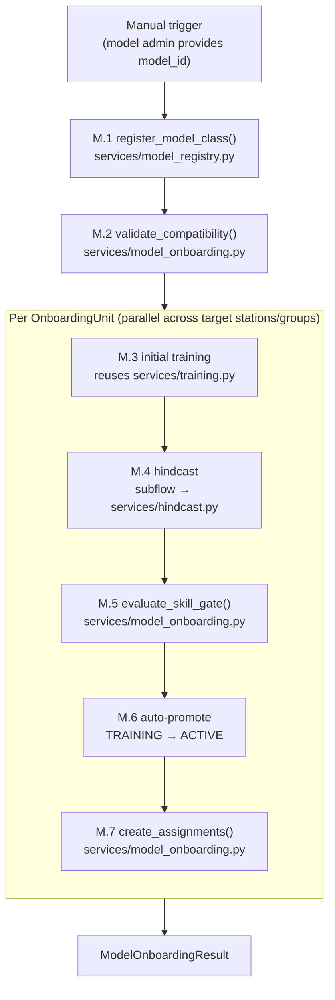

# v0 Flow 13 — Model Onboarding

> Design for the model onboarding pipeline: the end-to-end process of introducing a new forecast
> model class into the system, validating it, training it, evaluating its skill, and assigning it
> to stations. Distinct from Flow 6 (initial training), which operates on already-onboarded models.

---

## 1. Scope and simplifications (v0)

Per `v0-scope.md` §A7 and §G:

| Aspect | Full design (architecture-context.md) | v0 simplification |
|--------|---------------------------------------|-------------------|
| Approval gate | `PENDING_APPROVAL` status between training and promotion | Deferred. v0 auto-promotes (TRAINING → ACTIVE). `PENDING_APPROVAL` added later. |
| Cloud training | Dedicated training work pool with GPU resource labels | Single `default` pool. Work pool routing annotation is in place; execution is local. |
| Group assignment | `GroupModelAssignment` persisted via dedicated store method | Implemented as `station_group_assignments` table rows via `StationGroupStore`. |
| Compatibility check | Protocol conformance + feature availability + time step | Full compatibility check. No hardware checks. |
| Skill gate thresholds | Per-deployment configuration | Stored in `DeploymentConfig`. Numeric thresholds only (no percentile-relative gates in v0). |
| Multi-target predictions | `predict()` returns `dict[str, ForecastEnsemble]` | Implemented. Single-target models return a one-entry dict. |
| `forecast_targets` on station | `Literal["discharge", "water_level", "both"] \| None` | Replaced with `frozenset[str] \| None` (open set, not a fixed Literal). |

### What v0 implements

```
M.1 Registration → M.2 Compatibility check → M.3 Initial training →
M.4 Hindcast → M.5 Skill gate → M.6 Promotion → M.7 Station/group assignment
```



---

## 2. What already exists

| Layer | Status | Key files |
|-------|--------|-----------|
| Types (core model) | Complete | `types/model.py` (`TrainingData`, `GroupTrainingData`, `ModelInputs`, `ModelRecord`, `ModelRegistryEntry`, `ModelArtifactRecord`) |
| Types (training) | Complete | `types/training.py` (`TrainingUnit`, `TrainingScope`, `TrainingResult`, `HindcastStepResult`) |
| Types (station) | Complete | `types/station.py` (`ModelAssignment`, `StationGroup`, `StationConfig`) |
| Types (ensemble) | Complete | `types/ensemble.py` (`ForecastEnsemble` with `parameter: str` field) |
| Protocols (model) | Exists — **needs update** | `protocols/forecast_model.py` (`StationForecastModel`, `GroupForecastModel`) — `required_features` / `required_static_attributes` replaced by `data_requirements`, `predict()` return type widens |
| Protocols (stores) | Exists — **needs extension** | `protocols/stores.py` — needs `GroupModelAssignmentStore` |
| DB schema | Complete | `db/metadata.py` |
| Services (registry) | Complete | `services/model_registry.py` |
| Services (training) | Complete | `services/training.py` |
| Services (hindcast) | Complete | `services/hindcast.py` |
| Services (skill) | Complete | `services/skill/` |
| Fakes | Exists — **needs extension** | `tests/fakes/` |
| Factories | Exists — **needs extension** | `tests/conftest.py` |
| Config | Complete | `config/deployment.py` (`DeploymentConfig`) |
| Services (onboarding) | **Missing** | No `services/model_onboarding.py` |
| Flow (onboarding) | **Missing** | No `flows/onboard_model.py` |
| Sample model | **Missing** | No model implementations |

---

## 3. New types needed

### 3a. `StationInputData` and `StationModelInputs` (types/model.py — replaces `ModelInputs`)

The 4-slot input container. See §4 for full rationale.

```python
@dataclass(frozen=True, kw_only=True, slots=True)
class StationInputData:
    past_targets: pl.DataFrame      # wide: [timestamp, param1, param2, ...]
    past_dynamic: pl.DataFrame      # wide: [timestamp, precip, temp, ...]
    future_dynamic: pl.DataFrame    # wide: [timestamp, precip, temp, ...]
    static: pl.DataFrame | None     # single-row: [attr1, attr2, ...]


@dataclass(frozen=True, kw_only=True, slots=True)
class StationModelInputs:
    station_id: StationId
    data: StationInputData
    issue_time: UtcDatetime
    forecast_horizon_steps: int
    time_step: timedelta
```

### 3b. `GroupModelInputs` (types/model.py)

Stacked format for group models. Carries all stations in a single set of DataFrames (batch-efficient). The `.for_station()` accessor extracts single-station slices for per-station operations.

```python
@dataclass(frozen=True, kw_only=True, slots=True)
class GroupModelInputs:
    group_id: StationGroupId
    station_ids: tuple[StationId, ...]
    past_targets: pl.DataFrame      # [timestamp, station_id, param1, ...]
    past_dynamic: pl.DataFrame      # [timestamp, station_id, precip, temp, ...]
    future_dynamic: pl.DataFrame    # [timestamp, station_id, precip, temp, ...]
    static: pl.DataFrame | None     # [station_id, attr1, attr2, ...] — N rows
    issue_time: UtcDatetime
    forecast_horizon_steps: int
    time_step: timedelta

    def for_station(self, station_id: StationId) -> StationInputData:
        """Extract single-station slices from stacked DataFrames."""
```

### 3c. `StationTrainingData` and `GroupTrainingData` (types/model.py — replaces `TrainingData` and `GroupTrainingData`)

Training data mirrors the input container structure.

```python
@dataclass(frozen=True, kw_only=True, slots=True)
class StationTrainingData:
    past_targets: pl.DataFrame      # wide: [timestamp, param1, param2, ...]
    past_dynamic: pl.DataFrame      # wide: [timestamp, precip, temp, ...]
    future_dynamic: pl.DataFrame    # wide: [timestamp, precip, temp, ...]
    static: pl.DataFrame | None     # single-row: [attr1, attr2, ...]
    time_step: timedelta
    val_start: UtcDatetime | None


@dataclass(frozen=True, kw_only=True, slots=True)
class GroupTrainingData:
    group_id: StationGroupId
    station_ids: tuple[StationId, ...]
    past_targets: pl.DataFrame      # [timestamp, station_id, param1, ...]
    past_dynamic: pl.DataFrame      # [timestamp, station_id, precip, temp, ...]
    future_dynamic: pl.DataFrame    # [timestamp, station_id, precip, temp, ...]
    static: pl.DataFrame | None     # [station_id, attr1, attr2, ...] — N rows
    time_step: timedelta
    val_start: UtcDatetime | None

    def for_station(self, station_id: StationId) -> StationTrainingData:
        """Extract single-station slices from stacked DataFrames."""
```

**Migration note**: The existing `TrainingData` and `GroupTrainingData` (with `forcing`, `observations`, `targets` fields) are replaced by these types. All existing callers — `services/training_data.py`, `services/hindcast.py`, `protocols/forecast_model.py` — are updated as part of this work.

### 3d. `ModelDataRequirements` (types/model.py)

Replaces the four separate Protocol attributes (`required_features`, `required_static_attributes`, `spatial_input_type`, `supported_time_steps`) with a single composable requirements object.

```python
@dataclass(frozen=True, kw_only=True, slots=True)
class ModelDataRequirements:
    target_parameters: frozenset[str]           # e.g. frozenset({"discharge"})
    past_dynamic_features: frozenset[str]       # e.g. frozenset({"precipitation", "temperature"})
    future_dynamic_features: frozenset[str]     # e.g. frozenset({"precipitation", "temperature"})
    static_features: frozenset[str]             # e.g. frozenset({"area", "slope_mean"})
    supported_time_steps: frozenset[timedelta]
    lookback_steps: int
    spatial_input_type: SpatialRepresentation
```

**Rationale**: Previously `ModelRegistryEntry` repeated four fields from the Protocol. `ModelDataRequirements` makes the contract explicit, keeps the registry entry and Protocol in sync, and gives services a single object to validate against station/group data availability.

### 3e. `GroupModelAssignment` (types/station.py)

Parallel to `ModelAssignment` (per-station), this covers group-scoped model assignments.

```python
@dataclass(frozen=True, kw_only=True, slots=True)
class GroupModelAssignment:
    group_id: StationGroupId
    model_id: ModelId
    time_step: timedelta
    status: ModelAssignmentStatus
    priority: int
    created_at: UtcDatetime
```

### 3f. Model onboarding result types (types/model_onboarding.py — new file)

```python
@dataclass(frozen=True, kw_only=True, slots=True)
class CompatibilityReport:
    model_id: ModelId
    protocol_conforms: bool
    missing_target_parameters: frozenset[str]   # params station needs but model can't provide
    missing_past_dynamic: frozenset[str]         # features model needs but station lacks
    missing_future_dynamic: frozenset[str]
    missing_static_features: frozenset[str]
    time_step_compatible: bool
    compatible: bool                             # True iff all checks pass


@dataclass(frozen=True, kw_only=True, slots=True)
class SkillGateResult:
    model_id: ModelId
    station_id: StationId | None
    group_id: StationGroupId | None
    passed: bool
    metric_scores: dict[str, float]             # metric_name → score
    thresholds: dict[str, float]                # metric_name → required threshold
    failing_metrics: frozenset[str]             # metrics that did not meet threshold


@dataclass(frozen=True, kw_only=True, slots=True)
class OnboardingUnit:
    model_id: ModelId
    station_id: StationId | None
    group_id: StationGroupId | None
    station_ids: frozenset[StationId]           # 1 for station-scoped, N for group-scoped
    onboarding_period_start: UtcDatetime
    onboarding_period_end: UtcDatetime
    time_step: timedelta

    def __post_init__(self) -> None:
        if (self.station_id is None) == (self.group_id is None):
            raise ValueError("Exactly one of station_id / group_id must be set")


@dataclass(frozen=True, kw_only=True, slots=True)
class OnboardingUnitResult:
    unit: OnboardingUnit
    compatibility: CompatibilityReport
    artifact_id: ArtifactId | None
    hindcast_steps: list[HindcastStepResult]
    skill_gate: SkillGateResult | None
    promoted: bool
    assigned: bool
    error: str | None = None


@dataclass(frozen=True, kw_only=True, slots=True)
class ModelOnboardingResult:
    model_id: ModelId
    units: tuple[OnboardingUnitResult, ...]
    total: int
    promoted: int
    skipped: int                                # compatibility failures
    failed: int                                 # training/hindcast errors
```

### 3g. `StationConfig.forecast_targets` (types/station.py)

The `forecast_target: Literal["discharge", "water_level", "both"] | None` field is replaced:

```python
forecast_targets: frozenset[str] | None
```

This aligns with `ModelDataRequirements.target_parameters` (also `frozenset[str]`) and removes the artificial constraint that only two named parameters are forecastable. The old field is removed; the DB column `forecast_target` is migrated in the same Alembic migration that adds the new column `forecast_targets` (JSONB array of strings).

---

## 4. Generalized input container design

### Rationale

The existing `ModelInputs` type conflates three distinct data roles:

- `forcing`: past weather (lookback) merged with future weather (forecast horizon) in one DataFrame
- `observations`: past observed values (the target signal)
- `static_attributes`: time-invariant basin attributes

This conflation forces models to re-split forcing into past/future inside their `predict()` implementations. NeuralHydrology, PyTorch Forecasting, and Darts all converge on the same 4-slot contract because it maps directly to how sequence models consume data: lookback encoder (past_targets + past_dynamic), horizon decoder (future_dynamic), and static context (static).

### 4-slot contract

| Slot | Role | Temporal extent | Notes |
|------|------|----------------|-------|
| `past_targets` | Observed target values (discharge, water level, …) | `[issue_time - lookback_steps*dt, issue_time]` | Wide: one column per parameter |
| `past_dynamic` | Historical weather covariates | Same lookback window | Wide: one column per feature |
| `future_dynamic` | NWP forecast covariates | `(issue_time, issue_time + horizon*dt]` | Wide: one column per feature |
| `static` | Time-invariant basin attributes | N/A (single row) | None if model has no static features |

### Stacked format for group models

`GroupModelInputs` uses the same 4 slots but with a `station_id` column prepended to every DataFrame. All stations share the same timestamp range — data gaps are NaN rows rather than missing rows.

**Tensor creation path** (for ML models):

```python
# Sort consistently before tensor ops
df = inputs.past_dynamic.sort(["timestamp", "station_id"])
arr = df.select(feature_cols).to_numpy()           # (n_stations * seq_len, n_features)
tensor = arr.reshape(n_stations, seq_len, n_features)  # zero-copy reshape
```

One `.to_numpy()` call, one reshape. No per-station loops in the hot path.

### `.for_station()` accessor

`GroupModelInputs.for_station(station_id)` filters each stacked DataFrame to rows matching `station_id`, drops the `station_id` column, and returns a `StationInputData`. Used by:

- Station-level diagnostics and logging
- Single-station prediction fallback when batch fails
- Test assertions

---

## 5. Protocol changes

### 5a. `StationForecastModel` (protocols/forecast_model.py)

```python
@runtime_checkable
class StationForecastModel(Protocol):
    artifact_scope: ArtifactScope          # must equal ArtifactScope.STATION
    data_requirements: ModelDataRequirements

    def train(
        self,
        data: StationTrainingData,
        params: ModelParams,
        rng: random.Random,
    ) -> ModelArtifact: ...

    def predict(
        self,
        artifact: ModelArtifact,
        inputs: StationModelInputs,
        rng: random.Random,
        prior_state: bytes | None = None,
    ) -> tuple[dict[str, ForecastEnsemble], bytes | None]: ...

    def serialize_artifact(self, artifact: ModelArtifact) -> bytes: ...
    def deserialize_artifact(self, raw: bytes) -> ModelArtifact: ...
```

**Key changes vs current**:
- `required_features`, `required_static_attributes`, `spatial_input_type`, `supported_time_steps` → `data_requirements: ModelDataRequirements`
- `train(data: TrainingData, ...)` → `train(data: StationTrainingData, ...)`
- `predict(inputs: ModelInputs, ...)` → `predict(inputs: StationModelInputs, ...)`
- `predict()` returns `tuple[dict[str, ForecastEnsemble], bytes | None]` (multi-target dict, keyed by parameter name)

### 5b. `GroupForecastModel` (protocols/forecast_model.py)

```python
@runtime_checkable
class GroupForecastModel(Protocol):
    artifact_scope: ArtifactScope          # must equal ArtifactScope.GROUP
    data_requirements: ModelDataRequirements

    def train(
        self,
        data: GroupTrainingData,
        params: ModelParams,
        rng: random.Random,
    ) -> ModelArtifact: ...

    def predict_batch(
        self,
        artifact: ModelArtifact,
        inputs: GroupModelInputs,
        rng: random.Random,
    ) -> dict[StationId, tuple[dict[str, ForecastEnsemble], bytes | None]]: ...

    def serialize_artifact(self, artifact: ModelArtifact) -> bytes: ...
    def deserialize_artifact(self, raw: bytes) -> ModelArtifact: ...
```

**Key changes vs current**:
- Same attribute consolidation as `StationForecastModel`
- `predict_batch(inputs: dict[StationId, ModelInputs], ...)` → `predict_batch(inputs: GroupModelInputs, ...)`
- `predict_batch()` returns `dict[StationId, tuple[dict[str, ForecastEnsemble], bytes | None]]`

### 5c. `ModelRegistryEntry` (types/model.py)

`required_features`, `required_static_attributes`, `spatial_input_type`, and `supported_time_steps` are replaced by `data_requirements: ModelDataRequirements`. All consumers update accordingly.

---

## 6. Service layer design

### Layering principle

Same as the training pipeline design: services are pure Python with injected dependencies. Only `flows/` imports Prefect.

```
flows/onboard_model.py     ← Prefect @flow/@task, dependency wiring
  ↓
services/model_onboarding.py  ← Pure Python, composes existing services
  ↓
services/{registry, training, hindcast, skill/}  ← existing services
  ↓
protocols/  ← injected
```

### 6a. Compatibility validation (services/model_onboarding.py)

```python
def validate_compatibility(
    model: ForecastModel,
    station_config: StationConfig,
    available_features: frozenset[str],          # from HistoricalForcingStore or config
    available_static: frozenset[str],            # from basin.attributes keys
    requested_time_step: timedelta,
) -> CompatibilityReport:
```

**Logic**:
1. Protocol conformance: `isinstance(model, StationForecastModel | GroupForecastModel)`
2. Target parameter check: `model.data_requirements.target_parameters ⊆ station.forecast_targets`
3. Past dynamic check: `model.data_requirements.past_dynamic_features ⊆ available_features`
4. Future dynamic check: `model.data_requirements.future_dynamic_features ⊆ available_features`
5. Static check: `model.data_requirements.static_features ⊆ available_static`
6. Time step check: `requested_time_step ∈ model.data_requirements.supported_time_steps`
7. `compatible = True` iff all checks pass

### 6b. Skill gate evaluation (services/model_onboarding.py)

```python
def evaluate_skill_gate(
    station_id: StationId | None,
    group_id: StationGroupId | None,
    model_id: ModelId,
    artifact_id: ArtifactId,
    skill_store: SkillStore,
    config: DeploymentConfig,
) -> SkillGateResult:
```

**Logic**:
1. Fetch `SkillScore` records for `(model_id, artifact_id)` from `skill_store`
2. Filter to `sample_size >= config.min_skill_samples` (strata with too few pairs excluded)
3. For each metric in `config.skill_gate_thresholds`, compute mean score across valid strata
4. `passed = True` iff all gated metrics meet their threshold
5. Returns scores and which metrics failed

**`DeploymentConfig` additions**:

```python
skill_gate_thresholds: dict[str, float]  # metric_name → minimum required score
# e.g. {"nse": 0.3, "crpss": 0.0}       # non-negative skill relative to climatology
```

### 6c. Assignment creation (services/model_onboarding.py)

```python
def create_station_assignment(
    station_id: StationId,
    model_id: ModelId,
    time_step: timedelta,
    priority: int,
    station_store: StationStore,
    clock: Callable[[], UtcDatetime],
) -> ModelAssignment:

def create_group_assignment(
    group_id: StationGroupId,
    model_id: ModelId,
    time_step: timedelta,
    priority: int,
    group_store: StationGroupStore,
    clock: Callable[[], UtcDatetime],
) -> GroupModelAssignment:
```

Both upsert via the respective store. If an assignment already exists for the (station/group, model) pair with the same `time_step`, it is updated to `ACTIVE` status rather than duplicated.

### 6d. Top-level onboarding service (services/model_onboarding.py)

```python
def onboard_model(
    model_id: ModelId,
    model: ForecastModel,
    units: list[OnboardingUnit],
    model_store: ModelStore,
    station_store: StationStore,
    group_store: StationGroupStore,
    artifact_store: ModelArtifactStore,
    obs_store: ObservationStore,
    basin_store: BasinStore,
    hindcast_store: HindcastStore,
    skill_store: SkillStore,
    flow_regime_store: FlowRegimeConfigStore,
    forcing_source: WeatherReanalysisSource,
    config: DeploymentConfig,
    clock: Callable[[], UtcDatetime],
    rng: random.Random,
) -> ModelOnboardingResult:
```

**Orchestration**:

```
For each unit in units (parallelized at flow layer):
  1. validate_compatibility()                    # fast — pure logic
     → skip unit if not compatible
  2. assemble_training_data()                    # existing service
     → skip unit if returns None
  3. train_{station|group}_model()               # existing service
  4. store_and_promote_artifact()                # existing service (auto-promote)
  5. run_{station|group}_hindcast()              # existing service
  6. compute_skill_for_station()                 # existing service (per station in group)
  7. evaluate_skill_gate()
     → skip assignment if gate fails (artifact remains ACTIVE, not assigned)
  8. create_{station|group}_assignment()
```

**Composing existing services**: `onboard_model` is a thin orchestrator. Steps 2–6 delegate entirely to `services/training_data.py`, `services/training.py`, `services/hindcast.py`, and `services/skill/`. No new algorithmic logic lives in `model_onboarding.py` beyond the three new functions (steps 1, 7, 8).

---

## 7. Sample model — `LinearRegressionDaily`

Provides a concrete, immediately testable `StationForecastModel` implementation that validates the full onboarding pipeline from day one.

### Specification

| Property | Value |
|----------|-------|
| Entry point name | `linear_regression_daily` |
| Scope | `ArtifactScope.STATION` |
| Time steps | `{timedelta(hours=24)}` |
| Target parameters | `frozenset({"discharge"})` |
| Past dynamic features | `frozenset({"precipitation", "temperature"})` |
| Future dynamic features | `frozenset({"precipitation", "temperature"})` |
| Static features | `frozenset()` (none required) |
| Lookback steps | 7 (7 days lookback) |
| Spatial input type | `SpatialRepresentation.POINT` |

### Algorithm

- **Training**: Fit a scikit-learn `Ridge` regressor. Feature matrix = lagged precipitation + temperature (past 7 days) concatenated with forecast precipitation + temperature (next `horizon_steps` days). Target = observed discharge at each forecast step. One regressor fitted per forecast step (direct multi-step strategy).
- **Ensemble**: Pseudo-ensemble via residual bootstrapping. Compute training residuals → resample with replacement to generate `n_members=50` perturbations → add to deterministic prediction. RNG is seeded from the injected `random.Random` for reproducibility.
- **Artifact**: Serialized as `pickle` (list of fitted `Ridge` instances, one per step) + metadata dict. Total artifact size < 100 KB for 120-step horizon.

### File location

`src/sapphire_flow/models/linear_regression_daily.py`

### pyproject.toml entry point

```toml
[project.entry-points."sapphire_flow.models"]
linear_regression_daily = "sapphire_flow.models.linear_regression_daily:LinearRegressionDaily"
```

---

## 8. Prefect flow (flows/onboard_model.py)

```python
@flow(name="onboard-model")
def onboard_model_flow(
    model_id: str,
    station_ids: list[str] | None = None,      # None = all operational stations
    group_ids: list[str] | None = None,        # None = all groups for group-scoped models
    period_start: str | None = None,           # ISO 8601; defaults to 2 years ago
    period_end: str | None = None,             # ISO 8601; defaults to now
    time_step_hours: int = 24,
    assignment_priority: int = 10,
) -> ModelOnboardingResult:
```

**Task structure**:

```python
@task(name="register-model-class")
def register_model_class_task(model_id: ModelId, ...) -> ModelRegistryEntry: ...

@task(name="validate-compatibility")
def validate_compatibility_task(unit: OnboardingUnit, ...) -> CompatibilityReport: ...

@task(name="assemble-onboarding-data")
def assemble_onboarding_data_task(unit: OnboardingUnit, ...) -> StationTrainingData | GroupTrainingData | None: ...

@task(name="train-onboarding-model")
def train_onboarding_model_task(unit: OnboardingUnit, data: ..., ...) -> ArtifactId: ...

@task(name="evaluate-skill-gate")
def evaluate_skill_gate_task(unit: OnboardingUnit, artifact_id: ArtifactId, ...) -> SkillGateResult: ...

@task(name="create-assignment")
def create_assignment_task(unit: OnboardingUnit, ...) -> None: ...
```

Hindcast and skill computation delegate to the existing `run_hindcast` and `compute_skills` subflows (same as `train_models`).

**Fan-out**: Units are parallelized via `task.map()` or a `for unit in units` loop with each step submitted as a task. Compatibility and data assembly run first (fast, serial acceptable for v0 scale). Training tasks fan out across units.

**Dependency injection pattern**: identical to `flows/train_models.py` — concrete stores and adapters are constructed in the flow body and passed to service functions.

---

## 9. Cloud training via work pool routing

For large models (LSTM, transformer-based), training may require GPU resources not available in the default Docker Compose worker. The architecture supports work pool routing without adding new Protocols.

### v0 annotation (not yet active)

Each Prefect task that calls a training function annotates its preferred work pool:

```python
@task(name="train-onboarding-model", task_run_name="{unit.model_id}")
def train_onboarding_model_task(...) -> ArtifactId:
    # v0: runs on default pool
    # v1: route to gpu_training pool when model.data_requirements.spatial_input_type
    #     requires GPU (determined by a model capability flag)
    ...
```

### v1 routing plan

`ModelDataRequirements` gains a `compute_backend: Literal["cpu", "gpu"] = "cpu"` field. The flow checks this field and routes to a `gpu_training` work pool via `with_options(work_pool_name=...)`. No Protocol changes required — routing logic stays in the flow layer.

### v0 note

All training in v0 runs on the single `default` pool (CPU). The `gpu_training` pool is not created. The routing annotation serves as documentation for v1.

---

## 10. Consistency checks against existing design

### Alignment with architecture-context.md

| architecture-context.md says | This design | Notes |
|------------------------------|-------------|-------|
| Flow 5 step 5.6: configure model assignments | M.7 `create_assignment()` | Onboarding creates assignments after skill gate passes |
| Flow 5 step 5.7: trigger training (Flow 6) | M.3 initial training | Onboarding composes same training services as Flow 6 |
| Flow 5 step 5.8: auto-promote in v0 | M.6 auto-promote | Implemented via existing `store_and_promote_artifact()` |
| Flow 6 T.1–T.5 pipeline | Reused in M.3–M.5 | No duplication: onboarding calls the same service functions |
| `model_assignments` table | `ModelAssignment` persisted via `StationStore` | ✓ |
| `model_artifacts.status` enum | `training \| active \| superseded` (v0) | ✓ `pending_approval` deferred |

### Alignment with existing types

| Type | Location | Change | Notes |
|------|----------|--------|-------|
| `TrainingData` | `types/model.py` | Replaced by `StationTrainingData` | Same data, restructured slots |
| `GroupTrainingData` | `types/model.py` | Replaced (same name, new structure) | Stacked format |
| `ModelInputs` | `types/model.py` | Replaced by `StationModelInputs` + `StationInputData` | |
| `ModelRegistryEntry` | `types/model.py` | `data_requirements` replaces 4 fields | |
| `ModelAssignment` | `types/station.py` | Unchanged | Per-station |
| `StationGroup` | `types/station.py` | Unchanged | |
| `ForecastEnsemble` | `types/ensemble.py` | Unchanged — `parameter: str` already present | `predict()` now returns a dict keyed by this field |
| `StationConfig` | `types/station.py` | `forecast_target` → `forecast_targets: frozenset[str] \| None` | DB migration required |

### Alignment with existing Protocols (stores)

| Protocol method | Used by | Consistent? |
|-----------------|---------|-------------|
| `ModelStore.register_model()` | M.1 | ✓ |
| `ModelArtifactStore.store_artifact()` | M.3 (via training.py) | ✓ |
| `ModelArtifactStore.fetch_artifacts_by_status()` | M.3 auto-promote | ✓ |
| `ModelArtifactStore.transition_artifact_status()` | M.3 auto-promote | ✓ |
| `HindcastStore.store_hindcast()` | M.4 (via hindcast.py) | ✓ |
| `SkillStore.fetch_skill_scores()` | M.5 gate evaluation | ✓ Needs `fetch_skill_scores(model_id, artifact_id)` overload |
| `StationStore.store_model_assignment()` | M.7 | ✓ Store method exists |
| `StationGroupStore.store_group_assignment()` | M.7 | Needs `store_group_assignment(GroupModelAssignment)` added |

### Protocol method gaps

Two store methods need adding to existing Protocols (not new Protocols):

| Method | Protocol | Notes |
|--------|----------|-------|
| `fetch_skill_scores(model_id, artifact_id)` | `SkillStore` | M.5 reads skill scores for gate evaluation |
| `store_group_assignment(assignment)` | `StationGroupStore` | M.7 persists group-level assignment |

### DB schema alignment

| Table | Usage | Consistent? |
|-------|-------|-------------|
| `models` | M.1 writes | ✓ |
| `model_artifacts` | M.3–M.6 | ✓ `status` enum, `promoted_at` |
| `model_assignments` | M.7 writes | ✓ New row per assignment |
| `station_groups` / `station_group_members` | Group-scoped paths | ✓ |
| `skill_scores` | M.5 reads | ✓ `(model_id, artifact_id)` queryable |
| `stations.forecast_target` | M.2 target check | Migrated to `forecast_targets` (JSONB) |

---

## 11. Implementation phases

```json
{
  "phases": {
    "P1": { "name": "Docs update (v0-scope.md, types-and-protocols.md)", "depends_on": [] },
    "P2": { "name": "types/model.py — StationInputData, StationModelInputs, GroupModelInputs, StationTrainingData, GroupTrainingData (with for_station), ModelDataRequirements; remove old ModelInputs/TrainingData", "depends_on": [] },
    "P3": { "name": "types/station.py — GroupModelAssignment; StationConfig.forecast_targets; remove forecast_target Literal", "depends_on": [] },
    "P4": { "name": "types/model_onboarding.py — CompatibilityReport, SkillGateResult, OnboardingUnit, OnboardingUnitResult, ModelOnboardingResult", "depends_on": [] },
    "P5": { "name": "protocols/forecast_model.py — data_requirements replaces 4 attrs; updated train/predict signatures", "depends_on": ["P2", "P3"] },
    "P6": { "name": "protocols/stores.py — add fetch_skill_scores(model_id, artifact_id) to SkillStore; add store_group_assignment to StationGroupStore", "depends_on": ["P3"] },
    "P7": { "name": "tests/fakes/ — update FakeStationForecastModel, FakeGroupForecastModel for new Protocol; add FakeStationGroupStore.store_group_assignment; add FakeSkillStore.fetch_skill_scores", "depends_on": ["P5", "P6"] },
    "P8": { "name": "tests/conftest.py — add make_station_input_data, make_group_model_inputs, make_station_training_data, make_onboarding_unit, make_compatibility_report factories", "depends_on": ["P2", "P3", "P4"] },
    "P9": { "name": "services/training_data.py — update to return StationTrainingData / GroupTrainingData", "depends_on": ["P7", "P8"] },
    "P10": { "name": "services/hindcast.py — update to use StationModelInputs / GroupModelInputs; update _assemble_hindcast_inputs", "depends_on": ["P7", "P8"] },
    "P11": { "name": "services/training.py — update train_station_model / train_group_model signatures", "depends_on": ["P7", "P8"] },
    "P12": { "name": "services/model_registry.py — update build_registry_entry to use ModelDataRequirements", "depends_on": ["P9", "P10", "P11"] },
    "P13": { "name": "services/scope.py — update assemble_training_scope to use data_requirements", "depends_on": ["P9", "P10", "P11"] },
    "P14": { "name": "models/linear_regression_daily.py — full StationForecastModel implementation", "depends_on": ["P5"] },
    "P15": { "name": "pyproject.toml — linear_regression_daily entry point; DB migration for forecast_targets column", "depends_on": ["P3", "P14"] },
    "P16": { "name": "services/model_onboarding.py — validate_compatibility, evaluate_skill_gate, create_assignment, onboard_model", "depends_on": ["P12", "P13"] },
    "P17": { "name": "flows/onboard_model.py — @flow + @task wrappers, dependency injection", "depends_on": ["P16"] },
    "P18": { "name": "Update existing tests broken by Protocol/type changes (test_training.py, test_hindcast.py, test_scope.py)", "depends_on": ["P9", "P10", "P11", "P12", "P13"] },
    "P19": { "name": "New tests: test_model_onboarding.py (compatibility, skill gate, full onboard), test_linear_regression_daily.py", "depends_on": ["P16", "P17", "P14"] }
  },
  "execution_waves": {
    "wave_1": ["P1", "P2", "P3", "P4"],
    "wave_2": ["P5", "P6"],
    "wave_3": ["P7", "P8"],
    "wave_4": ["P9", "P10", "P11"],
    "wave_5": ["P12", "P13"],
    "wave_6": ["P14", "P15"],
    "wave_7": ["P16", "P17"],
    "wave_8": ["P18", "P19"]
  }
}
```

### Phase summary

| Phase | Creates / modifies | Tests |
|-------|-------------------|-------|
| P1 | `docs/v0-scope.md` (Flow 13 entry), `docs/spec/types-and-protocols.md` | — |
| P2 | `types/model.py` — new input/training container types, `ModelDataRequirements`, remove old types | `__post_init__` field validations, `for_station()` slicing |
| P3 | `types/station.py` — `GroupModelAssignment`, `forecast_targets` field | Dataclass field types |
| P4 | `types/model_onboarding.py` — all result/report types | XOR invariant on `OnboardingUnit`, `CompatibilityReport.compatible` logic |
| P5 | `protocols/forecast_model.py` — updated signatures | Protocol conformance check on `LinearRegressionDaily` placeholder |
| P6 | `protocols/stores.py` — two new Protocol methods | — |
| P7 | `tests/fakes/` — updated and new fakes | Fake conformance with updated Protocols |
| P8 | `tests/conftest.py` — new factory functions | Factory output conforms to types |
| P9 | `services/training_data.py` | Happy path, missing features → None, partial group |
| P10 | `services/hindcast.py` | No-future-leakage, data gap skip, multi-target output |
| P11 | `services/training.py` | Artifact lifecycle with new input types |
| P12 | `services/model_registry.py` | Entry discovery, `data_requirements` population |
| P13 | `services/scope.py` | All filter combos, unassigned excluded |
| P14 | `models/linear_regression_daily.py` | Train/predict/serialize round-trip, ensemble size, residual bootstrap |
| P15 | `pyproject.toml`, Alembic migration | Entry point discoverable via `importlib.metadata` |
| P16 | `services/model_onboarding.py` | Compatibility logic (all failure modes), skill gate pass/fail, assignment upsert |
| P17 | `flows/onboard_model.py` | Flow callable with fakes, full unit result shape |
| P18 | Updated existing tests | All previously passing tests green |
| P19 | `tests/unit/test_model_onboarding.py`, `tests/unit/test_linear_regression_daily.py` | Happy path end-to-end with fakes; compatibility failures; gate threshold boundary |

---

## 12. Open questions

### Resolved by this design

1. **`ModelInputs` vs 4-slot container** → `StationInputData` / `StationModelInputs` with explicit past_targets / past_dynamic / future_dynamic / static slots. Old `ModelInputs` removed.

2. **Multi-target support in `predict()`** → returns `dict[str, ForecastEnsemble]` keyed by parameter name. `ForecastEnsemble.parameter` already present. Single-target models return a one-entry dict.

3. **`required_features` proliferation** → consolidated into `ModelDataRequirements`. Protocol has one attribute; registry entry has one field.

4. **Group inputs format** → stacked DataFrames (Option 3 hybrid) with `.for_station()` accessor. Tensor creation is one `.to_numpy()` + reshape.

5. **Skill gate configuration** → `DeploymentConfig.skill_gate_thresholds: dict[str, float]`. Lives alongside existing `min_skill_samples`.

6. **v0a skips static attributes** → `static_features = frozenset()` on `LinearRegressionDaily`. `StationTrainingData.static = None` when model requests no static features. No v0a/v0b branching needed in the service layer.

### Still open

1. **`forecast_targets` DB migration scope**: The `stations.forecast_target` column (Literal string) must be migrated to `forecast_targets` (JSONB string array). Existing data maps: `"discharge"` → `["discharge"]`, `"water_level"` → `["water_level"]`, `"both"` → `["discharge", "water_level"]`, `null` → `null`. The migration script is straightforward but must be written and tested before P15 merges.

2. **Skill gate defaults**: What should `DeploymentConfig.skill_gate_thresholds` default to? A sensible v0 default might be `{"nse": 0.0}` (non-negative NSE — model outperforms mean flow). Deliberately permissive to avoid blocking the first onboarding. Hydrologist input needed before this is locked.

3. **Assignment priority convention**: `assignment_priority` defaults to 10 in the flow. For stations onboarded with multiple models, priority determines forecast cycle model order. Convention (lower = higher priority? or higher = higher priority?) should be documented in `conventions.md`. Not blocking for single-model v0.
