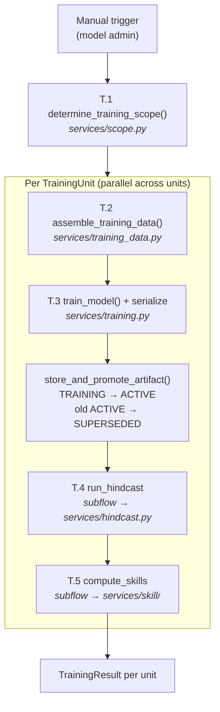
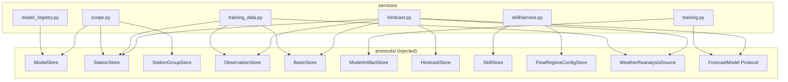
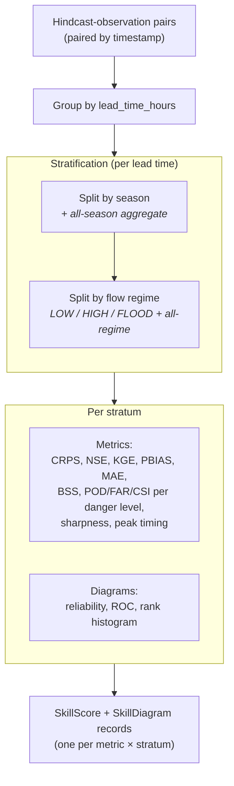

# v0 Training Pipeline — Design Overview

> High-level design for v0 Priority 3: model training (Flow 6), hindcast generation (Flow 7),
> and skill computation (Flow 8) using Swiss public data. Covers the service layer and Prefect
> flow orchestration needed to onboard forecast models end-to-end.

## 1. Scope and simplifications (v0)

Per `v0-scope.md` § A5 and § A7:

| Aspect | Full design (architecture-context.md) | v0 simplification |
|--------|---------------------------------------|-------------------|
| Artifact lifecycle | 5 statuses (training → pending_approval → active → superseded → rejected) | 3 statuses: `TRAINING` → `ACTIVE` (auto-promote). `ACTIVE` → `SUPERSEDED` when replaced. |
| Retraining comparison | T.6–T.8 (compare, request approval, promote/reject) | Skipped — auto-promote on initial training. Flow 9 deferred. |
| Work pools | 3 pools (ops, training, hindcast) | Single `default` pool |
| Forcing source | Configurable (station obs, reanalysis, NWP archive) | SMN station observations as pseudo-perfect forcing, tagged `ForcingType.REANALYSIS` |
| Skill metrics | Full suite | Full suite — kept as designed (pure computation, high research value) |
| `freshness` field | Set STALE on data change, reset to CURRENT by recomputation | Not exercised in v0 — no observation correction or NWP recovery flows. Field exists in schema. |
| Model params | Config-based override per model | Empty dict `{}` default. Models define internal defaults. |

### What v0 implements

```
Flow 6 (initial):  T.1 → T.2 → T.3 → auto-promote → T.4 (Flow 7) → T.5 (Flow 8)
Flow 7 (hindcast): H.1 → [per step: H.2–H.4 → H.5 → H.6]
Flow 8 (skill):    S.1 → S.2 + S.3 → S.4 → S.6
```

Steps T.6–T.8 (retraining comparison/approval) and S.5 (cross-station aggregation) are deferred.



---

## 2. What already exists

| Layer | Status | Key files |
|-------|--------|-----------|
| Types | Complete | `types/model.py` (TrainingData, GroupTrainingData, ModelInputs, ModelRecord, ModelRegistryEntry, ModelArtifactRecord), `types/skill.py` (SkillScore, SkillDiagram, FlowRegimeConfig), `types/forecast.py` (HindcastForecast), `types/station.py` (ModelAssignment, StationGroup) |
| Protocols | Complete | `protocols/forecast_model.py` (StationForecastModel, GroupForecastModel), `protocols/stores.py` (all store Protocols including HistoricalForcingStore), `protocols/adapters.py` (WeatherReanalysisSource — returns `list[RawHistoricalForcing]`) |
| DB schema | Complete | `db/metadata.py` (models, model_artifacts, hindcast_forecasts, skill_scores, etc.) |
| Fakes | Complete | `tests/fakes/fake_stores.py`, `tests/fakes/fake_models.py`, `tests/fakes/fake_adapters.py` |
| Factories | Complete | `tests/conftest.py` (make_station_config, make_observation(s), make_forecast_ensemble, make_model_artifact_record) |
| Config | Complete | `config/deployment.py` (DeploymentConfig with min_skill_samples, seasons, flow_regime percentiles) |
| Services | **Missing** | No `services/` directory exists |
| Flows | **Missing** | No `flows/` directory exists |

---

## 3. New types needed

### 3a. `TrainingUnit` (types/training.py)

Captures one (model × station) or (model × group) work item from scope determination.

```python
@dataclass(frozen=True, kw_only=True, slots=True)
class TrainingUnit:
    model_id: ModelId
    station_id: StationId | None       # set for STATION-scoped models
    group_id: StationGroupId | None    # set for GROUP-scoped models
    station_ids: frozenset[StationId]  # the stations involved (1 for station, N for group)
    training_period_start: UtcDatetime
    training_period_end: UtcDatetime
    time_step: timedelta
```

**XOR invariant**: Exactly one of `station_id` / `group_id` must be set. Enforced via `__post_init__`.

### 3b. `TrainingScope`

```python
@dataclass(frozen=True, kw_only=True, slots=True)
class TrainingScope:
    units: tuple[TrainingUnit, ...]
```

### 3c. `HindcastStepResult`

```python
@dataclass(frozen=True, kw_only=True, slots=True)
class HindcastStepResult:
    issue_time: UtcDatetime
    success: bool
    error: str | None = None
```

### 3d. `TrainingResult`

```python
@dataclass(frozen=True, kw_only=True, slots=True)
class TrainingResult:
    training_unit: TrainingUnit
    artifact_id: ArtifactId | None
    hindcast_steps: list[HindcastStepResult]
    skill_computed: bool
    error: str | None = None
```

---

## 4. Adapter implementation needed

### 4a. `WeatherReanalysisSource` concrete adapter (protocols/adapters.py)

The `WeatherReanalysisSource` Protocol already exists in `protocols/adapters.py`. What v0 needs is the **concrete adapter implementation**. In v0, this wraps co-located SMN weather station observations; v1 swaps to ERA5-Land. The Protocol returns `list[RawHistoricalForcing]` — a flat list of raw forcing records that callers group by station_id and convert to a `pl.DataFrame` as needed.

```python
class WeatherReanalysisSource(Protocol):
    def fetch_reanalysis(
        self,
        station_configs: list[StationWeatherSource],
        start: UtcDatetime,
        end: UtcDatetime,
        parameters: list[str],
    ) -> list[RawHistoricalForcing]: ...
```

**Persistence layer**: `HistoricalForcingStore` (defined in `protocols/stores.py`) is the complementary store Protocol. Forcing data is ingested once (during station onboarding or a separate ingest step) via `HistoricalForcingStore.store_forcing()` and retained permanently. The v0 concrete `SmNObservationForcingSource` adapter wraps `HistoricalForcingStore.fetch_forcing_as_dataframe()` internally — its `fetch_reanalysis()` reads from the DB, not from a live API. This means services take only `WeatherReanalysisSource` (the adapter) as a dependency; they do not need `HistoricalForcingStore` directly.

**v0 note**: v0 always produces the `pl.DataFrame` variant of forcing. The `xr.Dataset` path in `ModelInputs.forcing` is reserved for v1 gridded reanalysis.

**v0 implementation**: `FakeWeatherReanalysisSource` (canned `list[RawHistoricalForcing]` keyed by station_id). Production adapter wraps SMN observation queries — fetches co-located weather station data for the requested parameters and time range.

**v1 swap**: ERA5-Land adapter implementing the same Protocol — returns basin-average reanalysis as `list[RawHistoricalForcing]`.

---

## 5. FakeModelArtifactStore fix

The current `FakeModelArtifactStore.store_artifact()` auto-promotes to `ACTIVE` status. This must be fixed to store as `TRAINING` (with `promoted_at=None`) so the service's promotion logic is properly testable.

Additionally, `transition_artifact_status()` should set `promoted_at` when transitioning to `ACTIVE` and `superseded_at` when transitioning to `SUPERSEDED`, mirroring what the real PostgreSQL store would do.

---

## 6. Service layer design

### Layering principle

Services are pure Python with injected dependencies. Only `flows/` imports Prefect. Services testable without Prefect server.

```
flows/          ← Prefect @flow/@task decorators, dependency wiring
  ↓ calls
services/       ← Pure Python, injected deps (stores, adapters, clock, rng)
  ↓ calls
protocols/      ← Store/adapter/model Protocols (no implementation)
```



### 6a. Model Registry Service (services/model_registry.py)

Discovers models via Python entry points and registers in DB.

```python
def discover_models() -> dict[ModelId, ForecastModel]:
    """Scan `sapphire_flow.models` entry point group."""

def register_models(
    models: dict[ModelId, ForecastModel],
    store: ModelStore,
    clock: Callable[[], UtcDatetime],
) -> list[ModelRegistryEntry]:
    """Build ModelRegistryEntry from class attrs, upsert via store."""
```

**Entry point group**: `sapphire_flow.models`. Each entry point name becomes the `ModelId`. Models are classes satisfying `StationForecastModel` or `GroupForecastModel` Protocol.

**`display_name`**: Derived from the entry point name via title-casing (e.g. `lstm_daily` → `LSTM Daily`). Models may override with a `display_name` class attribute.

### 6b. Scope Determination Service (services/scope.py)

Implements T.1 / H.1. Determines which (model × station/group) pairs to train/hindcast.

```python
def determine_training_scope(
    model_ids: list[ModelId] | None,          # None = all registered models
    station_ids: list[StationId] | None,      # None = all operational stations
    group_ids: list[StationGroupId] | None,   # None = all groups
    period_start: UtcDatetime,
    period_end: UtcDatetime,
    time_step: timedelta,
    model_store: ModelStore,
    station_store: StationStore,
    group_store: StationGroupStore,
) -> TrainingScope:
```

**Logic**:
- If `model_ids` is None → `model_store.fetch_all_models()`
- For `STATION`-scoped models:
  - Get all stations via `station_store.fetch_all_stations()`
  - Skip non-operational (`station_status != OPERATIONAL`)
  - For each station, check `station_store.fetch_model_assignments(station_id)` — only produce a `TrainingUnit` if the model is assigned and active
  - Apply `station_ids` filter if provided
- For `GROUP`-scoped models:
  - Get groups via `group_store.fetch_groups_for_model(model_id)`
  - Apply `group_ids` filter if provided
  - One `TrainingUnit` per (model, group) with `station_ids = group.station_ids`

**Key decision**: `model_assignments` is the authoritative source for model → station mappings. A station without an active assignment for a model is excluded even if it passes all other filters.

### 6c. Training Data Assembly Service (services/training_data.py)

Implements T.2. Gathers `TrainingData` / `GroupTrainingData` for each training unit.

```python
def assemble_station_training_data(
    station_id: StationId,
    model_entry: ModelRegistryEntry,
    period_start: UtcDatetime,
    period_end: UtcDatetime,
    time_step: timedelta,
    forcing_source: WeatherReanalysisSource,
    obs_store: ObservationStore,
    basin_store: BasinStore,
    station_store: StationStore,
) -> TrainingData | None:
```

**Steps**:
1. Fetch QC-passed discharge observations for training period
2. Fetch forcing via `forcing_source.fetch_reanalysis()` for model's `data_requirements.past_dynamic_features | data_requirements.future_dynamic_features`
3. Load static attributes from `basin_store.fetch_basin(station.basin_id).attributes`
4. Validate `data_requirements.past_dynamic_features` (and `future_dynamic_features`) present in forcing columns
5. Validate `data_requirements.static_features` present in basin attributes
6. Return `None` + log warning if insufficient data

```python
def assemble_group_training_data(
    group: StationGroup,
    model_entry: ModelRegistryEntry,
    ...,
) -> GroupTrainingData | None:
```

Calls `assemble_station_training_data()` per station in group. Returns `None` if zero stations have sufficient data. Partial data (some stations missing) is OK — the group proceeds with available stations.

### 6d. Training Orchestration Service (services/training.py)

Implements T.3 + artifact promotion.

```python
def train_station_model(
    model: StationForecastModel,
    data: TrainingData,
    params: ModelParams,
    rng: random.Random,
) -> bytes:
    """Calls model.train() then model.serialize_artifact()."""

def train_group_model(
    model: GroupForecastModel,
    data: GroupTrainingData,
    params: ModelParams,
    rng: random.Random,
) -> bytes:

def store_and_promote_artifact(
    artifact_store: ModelArtifactStore,
    model_id: ModelId,
    artifact_bytes: bytes,
    period_start: UtcDatetime,
    period_end: UtcDatetime,
    clock: Callable[[], UtcDatetime],
    *,
    station_id: StationId | None = None,
    group_id: StationGroupId | None = None,
) -> ArtifactId:
```

**Promotion logic** (v0 auto-promote):
1. `store_artifact()` → creates record with `TRAINING` status
2. Find existing `ACTIVE` artifact for same scope → `transition_artifact_status(old, SUPERSEDED)`
3. `transition_artifact_status(new, ACTIVE)` with `promoted_at = clock()`

**Ordering matters**: Supersede old *before* promoting new. If step 3 fails, the old artifact is already superseded — but this is acceptable for v0 (manual recovery). v1 wraps in a DB transaction.

### 6e. Hindcast Service (services/hindcast.py)

Implements H.2–H.6. Simulates operational conditions over historical period.

```python
def run_station_hindcast(
    model: StationForecastModel,
    artifact: ModelArtifact,
    station_id: StationId,
    model_id: ModelId,
    artifact_id: ArtifactId,
    period_start: UtcDatetime,
    period_end: UtcDatetime,
    time_step: timedelta,
    forcing_source: WeatherReanalysisSource,
    obs_store: ObservationStore,
    basin_store: BasinStore,
    hindcast_store: HindcastStore,
    station_store: StationStore,
    clock: Callable[[], UtcDatetime],
    rng: random.Random,
    hindcast_run_id: UUID,
    forecast_horizon_steps: int = 120,
) -> list[HindcastStepResult]:

def run_group_hindcast(
    model: GroupForecastModel,
    artifact: ModelArtifact,
    group: StationGroup,
    ...,
) -> dict[StationId, list[HindcastStepResult]]:
```

**Per-step logic** (`_assemble_hindcast_inputs()`):
1. Temporal cutoff: forcing fetched only up to `issue_time` (NO future leakage)
2. Observations: fetched only up to `issue_time`
3. Lookback window: `issue_time - (lookback_steps × time_step)` to `issue_time`
4. Return `None` if data insufficient → step skipped, logged
5. No warm-up state carried between steps (cold start each step). For conceptual models, this means each step would need a fresh warm-up run from observations — deferred to when conceptual model implementations arrive. v0 targets ML models which are stateless.
6. Each step independently catchable — model exception → step skipped, others continue

**v0 simplification**: Forcing and observations are fetched per-step via store/adapter calls rather than pre-fetched in bulk (architecture-context.md H.2/H.3). Acceptable for v0 scale; v1 may batch-fetch for performance.

**No-future-leakage invariant**: This is the single most critical property of the hindcast service. All forcing and observation data must have timestamps ≤ `issue_time`. Tests must assert this explicitly with timestamp comparisons.

**Fault tolerance**: Each hindcast step is independent. Model failure or data gap at one step skips it (logged as `HindcastStepResult(success=False)`), remaining steps continue. The final result is a list of step results showing total/successful/failed.

### 6f. Skill Computation Service (services/skill/)

Implements S.2–S.6. Structured as a subpackage:

```
services/skill/
  __init__.py
  metrics.py    ← pure math functions (numpy only)
  diagrams.py   ← pure functions returning diagram data dicts
  service.py    ← orchestration: pairing, stratification, store writes
```

#### metrics.py — Pure functions

All functions operate on numpy arrays. No I/O, no external dependencies beyond numpy.

| Function | Inputs | Output | Notes |
|----------|--------|--------|-------|
| `compute_crps(ensemble, observed)` | 1D array, scalar | float | Implemented from scratch (~20 lines). Formula: E|X-y| - 0.5·E|X-X'| |
| `compute_crpss(crps, reference_crps)` | scalars | float | 1 - crps/reference_crps |
| `compute_nse(predicted, observed)` | 1D arrays | float | Nash-Sutcliffe Efficiency |
| `compute_kge(predicted, observed)` | 1D arrays | float | Kling-Gupta Efficiency |
| `compute_pbias(predicted, observed)` | 1D arrays | float | Percent bias |
| `compute_mae(predicted, observed)` | 1D arrays | float | Mean absolute error |
| `compute_bss(ensemble, observed, threshold)` | 2D, 1D, scalar | float | Brier Skill Score per danger level |
| `compute_contingency(ensemble, observed, threshold, decision_probability)` | 2D, 1D, scalars | (POD, FAR, CSI) | Contingency table metrics |
| `compute_peak_timing_error(predicted_median, observed, peak_threshold)` | 1D arrays, scalar | float \| None | None if no peaks found |
| `compute_sharpness(ensemble)` | 2D array | (p10_p90_width, p25_p75_width, ensemble_range) | Forecast-only metric (3 named values) |

**Why implement CRPS from scratch?** `properscoring` is abandoned since 2015 and has numpy compatibility risk. Ensemble CRPS is ~20 lines of numpy. All metric functions are pure with no external dependencies beyond numpy.

**CRPS formula**:
```python
def compute_crps(ensemble: np.ndarray, observed: float) -> float:
    n = len(ensemble)
    abs_diff = np.abs(ensemble - observed).mean()
    sorted_ens = np.sort(ensemble)
    spread = np.sum(np.abs(sorted_ens[:, None] - sorted_ens[None, :])) / (n * n)
    return abs_diff - 0.5 * spread
```

#### diagrams.py — Pure functions

| Function | Returns | Notes |
|----------|---------|-------|
| `compute_reliability_diagram(ensemble, observed, threshold, n_bins)` | `{"bins": [...], "observed_freq": [...], "forecast_freq": [...], "sample_counts": [...]}` | |
| `compute_roc_curve(ensemble, observed, threshold)` | `{"false_alarm_rate": [...], "hit_rate": [...], "thresholds": [...]}` | |
| `compute_rank_histogram(ensemble, observed)` | `{"ranks": [...], "counts": [...]}` | n_members + 1 bins |

#### service.py — Orchestration

```python
def compute_skill_for_station(
    station_id: StationId,
    model_id: ModelId,
    artifact_id: ArtifactId,
    hindcasts: list[HindcastForecast],
    observations: list[Observation],
    thresholds: list[StationThreshold],
    flow_regime_config: FlowRegimeConfig | None,
    seasons: list[SeasonDefinition],
    skill_source: SkillSource,
    forcing_type: ForcingType | None,
    parameter: str,
    clock: Callable[[], UtcDatetime],
    uuid_factory: Callable[[], UUID],
) -> tuple[list[SkillScore], list[SkillDiagram]]:
```

**Logic**:
1. Build observation lookup by timestamp
2. For each hindcast, pair with observation at each valid_time in the ensemble
3. Extract `lead_time_hours` from ensemble (valid_time − hindcast_step)
4. Stratify by: lead_time_hours × season × flow_regime
5. For each stratum, compute all metrics
6. Build `SkillScore` records (one per metric × stratum). Each `SkillScore` includes `sample_size` — the count of forecast-observation pairs in the stratum. Required for `min_skill_samples` threshold in `DeploymentConfig`.
7. Build `SkillDiagram` records for relevant strata
8. Use `computation_version = 1` (constant for v0)
9. v0 uses `skill_source = SkillSource.HINDCAST_REANALYSIS` (station observations as pseudo-perfect forcing)

**Stratification dimensions**:
- **Lead time**: Unique lead times extracted from hindcast ensemble valid_times
- **Season**: Month of `hindcast_step` mapped to `SeasonDefinition`. `None` for "all seasons" aggregate.
- **Flow regime**: Observed value at `hindcast_step` classified by `FlowRegimeConfig` (< p50 = LOW, p50–p90 = HIGH, > p90 = FLOOD). `None` for "all regimes" aggregate.



**Metric names**: `"crps"`, `"nse"`, `"kge"`, `"pbias"`, `"mae"`, `"bss_danger_{level}"`, `"pod_danger_{level}"`, `"far_danger_{level}"`, `"csi_danger_{level}"`, `"sharpness_p10_p90"`, `"sharpness_p25_p75"`, `"ensemble_range"`, `"peak_timing_error"`

---

## 7. Prefect flow layer (flows/)

### Layering rule

Each `@task` wraps one service function. `@flow` handles Prefect concerns (logging, retries, dependency injection). **No Prefect imports in services.** Prefect 3 flows are callable as plain Python functions for testing (no server needed).

### 7a. `flows/train_models.py`

```python
@flow(name="train-models")
def train_models(
    model_ids: list[str] | None = None,
    station_ids: list[str] | None = None,
    group_ids: list[str] | None = None,
    period_start: str | None = None,
    period_end: str | None = None,
) -> list[TrainingResult]:
    # T.1: scope = determine_training_scope(...)
    # For each unit:
    #   T.2: data = assemble_training_data(...)
    #   T.3: artifact_bytes = train_model(...)
    #   artifact_id = store_and_promote_artifact(...)
    #   T.4: hindcast_results = run_hindcast(...)  # subflow
    #   T.5: skill_results = compute_skills(...)   # subflow
```

### 7b. `flows/run_hindcast.py`

```python
@flow(name="run-hindcast")
def run_hindcast(
    model_id: str,
    artifact_id: str,
    station_id: str | None = None,
    group_id: str | None = None,
    period_start: str | None = None,
    period_end: str | None = None,
) -> list[HindcastStepResult] | dict[str, list[HindcastStepResult]]:
```

### 7c. `flows/compute_skills.py`

```python
@flow(name="compute-skills")
def compute_skills(
    station_id: str,
    model_id: str,
    artifact_id: str,
    parameter: str,
    hindcast_run_id: str | None = None,
) -> tuple[list[SkillScore], list[SkillDiagram]]:
```

### Dependency injection pattern

Flows construct concrete dependencies (stores, adapters, clock, rng) and pass them to services:

```python
@flow(name="train-models")
def train_models(...):
    # Construct dependencies
    artifact_store = PostgresModelArtifactStore(session)
    forcing_source = SmNObservationForcingSource(session)
    clock = lambda: ensure_utc(datetime.now(UTC))
    rng = random.Random()  # unseeded for production

    # Delegate to services
    scope = determine_training_scope(...)
    for unit in scope.units:
        data = assemble_station_training_data(..., forcing_source=forcing_source, ...)
        ...
```

For testing, fakes are injected instead:
```python
# In tests — no Prefect server needed
scope = determine_training_scope(..., model_store=FakeModelStore(), ...)
```

---

## 8. Consistency checks against existing design

### Alignment with architecture-context.md

| architecture-context.md says | This design | Notes |
|------------------------------|-------------|-------|
| T.1 resolves scope from request params | `determine_training_scope()` with optional filters | Aligned |
| T.2 gathers `TrainingData` / `GroupTrainingData` | `assemble_station_training_data()` / `assemble_group_training_data()` | Uses existing dataclasses from `types/model.py` |
| T.3 calls model Protocol `train()` + persist artifact | `train_station_model()` + `store_and_promote_artifact()` | Artifact persisted by service, not model — aligned with layering rule |
| T.4 composes Flow 7 | `run_hindcast` subflow | Aligned |
| T.5 composes Flow 8 | `compute_skills` subflow | Aligned |
| H.4 must simulate operational cutoff (no future leakage) | `_assemble_hindcast_inputs()` with `end=issue_time` | Explicit assertion in tests |
| H.4 gap handling: skip step, log, continue | Per-step try/except with `HindcastStepResult` | Aligned |
| S.4 metrics: CRPS, CRPSss, BSS, POD/FAR/CSI, peak timing, NSE, KGE, PBIAS, MAE, sharpness | All implemented in `metrics.py` | Full suite per v0-scope.md § A5 |
| S.4 stratification: lead time × season × flow regime | Service stratifies before computing | Aligned |
| Skill results versioned, never overwritten | `computation_version` field, append-only | Aligned |
| `ForcingType` tag on every hindcast result | Set to `REANALYSIS` for v0 (station obs as pseudo-perfect) | Per architecture-context.md H.2 notes |

### Alignment with existing types

| Type | Location | Used by | Consistent? |
|------|----------|---------|-------------|
| `TrainingData` | `types/model.py` | `assemble_station_training_data()` return | ✓ Fields match |
| `GroupTrainingData` | `types/model.py` | `assemble_group_training_data()` return | ✓ Fields match |
| `ModelInputs` | `types/model.py` | `_assemble_hindcast_inputs()` return | ✓ Fields match |
| `ModelRegistryEntry` | `types/model.py` | `register_models()`, scope determination | ✓ Has `data_requirements`, `artifact_scope` |
| `ModelArtifactRecord` | `types/model.py` | `store_and_promote_artifact()` | ✓ Has `status`, `promoted_at`, `superseded_at` |
| `HindcastForecast` | `types/forecast.py` | Hindcast store output | ✓ Has `forcing_type`, `hindcast_run_id` |
| `SkillScore` | `types/skill.py` | Skill service output | ✓ Has all stratification fields |
| `SkillDiagram` | `types/skill.py` | Skill service output | ✓ Has `diagram_type`, `data` |
| `ModelAssignment` | `types/station.py` | Scope determination | ✓ Has `model_id`, `status: ModelAssignmentStatus` |
| `StationGroup` | `types/station.py` | Group training/hindcast | ✓ Has `station_ids` |

### Alignment with existing Protocols

| Protocol | Method used | By which service | Consistent? |
|----------|------------|-----------------|-------------|
| `ModelStore.register_model()` | model_registry | ✓ |
| `ModelStore.fetch_all_models()` | scope | ✓ |
| `ModelStore.fetch_model()` | scope (with filter) | ✓ |
| `StationStore.fetch_all_stations()` | scope | ✓ |
| `StationStore.fetch_model_assignments()` | scope | ✓ |
| `StationStore.fetch_station()` | training_data, hindcast | ✓ |
| `StationGroupStore.fetch_groups_for_model()` | scope | ✓ |
| `ObservationStore.fetch_observations()` | training_data, hindcast | ✓ With `qc_status=QC_PASSED` |
| `BasinStore.fetch_basin()` | training_data, hindcast | ✓ For static attributes |
| `ModelArtifactStore.store_artifact()` | training | ✓ |
| `ModelArtifactStore.fetch_artifacts_by_status()` | training (find existing ACTIVE) | ✓ |
| `ModelArtifactStore.transition_artifact_status()` | training (supersede old, promote new) | ✓ |
| `HindcastStore.store_hindcast()` | hindcast | ✓ |
| `HindcastStore.fetch_hindcasts()` | skill (fetch hindcast results) | ✓ |
| `SkillStore.store_skill_scores()` | skill | ✓ |
| `SkillStore.store_skill_diagrams()` | skill | ✓ |
| `FlowRegimeConfigStore.fetch_latest()` | skill (flow regime stratification) | ✓ |
| `StationForecastModel.train()` | training | ✓ |
| `StationForecastModel.predict()` | hindcast | ✓ With `prior_state=None` |
| `StationForecastModel.serialize_artifact()` | training | ✓ |
| `GroupForecastModel.train()` | training | ✓ |
| `GroupForecastModel.predict_batch()` | hindcast | ✓ |

### Alignment with DB schema

| Table | Usage | Consistent? |
|-------|-------|-------------|
| `models` | `register_model()` writes here | ✓ Columns match `ModelRecord` |
| `model_artifacts` | `store_artifact()` / `transition_artifact_status()` | ✓ `status` enum, `promoted_at`, `superseded_at` |
| `model_assignments` | `fetch_model_assignments()` reads here | ✓ `status` filter (ModelAssignmentStatus.ACTIVE) |
| `hindcast_forecasts` | `store_hindcast()` writes here | ✓ `forcing_type`, `hindcast_run_id` columns present |
| `skill_scores` | `store_skill_scores()` writes here | ✓ All stratification columns present |
| `skill_diagrams` | `store_skill_diagrams()` writes here | ✓ |

---

## 9. Open questions

### Resolved by this design

1. **Forcing adapter for training/hindcast** → `WeatherReanalysisSource` in `protocols/adapters.py`. Returns `list[RawHistoricalForcing]`. Persistence via `HistoricalForcingStore` in `protocols/stores.py`.

2. **How are model params sourced?** → Empty dict `{}` default for v0. Models define internal defaults. Config-based override deferred to when model implementations arrive. (The `[models]` section is already excluded by `load_config()` via `data.pop("models", None)`.)

3. **How does scope determination work?** → `model_assignments` is the authoritative source for model → station mappings. Station without assignment → excluded.

4. **CRPS dependency?** → Implemented from scratch. No `properscoring` dependency.

### Still open

1. **ModelParams config loading**: The `[models]` TOML section is currently popped by `load_config()`. A separate loader or removal of the pop is needed when per-model parameter overrides become necessary. Not blocking for v0.

2. ~~**Hindcast period defaults**~~: **Resolved.** Default hindcast period is the same as the training period (T.4 inherits `period_start` / `period_end` from the `TrainingUnit`). Configurable separately in standalone hindcast runs via `run_hindcast` flow parameters.

3. **CRPSss reference baselines**: Climatology quantiles and persistence baselines are computed during station onboarding (Flow 5 step 5.8). Are they stored? Where? The skill service needs them as reference for CRPSss. This is a dependency on onboarding that must be resolved before skill computation can produce CRPSss. **v0 note**: CRPSss is deferred until onboarding (Flow 5) stores baselines. All other metrics in the v0 skill suite are independent of baselines.

---

## 10. Implementation phases

```json
{
  "phases": {
    "P1": { "name": "Supporting Types + Forcing Protocol + Fake Fix", "depends_on": [] },
    "P2": { "name": "Model Registry Service", "depends_on": [] },
    "P3": { "name": "Training Data Assembly", "depends_on": ["P1"] },
    "P4": { "name": "Training Orchestration", "depends_on": ["P1"] },
    "P5": { "name": "Scope Determination", "depends_on": ["P1"] },
    "P6": { "name": "Hindcast Service", "depends_on": ["P1"] },
    "P7": { "name": "Skill Computation", "depends_on": ["P1"] },
    "P8": { "name": "Prefect Flows", "depends_on": ["P2", "P3", "P4", "P5", "P6", "P7"] },
    "P9": { "name": "Integration Tests + Doc Update", "depends_on": ["P8"] }
  },
  "execution_waves": {
    "wave_1": ["P1", "P2"],
    "wave_2": ["P3", "P4", "P5", "P6", "P7"],
    "wave_3": ["P8"],
    "wave_4": ["P9"]
  }
}
```

### Phase summary

| Phase | Creates | Tests |
|-------|---------|-------|
| P1 | `types/training.py`, `HistoricalForcingRecord`/`RawHistoricalForcing` types, `HistoricalForcingStore` Protocol, `FakeWeatherReanalysisSource`, FakeModelArtifactStore fix, conftest factories | XOR invariant, fake conformance |
| P2 | `services/model_registry.py` | Entry point discovery, store registration |
| P3 | `services/training_data.py` | Happy path, missing features → None, missing attrs → None, empty obs → None, group partial |
| P4 | `services/training.py` | Artifact bytes, promotion lifecycle (TRAINING → ACTIVE, old → SUPERSEDED) |
| P5 | `services/scope.py` | All combos, filters, non-operational excluded, unassigned excluded |
| P6 | `services/hindcast.py` | Correct step count, data gap skip, model exception skip, no-future-leakage |
| P7 | `services/skill/` (metrics, diagrams, service) | Known analytical answers, stratification combinatorics |
| P8 | `flows/` (train_models, run_hindcast, compute_skills) | Flows callable with fakes |
| P9 | `tests/integration/test_training_pipeline.py` | End-to-end with fakes |

---

## 11. Risks and mitigations

| Risk | Mitigation |
|------|-----------|
| FakeModelArtifactStore behavior change (P1) may break existing tests | Run full test suite after P1 to catch regressions. Fix callers that assumed auto-promote. |
| CRPS from scratch may have numerical edge cases | Test against known analytical solutions. Cross-validate with `properscoring` in a one-off script (not a runtime dependency). |
| Hindcast no-future-leakage is subtle | Explicit timestamp assertions in tests. Code review gate on `_assemble_hindcast_inputs`. |
| `model_assignments` lookup adds complexity to scope | Already modeled in FakeStationStore. Seed test data with explicit assignments. |
| CRPSss requires baseline artifacts from onboarding | CRPSss deferred until onboarding stores baselines. Other metrics work independently. Flow 5 (Vertical Slice 1) phases S1–S7 must complete before training can run on real data. |
