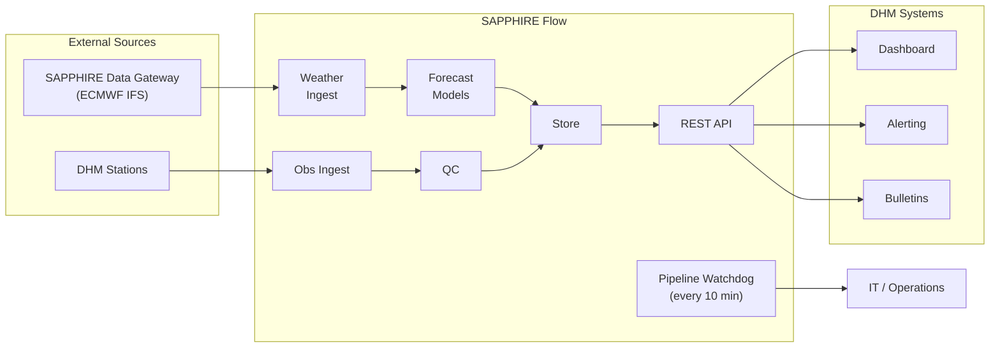

# SAPPHIRE Flow — Data Flows

**Audience**: DHM technical staff — hydrologists, IT, and integration partners.   
**Document version**: 0.1-draft (April 2026)   
**Status**: DRAFT — subject to change. 

---

## Overview

SAPPHIRE Flow processes data through approximately 13 data flows organised in three categories:

- **Operational** — run continuously on schedules (forecast cycle, observation ingest, pipeline watchdog)
- **Initialisation** — run on-demand to set up deployments, stations, and models
- **Maintenance** — run periodically to keep archives, models, and skill scores current

**System boundary.** SAPPHIRE ingests weather and station data, runs forecast models, stores results, and serves them via a REST API. Dashboard presentation, threshold-based alerting, and bulletin distribution are DHM's responsibility — DHM systems consume the REST API. Pipeline health monitoring is inside the SAPPHIRE boundary and reports to IT/operations staff.



---

## Operational Flows

### Flow 1 — Forecast Cycle

**Trigger**: Prefect schedule, every ~6 hours after NWP data becomes available.  
**Target**: All stations complete within 15 minutes per cycle.

#### Steps

| Step | What happens | Input | Output |
|------|-------------|-------|--------|
| 1.1 | Fetch NWP forcing from Data Gateway | NWP source config, cycle time | Pre-extracted per-station weather values |
| 1.5 | Post-process NWP | Extracted weather values + historical archive | Bias-corrected / calibrated per-station weather values (pass-through initially) |
| 1.6 | Fetch recent QC'd observations | Station configs, lookback window | Recent quality-controlled river and weather observations from store |
| 1.7 | Prepare model inputs | Post-processed weather values, observations, station configs | Validated input bundles grouped by model and station or station group |
| 1.8 | Run forecast models | Input bundles, model artefacts | Ensemble forecast values per station |
| 1.9 | Post-process forecast output (conditional) | Raw forecast ensembles, historical archive | Bias-corrected forecast ensembles |
| 1.10 | Forecast QC | Forecast ensembles, QC rule set | QC flags per ensemble; QC_FAILED triggers model fallback |
| 1.11 | Store forecast results | Forecast ensembles + model artefact version | Forecasts persisted to store; immediately available via REST API |

Step 1.9 is conditional — pass-through until sufficient forecast archive exists for bias correction.

> **Forecasts and observations are available via the REST API. Threshold checking and alerting are handled by DHM's systems.**

#### Notes

**Data Gateway.** ECMWF IFS data arrives pre-extracted at basin level from the SAPPHIRE Data Gateway — gridded archiving and spatial extraction are handled upstream by the Gateway. In deployments without a Data Gateway (e.g. the Swiss deployment using ICON-CH2-EPS), three additional steps run between 1.1 and 1.5: archive the raw NWP grid, extract spatial averages per basin, and archive the extractions.

**NWP lateness fallback.** When an expected NWP delivery is late:
1. Wait up to 3 hours (configurable) with exponential backoff.
2. Fall back to the most recent available NWP cycle (e.g. use the 18 UTC run if 00 UTC has not arrived).
3. Skip the cycle entirely if no NWP data is available within 12 hours (configurable). The event is logged and Flow 4 is notified.

Every stored forecast record carries the NWP cycle reference time used as forcing — the API and dashboard can display which NWP cycle produced each forecast, not just the forecast issue time.

**Multi-model fallback.** Each station can have multiple forecast models assigned in priority order. If a model fails at runtime (step 1.8) or its output fails QC (step 1.10), the flow automatically tries the next model by priority. The fallback model's identifier is recorded on the stored forecast for traceability.

**Sequencing.** The cycle runs in three phases:
- **Phase A** (per NWP source, parallel across sources): steps 1.1 → 1.5
- **Step 1.6** (observation fetch) runs in parallel with Phase A
- **Phase B** (per model and station or group, parallel across units): steps 1.7 → 1.8 → 1.9 → 1.10 → 1.11 — starts only after both Phase A and step 1.6 complete

**Observation staleness.** If the most recent observation for a station is older than a configurable threshold (e.g. 6 hours), the forecast still runs but a staleness warning flag is attached to the forecast record and is visible via the API.

---

### Flow 2 — Observation Ingest and QC

**Trigger**: Prefect schedule, every ~30 minutes.

#### Steps

| Step | What happens | Input | Output |
|------|-------------|-------|--------|
| 2.0 | Filter eligible stations | All station configs | Active gauged stations for Wave 1 ingest; calculated stations queued for Wave 2 |
| 2.1 | Fetch latest station observations | Station configs, last-seen timestamp per station | Raw river and weather observations |
| 2.2 | Store raw observations | Raw observations | Observations persisted to store (status = raw); raw values are never overwritten |
| 2.3 | Stage 1 QC — sensor validation | Raw observations, QC rule config | QC flags: range, rate-of-change, frozen sensor, spike, gross outlier |
| 2.4 | Store Stage 1 QC results | QC flags | Flags persisted; failed observations excluded from downstream steps |
| 2.5 | Derive complementary parameter via rating curve (conditional) | Stage 1–passed observations, active hQ rating table + correction parameter | Derived discharge (or water level) stored alongside original |
| 2.6 | Stage 2 QC — conversion validation (conditional) | Derived observations, rating curve metadata | Conversion QC flags: extrapolation, discharge range, cross-station consistency |
| 2.7 | Store Stage 2 QC results (conditional) | Conversion QC flags | Flags persisted on derived observation rows |

Steps 2.5, 2.6, and 2.7 are conditional — they run only when a station has an active rating curve.

> **Forecasts and observations are available via the REST API. Threshold checking and alerting are handled by DHM's systems.**

#### Notes

**Two-stage QC design.** QC is split into two stages with distinct purposes:
- **Stage 1** (sensor validation) catches instrument faults, transmission errors, and physically impossible values: range bounds, rate-of-change, frozen sensor (repeated identical value), single-interval spike, and gross statistical outlier. A Stage 1 failure means "sensor problem" — the observation is stored but excluded from forecast models and rating curve conversion.
- **Stage 2** (conversion validation) catches problems introduced by the rating curve itself, not the sensor. A Stage 2 flag means "rating curve problem" — the derived value is degraded in quality but is not rejected. Stage 2 never silently discards an observation; extreme-event values that look implausible may be correct and must not be lost.

Raw observations are never overwritten. QC results are stored as metadata on the observation record, not replacements.

**Nepal v1 — rating curve conversion.** DHM provides real-time water level. Discharge must be derived using DHM's hQ rating tables plus a correction parameter (correction method to be confirmed with DHM hydromet operations during Flow 5 design). Rating tables are updated yearly by DHM. Steps 2.5–2.7 are therefore active in the Nepal deployment. Both the original water level and the derived discharge are stored, with a reference to the rating curve version used — this allows reprocessing through updated curves without re-running Stage 1 QC.

**Sequencing.** Steps are sequential at the pipeline level. Within step 2.1, river and weather fetches run in parallel. Steps 2.2–2.7 are parallelisable across stations.

**v0 (Switzerland).** BAFU provides discharge directly from well-maintained rating curves — steps 2.5, 2.6, and 2.7 are skipped. Step 2.0 is a pass-through (all Swiss stations are gauged).

---

### Flow 4 — Pipeline Watchdog

**Trigger**: Prefect schedule, every 10 minutes, independent of all other flows.

#### Steps

| Step | What happens | Input | Output |
|------|-------------|-------|--------|
| 4.1 | Check NWP delivery status | Expected NWP schedule, weather archive | On-time / late / missing per NWP cycle; triggers Flow 11 if recoverable gaps found |
| 4.2 | Check observation freshness | Station configs, observations store | Per-station last-received timestamp and overdue flag |
| 4.3 | Check forecast cycle timeliness | Expected forecast schedule, forecasts store | Last successful cycle time and overdue flag |
| 4.4 | Check Prefect flow run health | Prefect run API | Recent run states for Flows 1 and 2; detects repeated failures and stuck runs |
| 4.5 | Evaluate and aggregate pipeline status | Results from 4.1–4.4, 4.9, 4.10 | Aggregated health status; new and resolved issues |
| 4.6 | Raise or resolve ops alerts | Aggregated issues, existing ops alerts | New or updated ops alert records |
| 4.7 | Notify operations team | New or changed ops alerts | Notifications dispatched to IT/operations channel |
| 4.8 | Log health metrics | All check results | Persisted to pipeline health table; supports trend diagnostics |
| 4.9 | Check disk usage | Filesystem mount points under /data/ | Usage percentage per mount; WARNING at 80%, CRITICAL at 90% |
| 4.10 | Check backup freshness | Backup metadata (last successful backup timestamp) | Backup age and status; WARNING if older than 36 hours, CRITICAL if older than 72 hours |

#### Notes

**Ops alerts vs flood alerts.** Pipeline alerts are distinct from flood alerts. They use the same alert store but carry a different source label (`PIPELINE`) and route to the IT/operations team — not to flood forecasters. They are queried separately.

**Step 4.1 and NWP gap recovery.** Step 4.1 also performs a retrospective audit of the NWP archive to detect gaps not caught in real time. When recoverable gaps are found, it triggers Flow 11 (NWP gap recovery) automatically.

**Step 4.9 — disk monitoring.** Monitors all storage mount points used by SAPPHIRE (database, cold storage, model artefacts). Thresholds are deployment-configurable. Disk status is also exposed in the API health endpoint.

**Step 4.10 — backup monitoring.** Reads backup age from a metadata marker file written by the backup task — avoids a dependency on backup storage connectivity. Three-day critical threshold allows for one missed daily backup cycle before the alert escalates.

**Sequencing.** Steps 4.1, 4.2, 4.3, 4.4, 4.9, and 4.10 are independent checks that run in parallel. They join at step 4.5. Steps 4.7 (notify) and 4.8 (log metrics) run in parallel after 4.6.

**Safety net.** Flow 4 itself runs inside Prefect. If the Prefect worker crashes, Flow 4 stops and pipeline issues would go undetected. Mitigation: the API health endpoint includes a Prefect worker status check, and a host-level cron watchdog (independent of Docker) polls this endpoint every few minutes. Prefect worker failure is therefore detected within 5 minutes even when Flow 4 is down.

---

## Initialisation Flows (on-demand)

### Flow 0 — Deployment Onboarding

**When:** Once per deployment region (e.g., once for Nepal), run by a system administrator before any stations are onboarded.

**Purpose:** Downloads and registers all area-wide datasets so that individual station onboarding can complete in minutes rather than hours.

| Step | What happens | Input | Output |
|------|-------------|-------|--------|
| 0.1 | Define area of interest | Country bounding box or union of watershed geometries | AOI polygon stored in deployment configuration |
| 0.2 | Download static attribute datasets (parallel with 0.3) | AOI, dataset catalogue | Local cache of static catchment data (global DEM, catchment attributes, national GIS where available) |
| 0.3 | Download historical dynamic datasets (parallel with 0.2) | AOI, date range, variable list | Local cache of historical forcing data (ERA5-Land reanalysis for v1) |
| 0.4 | Verify completeness | Local cache, expected coverage | Completeness report — spatial gaps and missing time steps identified |
| 0.5 | Register datasets in catalogue | Dataset metadata (source, version, local path, variables) | Dataset registry records for use by Flow 5 |
| 0.6 | Register deployment parameters (independent of 0.2/0.3) | `[[parameters]]` section of deployment config | Parameter records in the database |

**Notes**

- Steps 0.2 and 0.3 run in parallel immediately after 0.1. Step 0.6 is independent and runs in parallel from 0.1 onward — it reads only the deployment config file.
- Gaps in static data (0.4) block station onboarding. Gaps in dynamic/reanalysis data produce warnings — stations can still onboard but with a shorter training window.
- All download steps are resumable and idempotent. Re-running skips already-downloaded datasets (verified by checksum).
- For v1 Nepal, ERA5-Land reanalysis is sourced via the **SAPPHIRE Data Gateway**: SAPPHIRE uploads the AOI geometry, requests archive preparation, configures ongoing NWP extraction, and downloads the prepared data once the Gateway signals readiness.
- Flow 0 is a prerequisite for Flow 5 step 5.2 (catchment attribute extraction) and for model training. Other station onboarding steps (5.1, 5.3, 5.4) can proceed without it.
- If a new station's basin falls outside the existing AOI, the AOI must be expanded and steps 0.2–0.3 re-run for the new area (or the Data Gateway re-triggered).

**Sequencing:**
```
0.1 → (0.2 ∥ 0.3) → 0.4 → 0.5
0.6 runs in parallel from 0.1 (reads deployment config only)
```

---

### Flow 5 — River Station Onboarding

**When:** When new river stations are added — run on-demand by a model administrator, typically as a batch operation for multiple stations.

**Status lifecycle:** Stations enter as `onboarding` and become visible for operational forecasting only after the model administrator explicitly transitions them to `operational` at step 5.12.

| Step | What happens | Input | Output |
|------|-------------|-------|--------|
| 5.1 | Register station metadata | Station definitions (code, name, location, timezone, parameters, regulation type) | Station records in database with status `onboarding` |
| 5.2 | Fetch catchment attributes and set regional basin label | Basin geometries; local cache from Flow 0 | Static catchment features stored per basin (area, elevation, soil type, etc.) |
| 5.3 | Configure weather source mappings and band geometries | Station config, NWP source config | Weather source–station linkage and extraction geometry stored |
| 5.4 | Import historical observations | Station, historical source config, date range | Raw historical observations persisted |
| 5.5 | Stage 1 QC on historical observations | Raw observations, QC rule configuration | QC flags per measured value; flagged values excluded from training |
| 5.6 | Rating curve conversion (conditional) | Stage-1-passed observations, active rating curve | Derived observations (water level → discharge, or vice versa) |
| 5.7 | Stage 2 QC on derived values (conditional — runs only if 5.6 ran) | Derived observations, rating curve metadata | Conversion QC flags (extrapolation, range checks) |
| 5.8 | Compute baseline artifacts | QC'd historical observations | Climatology quantiles and persistence forecast stored per station |
| 5.9 | Compute flow regime boundaries | QC'd historical observations | Q50/Q90 percentiles stored in flow regime configuration |
| 5.10 | Configure model assignments | Station, available models | Model–station mappings and group membership records |
| 5.11 | Model readiness — branches run in parallel | Station, assigned models | Trained or validated model artifacts (see branches below) |
| 5.12 | Model administrator review and go-live (manual gate) | Onboarding checklist status | Station status transitions to `operational` |

**Step 5.11 branches:**

| Branch | Scenario | Action |
|--------|----------|--------|
| A — Transfer learning | Station added to existing pre-trained group model | Validation hindcast run; skill computed with source `transfer_validation`; model admin reviews |
| B — New conceptual model | Station-scoped model (e.g. HBV) trained from scratch | Full training cycle via Flow 6; auto-promoted on completion |
| C — New ML model or new group | No existing trained artifact exists | Full training cycle via Flow 6; auto-promoted on completion |
| D — Group model needs retraining | New station changes group composition | Triggers Flow 9 (retraining); existing artifact continues serving other stations until new one is approved |

**Notes**

- Step 5.2 extracts catchment attributes from the local cache prepared by Flow 0. If Flow 0 has not run, the system falls back to fetching directly from global datasets — slower but functional.
- Steps 5.6 and 5.7 are conditional: they run only when the station has an active rating curve AND the forecast target requires a derived variable (e.g. the station measures water level but the forecast is for discharge). If no rating curve is available, the station proceeds without the derived variable; models requiring it are skipped for that station.
- Baseline artifacts (5.8) and flow regime boundaries (5.9) are prerequisites for skill computation in Flows 8 and 10.
- The model type must be registered via Flow 13 before it can be assigned to stations in step 5.10.
- Step 5.12 requires at least one model artifact with `active` status. The model administrator can promote to `operational` with optional items (alert thresholds, rating curve) missing — the system warns but does not block.
- For **calculated stations** (v1): step 5.C3 derives observations as a weighted sum of component stations (Q_virtual = Σ(wᵢ × Qᵢ)); steps 5.4–5.7 are skipped.
- All data-writing steps are idempotent — re-running after failure resumes without duplicating data.

**Sequencing:**
```
5.1 → (5.2 ∥ 5.3 ∥ 5.4) → 5.5 → [5.6 → 5.7 (conditional)] → (5.8 ∥ 5.9 ∥ 5.10) → 5.11 → 5.12
```

---

### Flow 5w — Weather Station Onboarding

**When:** When new weather stations are added — simplified variant of Flow 5 for stations that provide forcing data but do not receive forecasts.

| Step | What happens | Input | Output |
|------|-------------|-------|--------|
| 5w.1 | Register station metadata | Station definitions (code, name, location, timezone, parameters, `kind = weather`) | Station records in database with status `onboarding` |
| 5w.2 | Import historical observations | Station, historical source config, date range | Raw historical observations persisted |
| 5w.3 | Stage 1 QC on historical observations | Raw observations, QC rule configuration | QC flags per measured value |
| 5w.4 | Model administrator confirms go-live (manual) | — | Station status transitions to `operational` |

**Notes**

- No rating curve conversion, no baseline artifacts, no flow regime boundaries, no model assignments — weather stations supply forcing data only.
- Step 5w.4 has no model artifact precondition. A weather station is operational once it has QC'd historical data and the real-time adapter is configured.
- Steps 5w.2 and 5w.3 use the same import and QC services as Flow 5 steps 5.4 and 5.5.
- Steps are sequential per station and parallelised across stations in the batch.

**Sequencing:**
```
5w.1 → 5w.2 → 5w.3 → 5w.4 (manual)
```

---

### Flow 13 — Model Onboarding

**When:** When a new model type is introduced to the system — run on-demand by a model administrator, and required before the model can be assigned to stations in Flow 5.

| Step | What happens | Input | Output |
|------|-------------|-------|--------|
| M.0 | Determine scope | Model admin request (model type, target stations or groups) | List of training units (station–model or group–model pairs) |
| M.1 | Register model | Model package, discovery via entry points | Model record written to the model registry |
| M.2 | Compatibility validation (conditional — per-unit skip on failure) | Model declaration, deployment configuration | Each unit: compatible (continue) or skipped with reason |
| M.2b | Smoke test — synthetic round-trip (conditional — per-unit skip on failure) | Synthetic training data shaped from model requirements | Each unit: pass (continue) or `FAILED_SMOKE_TEST` |
| M.3 | Initial training | Training data, model hyperparameters, forcing source | New model artifact in `training` status |
| M.4 | Hindcast verification | New artifact, validation period | Hindcast forecast ensembles (via Flow 7) |
| M.5 | Skill gate — worst-across-strata evaluation | Hindcast results, configured thresholds | Gate passed (continue) or artifact stays in `training` (no auto-retry) |
| M.6 | Promotion decision | Skill gate result; presence of existing champion artifact | v0: auto-promote to `active`. v1: `pending_approval` if a champion exists; model admin reviews |
| M.7 | Station and group assignment | Promoted artifact, target stations/groups | Model assignment records created with configured priority |

**Notes**

- M.2 checks three things: protocol satisfaction (the model implements the required interface), feature availability (all declared input features exist in the deployment's data), and time-step compatibility.
- M.2b exercises the full train → serialise → deserialise → predict round-trip on synthetic data to catch shape errors and contract violations before any real training.
- M.2 and M.2b failures are per-unit skips — incompatible units are skipped and the flow continues with remaining units.
- The skill gate (M.5) evaluates the worst score across all strata (lead time × season × flow regime). A model must meet the threshold in every stratum to pass. If no thresholds are configured, the gate is a pass-through.
- Skill gate failure keeps the artifact in `training` status. The model administrator can retry from M.3 or discard the artifact. The system does not auto-retry.
- If no champion artifact exists (first onboarding of this model type), M.6 always auto-promotes regardless of deployment version.
- Flow 13 composes the same underlying services as Flows 6, 7, and 8 directly — it does not call the training flow — so that the skill gate can be interposed between training and promotion.

**Sequencing:**
```
M.0 → M.1 → M.2 → M.2b → M.3 → M.4 → M.5 → M.6 → M.7
```

---

### Flow 6/9 — Model Training

**When:** On-demand (triggered from Flow 5 step 5.11 or manually by a model administrator) or on a scheduled basis (e.g. yearly). Flow 6 = initial training. Flow 9 = retraining after a model is already deployed.

Both are the same flow. The difference: no existing artifact → initial training (auto-promote). Existing artifact → retraining (compare and seek approval).

| Step | What happens | Input | Output |
|------|-------------|-------|--------|
| T.1 | Determine scope | Request parameters (models, stations or groups, training period) | List of training units |
| T.2 | Gather training data | Station or group configurations, training period | Training dataset per unit (observations, forcing, static attributes) |
| T.3 | Run training | Training data, model hyperparameters | New versioned model artifact |
| T.4 | Run hindcast | New artifact, hindcast period | Hindcast forecast ensembles (via Flow 7) |
| T.5 | Compute skill | Hindcast results | Skill scores for the new artifact (via Flow 8/10) |
| T.6 | Compare against current artifact (retraining only) | New skill scores, current model's skill scores | Comparison report (skill deltas per metric, lead time, season) |
| T.7 | Request model administrator approval (retraining only) | Comparison report | Pending approval record; notification sent to model admin |
| T.8 | Promote or reject (retraining only — async, awaits admin decision) | Model administrator decision | Artifact promoted to `active` or rejection logged |

**Notes**

- T.6–T.8 run only during retraining (Flow 9). For initial training (Flow 6), the artifact is auto-promoted after T.5.
- Promotion (T.8) atomically sets the old artifact to `superseded` and the new artifact to `active`. The old artifact is retained — never deleted.
- For group-scoped models, T.2 gathers data for all stations in the group. Training produces one artifact for the group; skill is always evaluated per station.
- The flow does not auto-retry on training failures. If T.3 fails, no artifact row is created. If T.4 or T.5 fails, the artifact remains in `training` status and the model administrator decides whether to retry from T.4 or discard.
- Training units (station–model or group–model pairs) run in parallel.

**Sequencing:**
```
Initial:    T.1 → T.2 → T.3 → T.4 → T.5 → auto-promote
Retraining: T.1 → T.2 → T.3 → T.4 → T.5 → T.6 → T.7 ···(async)··· T.8
```

---

### Flow 7 — Hindcast Generation

**When:** After model training (called from Flows 6/9 and Flow 13), or on-demand by a model administrator for standalone verification.

**Purpose:** Replays a trained model over a historical period to produce forecast ensembles for each past time step. Used as input to skill computation.

| Step | What happens | Input | Output |
|------|-------------|-------|--------|
| H.1 | Determine scope | Station or group, model artifact version, hindcast period, time step | List of hindcast time steps to evaluate |
| H.2 | Gather historical forcing (parallel with H.3) | Station weather source mappings, hindcast period, model lookback requirements | Historical weather forcing per time step |
| H.3 | Gather historical observations (parallel with H.2) | Station, hindcast period, lookback window | QC-passed observations per time step |
| H.4 | Assemble per-step inputs — no future data leakage | Forcing and observations, model input requirements | Input bundle per hindcast time step (data-availability cutoff enforced) |
| H.5 | Run model per time step | Input bundles, model artifact | Forecast ensembles per hindcast step |
| H.6 | Store hindcast results with forcing_type tag | Forecast ensembles, model artifact version | Persisted to hindcast tables |

**Notes**

- H.2 and H.3 run in parallel. H.4–H.6 form a per-time-step loop that runs across all steps; individual steps are parallelisable.
- H.4 is the critical data-integrity step: each time step sees only data that would have been available at that point in time — no future observations or forecasts leak in.
- The `forcing_type` tag on each hindcast result is essential for interpreting skill scores:
  - `nwp_archive` — hindcast forced with archived NWP forecasts that would have been available operationally. This is the only valid basis for computing operational skill scores, because it correctly captures NWP error and lead-time degradation.
  - `reanalysis` — hindcast forced with reanalysis or station observations. Useful for diagnosing whether errors come from the hydrology model or the NWP input, but produces optimistic skill scores that overestimate real-world performance.
- If H.4 finds insufficient data for a time step (gaps in forcing or observations below the model's minimum completeness requirement), the step is skipped and logged. The hindcast run continues; the summary reports completed vs skipped steps.
- If H.5 fails for a time step (model error, numerical divergence), that step is logged and skipped — the run continues. Unlike operational forecasting, there is no model fallback in hindcast mode: the goal is to evaluate a specific artifact.

**Sequencing:**
```
H.1 → H.2 ─┐
            ├→ [per time step: H.4 → H.5 → H.6]
     H.3 ──┘
```

---

### Flow 8/10 — Skill Computation

**When:** After hindcast generation (Flow 8 = narrow scope, one station/model). Scheduled yearly or after retraining (Flow 10 = broad scope, all stations and models).

Both are the same flow with different scope. Skill is always evaluated per station, even for group-scoped models.

| Step | What happens | Input | Output |
|------|-------------|-------|--------|
| S.1 | Determine scope | Request parameters (stations, models, period) or "all" | List of (station, model, period) tuples to evaluate |
| S.2 | Fetch forecast results (parallel with S.3) | Scope from S.1 | Hindcast and/or operational forecast ensembles |
| S.3 | Fetch corresponding observations (parallel with S.2) | Matching station and period pairs | QC-passed observed values |
| S.4 | Compute verification metrics | Forecast ensembles and observations | Per-station, per-model, per-lead-time, per-season skill scores |
| S.5 | Aggregate metrics | Station-level scores | Cross-station summaries (by model, by region, overall) |
| S.6 | Store skill results — versioned, never overwritten | Computed metrics | Persisted to skill tables; superseded rows marked `stale` |

**Notes**

- S.2 and S.3 run in parallel. S.4 and S.5 are parallelisable across stations.
- Verification metrics computed at S.4:
  - **Ensemble metrics:** CRPS, CRPS skill score (CRPSss against climatology and persistence baselines), reliability diagram data, rank histogram, spread-skill ratio
  - **Sharpness:** mean prediction interval width (P10–P90 and P25–P75), mean ensemble range
  - **Threshold-specific:** Brier Skill Score (BSS) at each configured danger level threshold; ROC curve data per threshold
  - **Event contingency (per danger level):** Probability of Detection, False Alarm Ratio, Critical Success Index
  - **Peak timing:** mean peak timing error (hours early/late) for events exceeding Q90
  - **Deterministic (on ensemble median):** NSE, KGE, PBIAS, MAE
  - All metrics computed per lead time, per season (configurable — e.g. monsoon Jun–Sep and dry Oct–May for Nepal), and per flow regime (low flow below Q50, high flow Q50–Q90, flood above Q90)
- Skill scores carry a `skill_source` tag:
  - `hindcast_nwp_archive` — gold standard; reflects true operational conditions
  - `hindcast_reanalysis` — diagnostic; isolates hydrology model skill from NWP error; optimistic
  - `operational` — computed on accumulated real-time forecasts
  - `transfer_validation` — pre-trained group model applied to a station it was not trained on
- Baseline artifacts (climatology quantiles, persistence forecast) computed during station onboarding (Flow 5 step 5.8) are required as reference for CRPSss and BSS. If they are missing, skill scores cannot be computed for the station.
- Skill results are versioned: recomputation creates a new record without overwriting prior results, enabling tracking of skill evolution over time.

**Sequencing:**
```
S.1 → S.2 ─┐
            ├→ S.4 → S.5 → S.6
     S.3 ──┘
```

---

## Maintenance Flows

### Flow 11 — NWP Gap Recovery

**Trigger:** Activated by Flow 4 step 4.1 when recoverable NWP archive gaps are detected.

**Conditional:** This flow is only needed when SAPPHIRE manages its own NWP archiving. **For Nepal v1, where the Data Gateway manages the archive, Flow 11 is not required.**

| Step | What happens | Input | Output |
|------|-------------|-------|--------|
| 11.1 | Prioritise and filter gaps | Missing cycle list from Flow 4, NWP source configuration | Prioritised list of recoverable cycles (filtered by provider retention window, sorted newest-first) |
| 11.2 | Attempt re-fetch — up to 3 tries per cycle | Prioritised cycle list | Recovered raw data per cycle, or permanent failure |
| 11.3 | Extract per-station values | Recovered raw grids, station configurations | Per-station extracted NWP values (basin-average, point, or elevation-band) |
| 11.4 | Store recovered data and mark affected skill scores stale | Extracted values | Data persisted; overlapping skill score rows marked `stale` |
| 11.5 | Flag unrecoverable gaps | Permanently failed cycles | Rows inserted with `gap_status = unrecoverable` |
| 11.6 | Report outcomes | Recovery results | Log summary; unrecoverable gaps fed to Flow 4 operations alerting |

**Notes**

- After step 11.2, the flow splits: recovered cycles proceed to 11.3 → 11.4; permanently failed cycles go to 11.5. Both paths join at 11.6.
- A cycle is declared unrecoverable after exhausting retry attempts or when its age exceeds the provider's data retention window (configured per NWP source).
- Step 11.3 uses the same extraction logic as Flow 1 step 1.3 — not a separate implementation.
- Stale skill scores (11.4) are recomputed by the next Flow 10 run.
- Each flow run processes gaps for a single NWP source. If gaps exist across multiple sources, Flow 4 triggers one Flow 11 run per source.
- The flow is safe to re-trigger for the same gaps — step 11.1 skips cycles that already have a result record.

---

### Flow 12 — Observation Reprocessing

**Trigger:** Event-driven — activated by a rating curve upload, a manual CSV import request, or an operator QC re-evaluation request. Only one branch runs per invocation.

| Step | What happens | Input | Output |
|------|-------------|-------|--------|
| 12.1 | Determine scope | Trigger event (branch type, station, time window) | Validated scope (station exists, period valid) |
| **Branch A** | **Rating curve reprocessing (v1+)** | | |
| 12.2a | Fetch derived observations under old curve | Station, old curve's validity period | All rating-curve-derived observations in that time window |
| 12.3a | Recompute with new curve | Old derived observations, new rating curve | New derived discharge values |
| 12.4a | Upsert reprocessed observations | New derived values | Updated observation rows referencing new rating curve |
| **Branch B** | **Manual CSV import (v0+)** | | |
| 12.2b | Validate CSV format and content | CSV file, overwrite flag | Parsed and validated rows, or validation errors |
| 12.3b | Ingest validated observations | Validated rows | Persisted with `source = manual_import` |
| 12.4b | Run QC on imported observations | Newly ingested observations | QC flags applied |
| **Branch C** | **QC rule re-evaluation (future)** | | |
| 12.2c | Fetch observations in time window | Station, time window | All observations in range |
| 12.3c | Re-run QC rules using current rule version | Fetched observations, current QC configuration | New QC flags per observation |
| 12.4c | Update QC flags | New QC flags | QC status and rule version updated on existing rows |
| **Common tail** | | | |
| 12.5 | Mark affected skill scores stale | Station, affected time window | Overlapping skill score rows marked `stale` |
| 12.6 | Write audit log | Reprocessing summary | Audit log entry (branch, station, time window, row count, actor) |

**Notes**

- **Branch A** (v1+): When a new rating curve is uploaded, all derived discharge values within the old curve's validity period are recomputed. Original measured water level observations are never modified. Historical operational forecasts are not retroactively reprocessed — they are immutable.
- **Branch B** (v0+): CSV format is fixed (`station_code, timestamp, parameter, value`). Duplicate handling is controlled by an explicit `overwrite` flag in the API request — if `overwrite = false` and conflicts exist, the request is rejected with a list of conflicting rows.
- **Branch C** (future): Re-runs QC rules on an existing time window using the current rule version. Does not re-derive rating curve values.
- Flow 12 must not overlap with Flow 2 (observation ingest) for the same station and time period. This is enforced by concurrency controls.
- Stale skill scores (12.5) are recomputed by the next Flow 10 run.

---

## REST API

All data produced by the SAPPHIRE system is served through a REST API at `/api/v1/`. External systems — dashboards, alert portals, hydropower operators — pull data from this API. There is no push-based export.

**Key resource groups:**

| Group | Endpoints | Description |
|-------|-----------|-------------|
| Stations | `GET /api/v1/stations`, `GET /api/v1/stations/{id}` | Station metadata (location, parameters, status, alert thresholds) |
| Observations | `GET /api/v1/stations/{id}/observations` | Time-series observations for a station |
| Forecasts | `GET /api/v1/stations/{id}/forecasts`, `GET /api/v1/forecasts/{id}` | Forecast list and full ensemble detail per forecast |
| Alerts | `GET /api/v1/alerts` | Active and historical alerts, filterable by status and source |
| Operations | `POST /api/v1/flows/{flow}/trigger` | Manually trigger a flow run |
| Health | `GET /api/v1/health`, `GET /api/v1/health/detail` | System health status |

**Response format:** JSON by default. CSV available via `?format=csv`.

**Pagination:** Cursor-based using `limit` and `after` query parameters.

**Temporal aggregation:** `?aggregate=pentadal` (5-day) or `?aggregate=dekadal` (10-day) for observation and forecast series.

**Health endpoints:**
- `GET /api/v1/health` — unauthenticated. Returns `{"status": "ok | degraded | down"}`. Used by uptime monitors. Returns HTTP 503 when degraded or down.
- `GET /api/v1/health/detail` — authenticated (IT admin or organisation admin). Returns per-component status (database, Prefect worker, NWP ingest, observation ingest, forecast cycle, disk).

**Access control:** API keys are scoped per consumer. A key for the DRRMA Bipad portal, for example, can be restricted to alert data and border-relevant stations. DHM's own dashboard holds a full-access key.

---

## Integration Points

| System | Direction | Data exchanged | Used by |
|--------|-----------|---------------|---------|
| SAPPHIRE Data Gateway | SAPPHIRE pulls | ERA5-Land reanalysis (historical), ECMWF IFS NWP (operational, pre-extracted per basin) | Flow 0, Flow 1 |
| DHM stations | SAPPHIRE pulls | Real-time water level observations | Flow 2 |
| Global DEM | One-time download | Elevation data for basin delineation and band geometry generation | Flow 0 |
| Global/national catchment attributes | One-time download or import | Catchment characteristics (area, slope, soil, climate indices) — exact sources TBD | Flow 0 |
| DHM rating tables | Uploaded annually or on update | hQ tables for discharge derivation | Flow 2, Flow 5 step 5.6 |
| DHM forecast dashboard | Consumer pulls API | Forecasts, observations, station metadata, skill scores | REST API |
| Other consumers (DRRMA, hydropower, neighbouring countries, etc.) | Consumer pulls API | Forecasts and alerts, scoped by API key | REST API |

---

## Data Flow Dependencies

```
Flow 0 (deployment onboarding)
  └──→ Flow 5 / 5w (station onboarding)
         ├──→ Flow 6 (model training)
         │      └──→ Flow 7 (hindcast)
         │             └──→ Flow 8 (skill computation)
         └──→ Flow 2 (observation ingest — begins immediately after 5.1)

Flow 13 (model onboarding) → reuses Flow 6/7/8 services

Flow 1 (forecast cycle) ← requires: stations onboarded, models trained, NWP available
Flow 4 (pipeline watchdog) ← independent, always running
Flow 4 ──→ Flow 11 (NWP gap recovery, when applicable)

Flow 9 (retraining) → Flow 7 → Flow 10 (skill recomputation)
Flow 12 (observation reprocessing) → marks skill scores stale → Flow 10
```

---

*This document is maintained by the SAPPHIRE team. For questions, contact hydrosolutions.*
