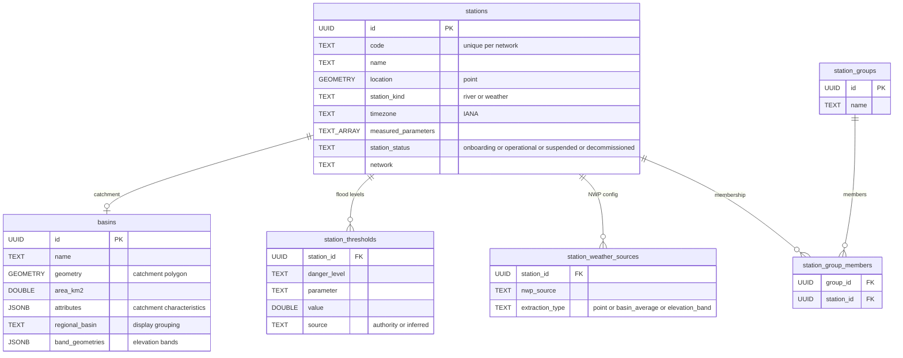
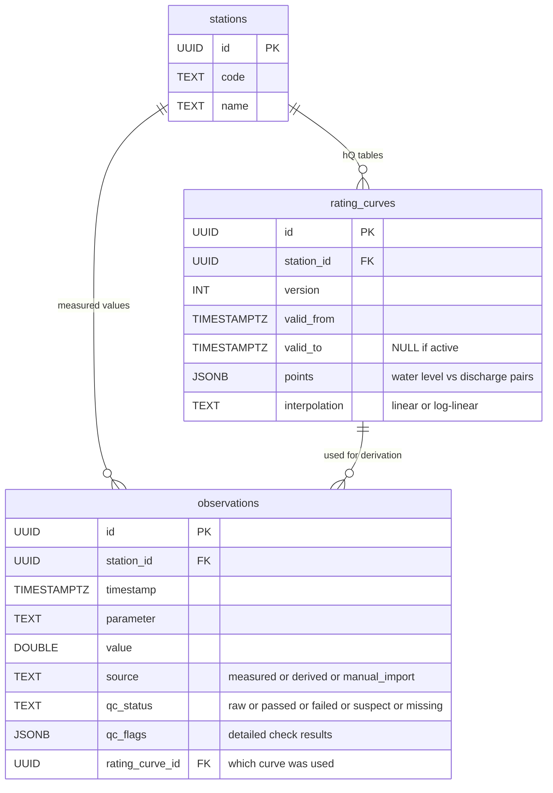
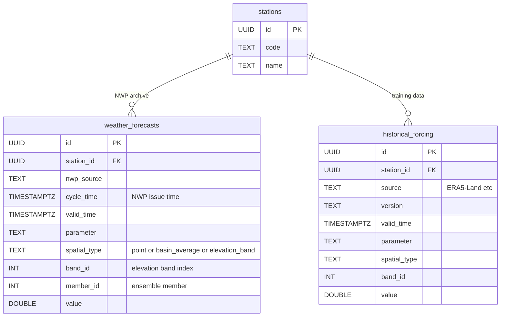
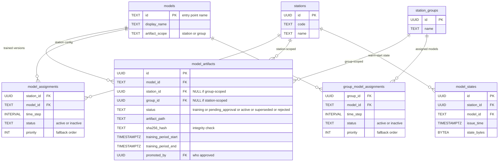
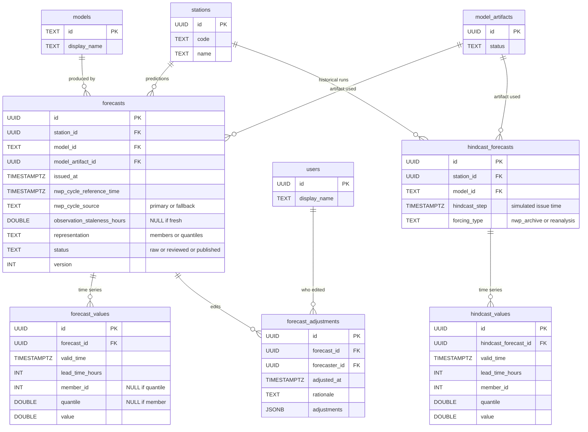
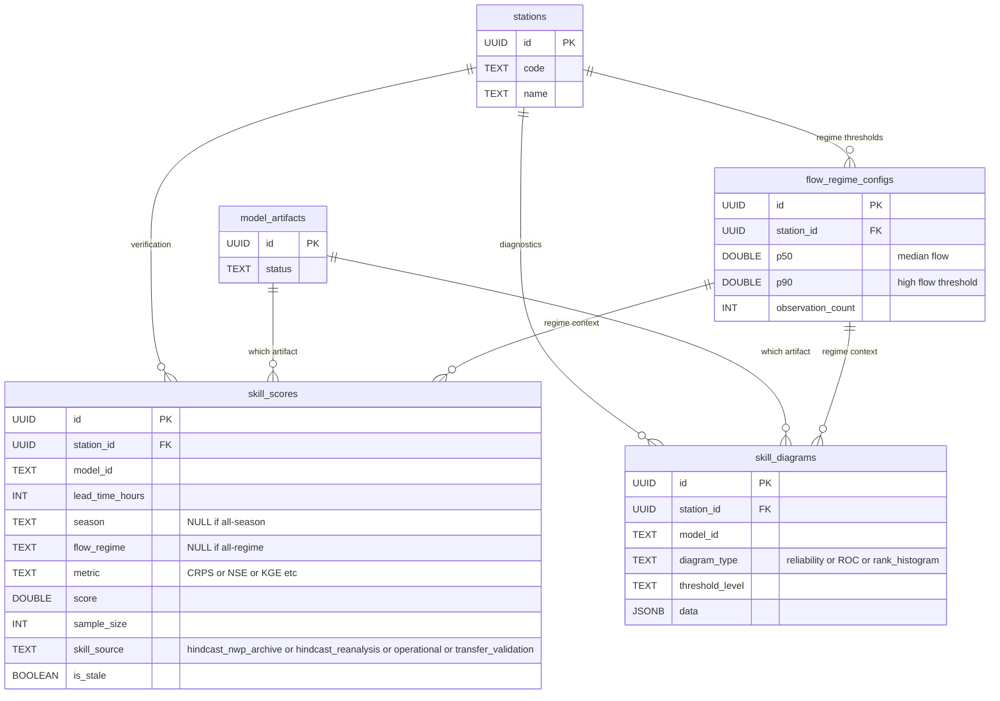
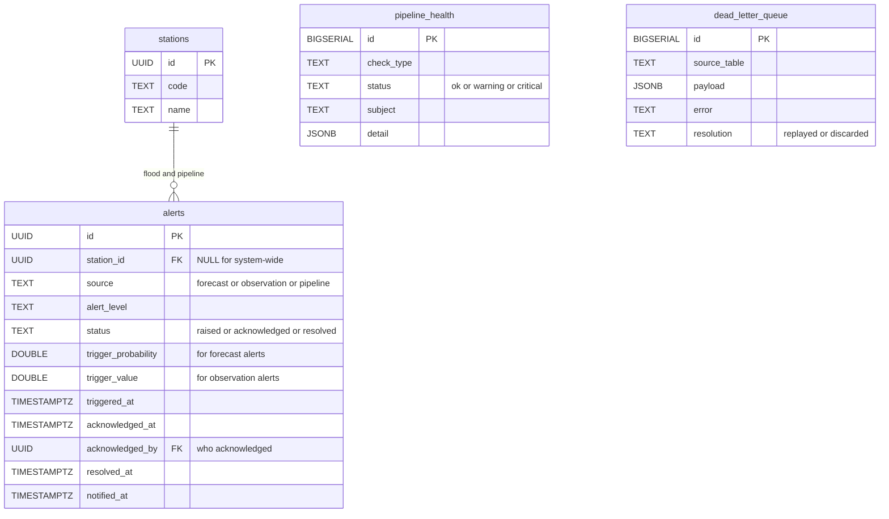
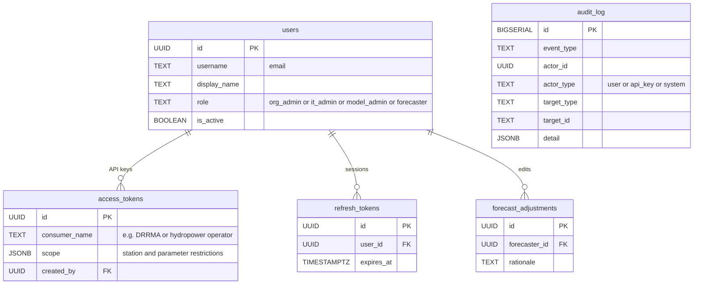

# SAPPHIRE Flow — Data Model Overview

**Audience**: DHM technical staff — hydrologists, IT, and integration partners.  

**Document version**: 0.1-draft (April 2026)

**Status**: DRAFT — subject to change. This document describes the intended design; implementation is ongoing.

---

## Overview

SAPPHIRE Flow uses a PostgreSQL database to store all operational data. The data model is organised into nine domains.

| Domain | Tables | What it stores |
|--------|--------|----------------|
| Reference | 2 | Canonical parameter definitions; dataset registry for deployment-wide data (DEM, reanalysis) |
| Station | 6 | Station metadata, basin boundaries, flood thresholds, weather source configuration, station groups |
| Observation | 2 | Real-time and historical observations with QC flags, rating curves for water level to discharge conversion |
| Weather | 2 | Archived weather forecast data (per station, per ensemble member) and historical forcing for model training |
| Model | 5 | Model definitions, trained model artifacts, station and group assignments, model state snapshots |
| Forecast | 5 | Operational forecasts (ensemble members or quantiles), hindcast results, forecaster adjustments |
| Skill | 3 | Verification metrics, diagnostic diagrams, flow regime definitions |
| Operations | 3 | Flood and pipeline alerts, system health records, dead letter queue |
| Auth | 4 | User accounts, API keys, session tokens, audit log |

---

## Domain Details

### Reference Data

| Table | Purpose | Key fields |
|-------|---------|------------|
| **parameters** | Canonical parameter names and units used throughout the system | `name` (e.g. water_level, discharge, precipitation), `unit` (m, m3/s, mm), `parameter_domain` (river, weather), `aggregation_method` (sum, mean) |
| **dataset_registry** | Catalogue of deployment-wide datasets downloaded during onboarding (Flow 0) | `source` (e.g. ERA5-Land, HydroSHEDS DEM), `version`, `local_path`, `aoi_coverage`, `variables`, `downloaded_at` |

All observations, forecasts, and weather data reference these standard parameter names regardless of the source system's terminology. The dataset registry tracks bulk downloads (DEM, reanalysis archives, catchment attributes) so that station onboarding (Flow 5) can find cached data locally instead of re-downloading per station.

### Station Domain

| Table | Purpose | Key fields |
|-------|---------|------------|
| **stations** | Master station register | `code`, `name`, geographic `location`, `station_kind` (river, weather), `timezone`, `measured_parameters`, `station_status` (onboarding, operational, suspended, decommissioned), `network`, `ownership` |
| **basins** | Catchment boundaries for each river station | `geometry` (polygon), `area_km2`, `attributes` (catchment characteristics), `band_geometries` (elevation band polygons) |
| **station_thresholds** | Flood danger level thresholds per station and parameter | `station_id`, `danger_level`, `parameter`, `value`, `source` (authority or inferred) |
| **station_weather_sources** | Which weather forecast source(s) each station uses | `station_id`, `nwp_source`, `extraction_type` (point, basin_average, elevation_band) |
| **station_groups** | Named groups of stations (for group-scoped ML models) | `name`, `description` |
| **station_group_members** | Which stations belong to which groups | `group_id`, `station_id` |

**Station status lifecycle**: `onboarding` → `operational` → `decommissioned`. A station can be temporarily `suspended` (e.g. sensor maintenance, flood damage) — suspended stations are excluded from forecast cycles but retain all historical data. Suspension is reversible; decommissioning is permanent.

**Relationships**: Each river station has exactly one basin (one-to-one); weather stations have no basin. Stations can be members of multiple groups. Each station has zero or more flood thresholds, defined per danger level and parameter.

### Observation Domain

| Table | Purpose | Key fields |
|-------|---------|------------|
| **observations** | All observed values — raw, QC'd, and derived | `station_id`, `timestamp`, `parameter`, `value`, `source` (measured, rating_curve_derived, manual_import; v1 adds component_derived for calculated stations), `qc_status` (raw, qc_passed, qc_failed, qc_suspect, missing), `qc_flags` (detailed check results), `rating_curve_id` |
| **rating_curves** | Versioned water level to discharge relationships per station | `station_id`, `version`, `valid_from`, `valid_to`, `points` (hQ pairs), `interpolation` method |

**Key principle**: Raw observation values are never overwritten. QC status and derived values (e.g., discharge from water level) are stored as metadata alongside the original measurement. Each derived value records which rating curve version was used.

### Weather Domain

| Table | Purpose | Key fields |
|-------|---------|------------|
| **weather_forecasts** | Archived NWP forecast values per station | `station_id`, `nwp_source`, `cycle_time`, `valid_time`, `parameter`, `spatial_type` (point, basin_average, elevation_band), `band_id`, `member_id` (ensemble member), `value` |
| **historical_forcing** | Historical weather data for model training | `station_id`, `source` (ERA5-Land, etc.), `version`, `valid_time`, `parameter`, `spatial_type`, `band_id`, `member_id`, `value` |

**Note**: Weather data is stored per station as extracted values (basin-average or elevation-band), not as raw gridded files. This is a permanent archive — values are retained indefinitely for retraining and hindcasting.

### Model Domain

| Table | Purpose | Key fields |
|-------|---------|------------|
| **models** | Model type definitions | `id` (entry point name), `display_name`, `artifact_scope` (station or group — whether one artifact is trained per station or per group of stations) |
| **model_artifacts** | Trained model files | `model_id`, `station_id` or `group_id`, `status` (training, pending_approval, active, superseded, rejected), `artifact_path`, `sha256_hash` (integrity check), `training_period_start/end`, `trained_at`, `promoted_at`, `promoted_by` |
| **model_assignments** | Which models are assigned to which stations | `station_id`, `model_id`, `time_step`, `status` (active, inactive), `priority` (fallback order) |
| **group_model_assignments** | Which models are assigned to which station groups | `group_id`, `model_id`, `time_step`, `status` (active, inactive), `priority` |
| **model_states** | Model state snapshots for warm-start | `station_id`, `model_id`, `issue_time`, `state_bytes` |

**Lifecycle**: A model artifact moves through statuses: `training` → `active` (auto-promoted on initial training) or `training` → `pending_approval` → `active` (retraining requires model administrator approval). An artifact can also be `rejected` from `pending_approval`. When a new artifact is promoted to `active`, the previous one is automatically set to `superseded`. Only one artifact per model per station (or group) can be active at a time. Old artifacts are retained — never deleted.

**Station vs group assignments**: Station-scoped models (e.g. HBV) use `model_assignments` — one row per station. Group-scoped models (e.g. LSTM) use `group_model_assignments` — one row per group — and the system expands these to per-station assignments based on group membership.

### Forecast Domain

| Table | Purpose | Key fields |
|-------|---------|------------|
| **forecasts** | Forecast metadata — one record per model run per station | `station_id`, `model_id`, `model_artifact_id`, `issued_at`, `nwp_cycle_reference_time`, `nwp_cycle_source` (primary or fallback — indicates whether the expected NWP cycle was used or a fallback), `observation_staleness_hours` (age of most recent observation at forecast time; NULL if fresh), `representation` (members or quantiles), `status` (raw, reviewed, published), `version` |
| **forecast_values** | Individual forecast time series values | `forecast_id`, `valid_time`, `lead_time_hours`, `member_id` or `quantile`, `value` |
| **hindcast_forecasts** | Historical simulation metadata | `station_id`, `model_id`, `hindcast_step` (simulated issue time), `forcing_type` (nwp_archive or reanalysis) |
| **hindcast_values** | Historical simulation time series values | `hindcast_forecast_id`, `valid_time`, `lead_time_hours`, `member_id` or `quantile`, `value` |
| **forecast_adjustments** | Audit trail for forecaster edits | `forecast_id`, `forecaster_id`, `adjusted_at`, `rationale`, `adjustments` (list of operations — see below) |

**Ensemble representation**: Forecasts are stored either as individual ensemble members (e.g., 51 ECMWF members) or as quantiles (e.g., 10th, 25th, 50th, 75th, 90th percentiles). The `representation` field indicates which format is used.

**Forecast adjustments**: The `adjustments` field is a JSON list of operations applied by the forecaster. Each operation specifies a time step and one of four adjustment types:

| Type | Effect | Example |
|------|--------|---------|
| `shift` | Add a constant to all ensemble members at a time step | Raise all members by +0.5 m |
| `scale` | Multiply all ensemble members by a factor | Scale by 1.2 (increase 20%) |
| `cap` | Set an upper bound — clip members above this value | Cap at 5.0 m |
| `floor` | Set a lower bound — clip members below this value | Floor at 0.0 m |

The original raw forecast is never overwritten — adjustments are stored as a separate layer with full audit trail (who, when, why).

### Skill Domain

| Table | Purpose | Key fields |
|-------|---------|------------|
| **skill_scores** | Verification metrics per model, station, lead time, season, and flow regime | `station_id`, `model_id`, `lead_time_hours`, `season`, `flow_regime`, `metric` (CRPS, NSE, KGE, etc.), `score`, `sample_size`, `skill_source` (see below), `is_stale` |
| **skill_diagrams** | Diagnostic plots stored as structured data | `station_id`, `model_id`, `diagram_type` (reliability, ROC, rank_histogram), `threshold_level`, `data` |
| **flow_regime_configs** | Flow regime thresholds per station (median and 90th percentile) | `station_id`, `p50`, `p90`, `observation_count` |

**Skill source**: Each skill score carries a `skill_source` tag that indicates how it was computed. This is critical for interpreting the score correctly:

| Source | Meaning | Reliability |
|--------|---------|-------------|
| `hindcast_nwp_archive` | Hindcast forced with archived NWP forecasts | Gold standard — reflects true operational conditions |
| `hindcast_reanalysis` | Hindcast forced with reanalysis (ERA5-Land) | Diagnostic — isolates hydrology model skill from NWP error; tends to be optimistic |
| `operational` | Computed on accumulated real-time forecasts | Real-world performance; grows over time |
| `transfer_validation` | Pre-trained group model applied to a station it was not trained on | Used during station onboarding to assess whether a group model transfers well |

**Staleness tracking**: When underlying data changes (new observations, rating curve updates, model retraining), affected skill scores are marked as stale and flagged for recomputation.

### Operations Domain

| Table | Purpose | Key fields |
|-------|---------|------------|
| **alerts** | Active and historical flood and pipeline alerts | `station_id`, `source` (forecast, observation, pipeline), `alert_level`, `status` (raised, acknowledged, resolved), `trigger_probability`, `trigger_value`, `triggered_at`, `acknowledged_at`, `acknowledged_by` (who acknowledged), `resolved_at`, `notified_at` |
| **pipeline_health** | System health check results from the watchdog | `check_type`, `status` (ok, warning, critical), `subject`, `detail` |
| **dead_letter_queue** | Failed records for manual review | `source_table`, `payload`, `error`, `resolution` (replayed or discarded) |

### Auth Domain

| Table | Purpose | Key fields |
|-------|---------|------------|
| **users** | Staff accounts with role-based access | `username`, `display_name`, `role` (org_admin, it_admin, model_admin, forecaster), `is_active`, two-factor auth fields |
| **access_tokens** | Scoped API keys for external consumers | `consumer_name`, `scope` (station/parameter access restrictions), `created_by` |
| **refresh_tokens** | Session management for dashboard users | `user_id`, `expires_at` |
| **audit_log** | Every login, data change, and administrative action | `event_type`, `actor_id`, `actor_type` (user, api_key, or system), `target_type`, `target_id`, `detail`, `ip_address` |

---

## Entity Relationship Diagrams

Each diagram below shows one domain. Tables from other domains appear in grey where they connect across domains.

### How to read the diagrams

The lines between tables use **crow's foot notation** to show how records relate:

| Symbol | Meaning | Example |
|--------|---------|---------|
| `\|\|` (two lines) | **Exactly one** | Each observation belongs to exactly one station |
| `o\|` (circle + line) | **Zero or one** | A station has zero or one basin |
| `o{` (circle + fork) | **Zero or more** | A station can have zero, one, or many observations |

A line reading `stations ||--o{ observations` means: **one station has zero or more observations, and each observation belongs to exactly one station**. This is a one-to-many relationship. A line reading `basins ||--o| stations` means: **one basin belongs to exactly one station, and a station has zero or one basin**. This is a one-to-one relationship.

Most relationships in this schema are one-to-many. The `||` side is always the "one" (parent), and the `o{` side is always the "many" (child). The circle (`o`) indicates that having zero children is valid — for example, a newly onboarded station may not yet have any observations.

### Station and Reference Domain

Stations, their catchment basins, flood thresholds, weather source configuration, and grouping.

### Observation Domain

Real-time and historical observations with QC flags. Rating curves for water level to discharge conversion.

### Weather Domain

Archived weather forecast data and historical forcing for model training. Values are stored per station as extracted spatial averages, not raw gridded files.

### Model Domain

Model definitions, trained artifacts, station assignments, and runtime state snapshots. Models can be scoped per station or per station group.

### Forecast Domain

Operational forecasts and historical simulations (hindcasts). Each forecast contains an ensemble of time series values (members or quantiles). Forecaster adjustments are tracked with full audit trail.

### Skill Domain

Verification metrics and diagnostic diagrams, broken down by lead time, season, and flow regime. Scores are marked stale when underlying data changes.

### Operations Domain

Flood alerts, observation alerts, and pipeline health monitoring. Alert lifecycle: raised, acknowledged, resolved.

### Auth Domain

User accounts with role-based access, scoped API keys for external consumers, and a full audit log.

---

## Data Volumes (estimated for Nepal, ~170 stations)

| Table | Growth rate | Retention |
|-------|------------|-----------|
| stations, basins, parameters | Static after onboarding | Permanent |
| observations | ~9M rows/year | Permanent (raw values never deleted) |
| weather_forecasts | ~50M rows/year | Permanent (NWP archive) |
| forecast_values | ~200M rows/year | Permanent |
| hindcast_values | Large batches during training | Permanent |
| alerts | ~10K rows/year | Resolved alerts pruned after 90 days |
| pipeline_health | ~50K rows/year | Pruned after 30 days |

High-volume tables (observations, weather_forecasts, forecast_values, hindcast_values) use database partitioning for query performance and maintenance.

---

## Key Design Principles

1. **Immutable raw data**: Raw observations and weather forecasts are never modified after storage. Corrections and derived values are stored separately with full provenance.

2. **Full audit trail**: Every forecast adjustment, model promotion, alert acknowledgement, and administrative action is recorded with user identity, timestamp, and rationale.

3. **Ensemble-first**: All forecasts are stored as ensembles (individual members) or quantiles. There is no "single best guess" — uncertainty representation is built into the data model.

4. **Versioned models**: Model artifacts are versioned with clear lifecycle states. Only one artifact per model per station can be active at a time, with a complete history of previous versions.

5. **Separation of concerns**: Flood alerts (forecast-based and observation-based) are structurally separate from pipeline alerts (system health). They share the same alert table but are labelled by source and routed to different recipients.

---

*This document is maintained by the SAPPHIRE team. For questions, contact hydrosolutions.*
