# Database Schema

Entity-relationship diagrams for the SAPPHIRE Flow PostgreSQL database.
Derived from table definitions in `architecture-context.md` and scoping rules in `v0-scope.md`.

---

## v0 Schema (25 tables)

Swiss public data, up to ~170 stations (LINDAS-available BAFU gauges), single VM. Architecture supports ~1000 stations across deployments. No partitioning, no auth, no rating curves,
no forecast adjustments, no DLQ, no cold storage. See `v0-scope.md` §A–C for rationale and plan 013 for scale re-evaluation.

**Differences from full schema** (marked with `v0▸` below):
- `observations`: no `rating_curve_id`, no `rating_curve_correction_version` columns
- `weather_forecasts`: no `is_gap`, no `gap_status` columns (Flow 11 deferred)
- `model_artifacts.status`: only `training | active | superseded` (no approval gate)
- `forecasts.model_artifact_id`: nullable (`UUID NULL`) — combined forecasts have no artifact. Also adds `combination_strategy TEXT NULL` and `source_model_ids JSONB NULL` (v0b, Plan 026)
- `skill_scores.model_artifact_id` and `skill_diagrams.model_artifact_id`: nullable (`UUID NULL`) — combined-model skill rows use `NULL` (v0b, Plan 026)
- `models.artifact_scope`: CHECK constraint includes `'virtual'` for sentinel combination models (`_pooled`, `_bma`, `_consensus`) (v0b, Plan 026)
- No table partitioning anywhere
- 8 tables removed entirely (see "Not in v0" below)
- `tenants` + `stations.tenant_id`/`station_groups.tenant_id`/`station_group_members.tenant_id` land early (Plan 147 Slice A) as a pure data-model foundation, and `audit_log` (Plan 147 Slice B) lands as an append-only substrate ahead of enforcement — auth/RBAC enforcement itself (access-token auth, DB roles, write-isolation call sites) is still deferred (`users`/`access_tokens`/`refresh_tokens` remain "Not in v0" below)

```mermaid
erDiagram
    %% ──────────────────────────────────────────────
    %% REFERENCE DATA
    %% ──────────────────────────────────────────────

    parameters {
        TEXT name PK "canonical name"
        TEXT display_name
        TEXT unit
        TEXT parameter_domain "river | weather | water_quality | groundwater | soil"
        TEXT aggregation_method "sum | mean"
        TIMESTAMPTZ created_at
    }

    %% ──────────────────────────────────────────────
    %% STATION DOMAIN
    %% ──────────────────────────────────────────────

    %% Plan 147 Slice A: tenant-model foundation. Seeded with a default
    %% `sapphire` tenant (migration 0041) so existing single-tenant Swiss
    %% data backfills onto it — this is the ROOT of the v1.0 auth/RBAC
    %% foundation, landed early as a pure data-model slice (no auth yet).
    tenants {
        UUID id PK
        TEXT code UK "human/config handle, e.g. sapphire, dhm"
        TEXT name
        TIMESTAMPTZ created_at
    }

    basins {
        UUID id PK
        TEXT code "UK (network, code)"
        TEXT network "NOT NULL"
        TEXT name
        GEOMETRY geometry "MULTIPOLYGON 4326"
        DOUBLE_PRECISION area_km2 "NULL"
        JSONB attributes "NULL — catchment attrs"
        TEXT regional_basin "NULL — display grouping"
        JSONB band_geometries "NULL — elevation bands"
        TIMESTAMPTZ created_at
    }

    stations {
        UUID id PK
        TEXT code "UK (network, code)"
        TEXT name
        GEOMETRY location "POINT 4326"
        DOUBLE_PRECISION altitude_masl "NULL"
        DOUBLE_PRECISION water_level_datum_masl "NULL"
        TEXT water_level_unit "NULL"
        TEXT station_kind "weather | river | lake"
        UUID basin_id FK "NULL"
        TEXT timezone "IANA"
        TEXT regulation_type "NULL"
        TEXT_ARRAY forecast_targets "NULL"
        TEXT_ARRAY measured_parameters
        TEXT station_status "default onboarding"
        TEXT network "NOT NULL"
        TEXT ownership "default own"
        TEXT wigos_id "NULL"
        TEXT gauging_status "default gauged"
        TIMESTAMPTZ created_at
        TIMESTAMPTZ updated_at
        UUID tenant_id FK "NOT NULL, canonical (R4) — UK (id, tenant_id)"
    }

    station_thresholds {
        UUID station_id PK, FK
        TEXT danger_level PK
        TEXT parameter PK
        DOUBLE_PRECISION value
        TEXT source "authority | inferred"
        TIMESTAMPTZ created_at
        TIMESTAMPTZ updated_at
    }

    station_weather_sources {
        UUID station_id PK, FK
        TEXT nwp_source PK
        TEXT extraction_type "point | basin_average | elevation_band"
        TEXT status "active | inactive, default active"
        TEXT role "forecast | reanalysis, NULL until 115c cleanup (rev TBD)"
    }

    station_groups {
        UUID id PK
        TEXT name "UK (tenant_id, name) — NOT globally unique"
        TEXT description "NULL"
        TIMESTAMPTZ created_at
        UUID tenant_id FK "NOT NULL — UK (id, tenant_id)"
    }

    station_group_members {
        UUID group_id PK, FK
        UUID station_id PK, FK
        TIMESTAMPTZ created_at
        UUID tenant_id "NOT NULL — 2 composite FKs force it to equal both the station's and group's tenant_id"
    }

    stations ||--o| basins : "basin_id"
    stations ||--o{ station_thresholds : "station_id"
    stations ||--o{ station_weather_sources : "station_id"
    stations ||--o{ station_group_members : "station_id"
    station_groups ||--o{ station_group_members : "group_id"
    tenants ||--o{ stations : "tenant_id"
    tenants ||--o{ station_groups : "tenant_id"

    %% ──────────────────────────────────────────────
    %% OBSERVATION DOMAIN
    %% v0: no rating_curve_id, no rating_curve_correction_version
    %% v0: no rating_curves table
    %% v0: not partitioned (plan 013: ~8.9M rows/year at ~170 stations, ~52.6M at ~1000 — ~6×)
    %% ──────────────────────────────────────────────

    observations {
        UUID id PK
        UUID station_id FK
        TIMESTAMPTZ timestamp
        TEXT parameter
        DOUBLE_PRECISION value "NULL when missing"
        TEXT source "measured | manual_import"
        TEXT qc_status "raw | qc_passed | qc_failed | qc_suspect | missing"
        JSONB qc_flags
        TEXT qc_rule_version "NULL"
        TIMESTAMPTZ created_at
    }

    stations ||--o{ observations : "station_id"

    %% ──────────────────────────────────────────────
    %% WEATHER / NWP DOMAIN
    %% v0: no is_gap, no gap_status (Flow 11 deferred)
    %% v0: not partitioned (plan 013: negligible volume vs forecast_values)
    %% ──────────────────────────────────────────────

    weather_forecasts {
        UUID id PK
        UUID station_id FK
        TEXT nwp_source
        TIMESTAMPTZ cycle_time
        TIMESTAMPTZ valid_time
        TEXT parameter
        TEXT spatial_type "point | basin_average | elevation_band"
        INT band_id "NULL"
        INT member_id "NULL"
        DOUBLE_PRECISION value
        TIMESTAMPTZ created_at
    }

    stations ||--o{ weather_forecasts : "station_id"

    %% ──────────────────────────────────────────────
    %% HISTORICAL FORCING DOMAIN
    %% ──────────────────────────────────────────────

    historical_forcing {
        UUID id PK
        UUID station_id FK
        TEXT source "camels-ch | era5 | era5-land | smn"
        TEXT version "dataset version tag"
        TIMESTAMPTZ valid_time
        TEXT parameter
        TEXT spatial_type "point | basin_average | elevation_band"
        INT band_id "NULL"
        INT member_id "NULL — deterministic | control | ensemble"
        DOUBLE_PRECISION value
        TIMESTAMPTZ created_at
    }

    stations ||--o{ historical_forcing : "station_id"

    %% ──────────────────────────────────────────────
    %% MODEL DOMAIN
    %% v0: model_artifacts.status = training | active | superseded only
    %% v0b: models.artifact_scope includes 'virtual' for sentinel combination rows
    %% ──────────────────────────────────────────────

    models {
        TEXT id PK "entry point name, or sentinel _pooled/_bma/_consensus"
        TEXT display_name
        TEXT artifact_scope "station | group | virtual"
        TEXT description
        TIMESTAMPTZ created_at
    }

    model_artifacts {
        UUID id PK
        TEXT model_id FK
        UUID station_id FK "NULL — station-scoped"
        UUID group_id FK "NULL — group-scoped"
        TEXT status "v0: training | active | superseded"
        TEXT artifact_path
        TEXT artifact_sha256 "integrity check"
        TIMESTAMPTZ training_period_start
        TIMESTAMPTZ training_period_end
        TIMESTAMPTZ trained_at
        TIMESTAMPTZ promoted_at "NULL"
        UUID promoted_by "NULL"
        TIMESTAMPTZ superseded_at "NULL"
        TIMESTAMPTZ created_at
    }

    model_assignments {
        UUID station_id PK, FK
        TEXT model_id PK, FK
        INTERVAL time_step
        TEXT status "active | inactive"
        INT priority "default 0"
        TIMESTAMPTZ created_at
    }

    group_model_assignments {
        UUID group_id PK, FK
        TEXT model_id PK, FK
        INTERVAL time_step
        TEXT status "active | inactive"
        INT priority "default 0"
        TIMESTAMPTZ created_at
    }

    model_states {
        UUID id PK
        UUID station_id FK
        TEXT model_id FK
        TIMESTAMPTZ issue_time
        BYTEA state_bytes
        TIMESTAMPTZ created_at
    }

    models ||--o{ model_artifacts : "model_id"
    models ||--o{ model_assignments : "model_id"
    models ||--o{ group_model_assignments : "model_id"
    models ||--o{ model_states : "model_id"
    stations ||--o{ model_artifacts : "station_id"
    station_groups ||--o{ model_artifacts : "group_id"
    stations ||--o{ model_assignments : "station_id"
    station_groups ||--o{ group_model_assignments : "group_id"
    stations ||--o{ model_states : "station_id"

    %% ──────────────────────────────────────────────
    %% FORECAST DOMAIN
    %% v0: not partitioned (plan 013: ~3.7B forecast_values rows/year at ~1000 stations; see v0-scope §A1 DECISION)
    %% v0: no forecast_adjustments table
    %% v0b: forecasts.model_artifact_id nullable; combination_strategy + source_model_ids added (Plan 026)
    %% ──────────────────────────────────────────────

    forecasts {
        UUID id PK
        UUID station_id FK
        TEXT model_id FK
        UUID model_artifact_id FK "NULL for combined forecasts"
        TIMESTAMPTZ issued_at
        TIMESTAMPTZ nwp_cycle_reference_time
        TEXT nwp_cycle_source "primary | fallback"
        TEXT parameter
        TEXT units
        TEXT representation "members | quantiles"
        TEXT status "default raw"
        INT version "default 1"
        TEXT warm_up_source "NULL"
        DOUBLE_PRECISION warm_up_state_age_hours "NULL"
        DOUBLE_PRECISION observation_staleness_hours "NULL"
        TEXT qc_status "default raw"
        JSONB qc_flags "default empty"
        TEXT combination_strategy "NULL for individual; pooled|bma|consensus for combined"
        JSONB source_model_ids "NULL for individual; [model_id, ...] for combined"
        TIMESTAMPTZ created_at
        TIMESTAMPTZ updated_at
    }

    forecast_values {
        UUID id PK
        UUID forecast_id FK
        TIMESTAMPTZ issued_at "denorm — not partitioned in v0"
        TIMESTAMPTZ valid_time
        INT lead_time_hours
        INT member_id "NULL"
        DOUBLE_PRECISION quantile "NULL"
        DOUBLE_PRECISION value
    }

    hindcast_forecasts {
        UUID id PK
        UUID station_id FK
        TEXT model_id FK
        UUID model_artifact_id FK
        TIMESTAMPTZ hindcast_step "simulated issue time"
        TEXT forcing_type "nwp_archive | reanalysis"
        TEXT representation "members | quantiles"
        UUID hindcast_run_id
        TEXT qc_status "default raw"
        JSONB qc_flags "default empty"
        TIMESTAMPTZ created_at
    }

    hindcast_values {
        UUID id PK
        UUID hindcast_forecast_id FK
        TIMESTAMPTZ hindcast_step "denorm — not partitioned in v0"
        TIMESTAMPTZ valid_time
        INT lead_time_hours
        INT member_id "NULL"
        DOUBLE_PRECISION quantile "NULL"
        DOUBLE_PRECISION value
    }

    stations ||--o{ forecasts : "station_id"
    models ||--o{ forecasts : "model_id"
    model_artifacts ||--o{ forecasts : "model_artifact_id"
    forecasts ||--o{ forecast_values : "forecast_id"

    stations ||--o{ hindcast_forecasts : "station_id"
    models ||--o{ hindcast_forecasts : "model_id"
    model_artifacts ||--o{ hindcast_forecasts : "model_artifact_id"
    hindcast_forecasts ||--o{ hindcast_values : "hindcast_forecast_id"

    %% ──────────────────────────────────────────────
    %% SKILL DOMAIN
    %% v0b: model_artifact_id nullable (Plan 026); combined-model rows use NULL
    %% ──────────────────────────────────────────────

    skill_scores {
        UUID id PK
        UUID station_id FK
        TEXT model_id FK
        UUID model_artifact_id FK "NULL for combined-model skill rows"
        TEXT skill_source
        TEXT forcing_type "NULL"
        INT computation_version
        TIMESTAMPTZ computed_at
        INT lead_time_hours
        TEXT season "NULL"
        TEXT flow_regime "NULL"
        UUID flow_regime_config_id FK "NULL"
        TEXT metric
        DOUBLE_PRECISION score
        INT sample_size
        BOOLEAN is_stale "default FALSE"
        TIMESTAMPTZ created_at
    }

    skill_diagrams {
        UUID id PK
        UUID station_id FK
        TEXT model_id FK
        UUID model_artifact_id FK "NULL for combined-model skill rows"
        TEXT skill_source
        INT computation_version
        INT lead_time_hours
        TEXT season "NULL"
        TEXT flow_regime "NULL"
        UUID flow_regime_config_id FK "NULL"
        TEXT diagram_type "reliability | roc | rank_histogram"
        TEXT threshold_level "NULL"
        JSONB data
        TIMESTAMPTZ created_at
    }

    flow_regime_configs {
        UUID id PK
        UUID station_id FK
        DOUBLE_PRECISION p50
        DOUBLE_PRECISION p90
        TIMESTAMPTZ computed_at
        INT observation_count
        INT version
        TIMESTAMPTZ created_at
    }

    stations ||--o{ skill_scores : "station_id"
    model_artifacts ||--o{ skill_scores : "model_artifact_id"
    flow_regime_configs ||--o{ skill_scores : "flow_regime_config_id"
    stations ||--o{ skill_diagrams : "station_id"
    model_artifacts ||--o{ skill_diagrams : "model_artifact_id"
    flow_regime_configs ||--o{ skill_diagrams : "flow_regime_config_id"
    stations ||--o{ flow_regime_configs : "station_id"

    %% ──────────────────────────────────────────────
    %% OPS DOMAIN
    %% v0: alerts kept but notified_at always NULL (no notification system)
    %% Note: skill_scores.model_artifact_id and skill_diagrams.model_artifact_id are nullable (v0b, Plan 026)
    %% Retention: pipeline_health rows deleted after 30 days;
    %%            resolved alerts deleted after 90 days
    %% Plan 013: growth rate increases ~20× at ~1000 stations vs ~50
    %% ──────────────────────────────────────────────

    alerts {
        UUID id PK
        UUID station_id FK "NULL for system-wide"
        TEXT source "forecast | observation | pipeline"
        TEXT alert_level
        TEXT status "raised | acknowledged | resolved"
        DOUBLE_PRECISION trigger_probability "NULL"
        DOUBLE_PRECISION trigger_value "NULL"
        TIMESTAMPTZ triggered_at
        TIMESTAMPTZ acknowledged_at "NULL"
        UUID acknowledged_by "NULL"
        TIMESTAMPTZ resolved_at "NULL"
        TIMESTAMPTZ first_detected_at "NULL"
        TIMESTAMPTZ notified_at "NULL — always NULL in v0"
        TIMESTAMPTZ created_at
    }

    pipeline_health {
        BIGSERIAL id PK
        TEXT check_type
        TIMESTAMPTZ checked_at
        TEXT status "ok | warning | critical"
        TEXT subject
        JSONB detail
        TIMESTAMPTZ cycle_time "NULL"
        TIMESTAMPTZ created_at
    }

    stations ||--o{ alerts : "station_id"
```



### v0 table inventory (23 tables)

| # | Table | PK | Domain |
|---|-------|----|--------|
| 1 | `parameters` | TEXT | Reference |
| 2 | `tenants` | UUID | Reference |
| 3 | `basins` | UUID | Station |
| 4 | `stations` | UUID | Station |
| 5 | `station_thresholds` | composite | Station |
| 6 | `station_weather_sources` | composite | Station |
| 7 | `station_groups` | UUID | Station |
| 8 | `station_group_members` | composite | Station |
| 9 | `observations` | UUID | Observation |
| 10 | `weather_forecasts` | UUID | Weather |
| 11 | `historical_forcing` | UUID | Weather |
| 12 | `models` | TEXT | Model |
| 13 | `model_artifacts` | UUID | Model |
| 14 | `model_assignments` | composite | Model |
| 15 | `group_model_assignments` | composite | Model |
| 16 | `model_states` | UUID | Model |
| 17 | `forecasts` | UUID | Forecast |
| 18 | `forecast_values` | UUID | Forecast |
| 19 | `hindcast_forecasts` | UUID | Forecast |
| 20 | `hindcast_values` | UUID | Forecast |
| 21 | `skill_scores` | UUID | Skill |
| 22 | `skill_diagrams` | UUID | Skill |
| 23 | `flow_regime_configs` | UUID | Skill |
| — | `alerts` | UUID | Ops |
| — | `pipeline_health` | BIGSERIAL | Ops |

**Note**: `alerts` and `pipeline_health` bring the total to 25 if counted.
`v0-scope.md` §C predates Plan 147's `tenants` table — the count depends on whether `alerts` + `pipeline_health`
are included (alerting is optional in v0, controlled by per-source alert flags (see v0-scope.md §A8c)).

### Not in v0 (8 tables added in v1)

| Table | Why deferred | Reference |
|-------|-------------|-----------|
| `rating_curves` | BAFU provides discharge directly | v0-scope §B |
| `observation_versions` | Rating-curve reprocessing archive; no rating curves in v0 | Plan 035 Task 3 |
| `forecast_adjustments` | No dashboard, no forecaster adjustments | v0-scope §A9 |
| `dead_letter_queue` | No partitioning = no DLQ needed (plan 013: if partitioning is advanced, DLQ must be re-evaluated — see v0-scope §A1 DECISION) | v0-scope §A1 |
| `users` | Auth deferred to v1 | v0-scope §B |
| `access_tokens` | Auth deferred to v1 | v0-scope §B |
| `refresh_tokens` | Auth deferred to v1 | v0-scope §B |
| `audit_log` | Auth deferred to v1 | v0-scope §B |

---

## Full Schema (33 tables)

The complete v1 schema. Adds partitioning, auth, rating curves, forecast adjustments,
DLQ, and gap recovery fields. See `architecture-context.md` for column details, CHECK
constraints, indexes, and retention policies.

```mermaid
erDiagram
    %% ──────────────────────────────────────────────
    %% REFERENCE DATA
    %% ──────────────────────────────────────────────

    parameters {
        TEXT name PK "canonical name"
        TEXT display_name
        TEXT unit
        TEXT parameter_domain "river | weather | water_quality | groundwater | soil"
        TEXT aggregation_method "sum | mean"
        TIMESTAMPTZ created_at
    }

    %% Plan 147 Slice A: tenant-model foundation (landed in v0 already — see
    %% the v0 Schema diagram above).
    tenants {
        UUID id PK
        TEXT code UK "human/config handle, e.g. sapphire, dhm"
        TEXT name
        TIMESTAMPTZ created_at
    }

    %% ──────────────────────────────────────────────
    %% STATION DOMAIN
    %% ──────────────────────────────────────────────

    basin_static_packages {
        TEXT package_id PK "producer-declared, not a UUID"
        TEXT network "NOT NULL"
        TEXT contract_version "NOT NULL"
        JSONB checksums "NOT NULL — payload-set sha256s"
        TEXT extractor_name "NULL"
        TEXT extractor_version "NULL"
        JSONB source_datasets "NULL"
        JSONB climatology_window "NULL"
        TIMESTAMPTZ imported_at
    }

    basins {
        UUID id PK
        TEXT code "UK (network, code)"
        TEXT network "NOT NULL"
        TEXT name
        GEOMETRY geometry "MULTIPOLYGON 4326 — CURRENT version"
        DOUBLE_PRECISION area_km2 "NULL"
        JSONB attributes "NULL — catchment attrs"
        TEXT regional_basin "NULL — display grouping"
        JSONB band_geometries "NULL — elevation bands"
        TEXT package_id FK "NULL — legacy/non-package sentinel (Plan 120)"
        TIMESTAMPTZ created_at
    }

    basin_versions {
        UUID id PK
        UUID basin_id FK "stable logical identity, never repointed"
        TEXT package_id FK "NULL — legacy/non-package sentinel"
        INTEGER version "UK (basin_id, version)"
        GEOMETRY geometry "MULTIPOLYGON 4326"
        JSONB attributes "NULL"
        DOUBLE_PRECISION area_km2 "NULL"
        JSONB band_geometries "NULL"
        JSONB gateway_mapping "NULL — §5a snapshot for this version"
        TIMESTAMPTZ superseded_at "NULL = current; partial-UK one-current-per-basin"
        TIMESTAMPTZ created_at "clock_timestamp() default"
    }

    model_artifact_basin_versions {
        UUID model_artifact_id PK, FK
        UUID basin_version_id PK, FK
    }

    stations {
        UUID id PK
        TEXT code "UK (network, code)"
        TEXT name
        GEOMETRY location "POINT 4326"
        DOUBLE_PRECISION altitude_masl "NULL"
        DOUBLE_PRECISION water_level_datum_masl "NULL"
        TEXT water_level_unit "NULL"
        TEXT station_kind "weather | river | lake"
        UUID basin_id FK "NULL"
        TEXT timezone "IANA"
        TEXT regulation_type "NULL"
        TEXT_ARRAY forecast_targets "NULL"
        TEXT_ARRAY measured_parameters
        TEXT station_status "default onboarding"
        TEXT network "NOT NULL"
        TEXT ownership "default own"
        TEXT wigos_id "NULL"
        TEXT gauging_status "default gauged"
        TIMESTAMPTZ created_at
        TIMESTAMPTZ updated_at
        UUID tenant_id FK "NOT NULL, canonical (R4) — UK (id, tenant_id)"
    }

    station_thresholds {
        UUID station_id PK, FK
        TEXT danger_level PK
        TEXT parameter PK
        DOUBLE_PRECISION value
        TEXT source "authority | inferred"
        TIMESTAMPTZ created_at
        TIMESTAMPTZ updated_at
    }

    station_weather_sources {
        UUID station_id PK, FK
        TEXT nwp_source PK
        TEXT extraction_type "point | basin_average | elevation_band"
        TEXT status "active | inactive, default active"
        TEXT role "forecast | reanalysis, NULL until 115c cleanup (rev TBD)"
    }

    station_groups {
        UUID id PK
        TEXT name "UK (tenant_id, name) — NOT globally unique"
        TEXT description "NULL"
        TIMESTAMPTZ created_at
        UUID tenant_id FK "NOT NULL — UK (id, tenant_id)"
    }

    station_group_members {
        UUID group_id PK, FK
        UUID station_id PK, FK
        TIMESTAMPTZ created_at
        UUID tenant_id "NOT NULL — 2 composite FKs force it to equal both the station's and group's tenant_id"
    }

    stations ||--o| basins : "basin_id"
    stations ||--o{ station_thresholds : "station_id"
    stations ||--o{ station_weather_sources : "station_id"
    stations ||--o{ station_group_members : "station_id"
    station_groups ||--o{ station_group_members : "group_id"
    tenants ||--o{ stations : "tenant_id"
    tenants ||--o{ station_groups : "tenant_id"
    basins ||--o{ basin_versions : "basin_id"
    basin_static_packages ||--o{ basin_versions : "package_id"

    %% ──────────────────────────────────────────────
    %% OBSERVATION DOMAIN
    %% ──────────────────────────────────────────────

    observations {
        UUID id PK
        UUID station_id FK
        TIMESTAMPTZ timestamp "partition key (yearly)"
        TEXT parameter
        DOUBLE_PRECISION value "NULL when missing"
        TEXT source "measured | rating_curve_derived | manual_import | component_derived"
        UUID rating_curve_id FK "NULL"
        TEXT rating_curve_correction_version "NULL"
        TEXT qc_status "raw | qc_passed | qc_failed | qc_suspect | missing"
        JSONB qc_flags
        TEXT qc_rule_version "NULL"
        TIMESTAMPTZ created_at
    }

    rating_curves {
        UUID id PK
        UUID station_id FK
        INT version
        TIMESTAMPTZ valid_from
        TIMESTAMPTZ valid_to "NULL = active"
        JSONB points
        TEXT interpolation "linear | log_linear"
        UUID uploaded_by "NULL"
        TIMESTAMPTZ created_at
    }

    observation_versions {
        UUID id PK
        UUID observation_id FK
        UUID station_id FK
        TIMESTAMPTZ timestamp
        TEXT parameter
        DOUBLE_PRECISION value "NULL if superseded obs was MISSING"
        UUID rating_curve_id FK "curve that produced the value"
        TIMESTAMPTZ superseded_at
        UUID superseded_by_curve_id FK "curve that replaced it"
    }

    stations ||--o{ observations : "station_id"
    stations ||--o{ rating_curves : "station_id"
    rating_curves ||--o{ observations : "rating_curve_id"
    observations ||--o{ observation_versions : "observation_id"
    rating_curves ||--o{ observation_versions : "rating_curve_id"

    %% ──────────────────────────────────────────────
    %% WEATHER / NWP DOMAIN
    %% ──────────────────────────────────────────────

    weather_forecasts {
        UUID id PK
        UUID station_id FK
        TEXT nwp_source
        TIMESTAMPTZ cycle_time "partition key (monthly)"
        TIMESTAMPTZ valid_time
        TEXT parameter
        TEXT spatial_type "point | basin_average | elevation_band"
        INT band_id "NULL"
        INT member_id "NULL"
        DOUBLE_PRECISION value
        BOOL is_gap "default FALSE"
        TEXT gap_status "NULL | recovered | unrecoverable"
        TIMESTAMPTZ created_at
    }

    stations ||--o{ weather_forecasts : "station_id"

    %% ──────────────────────────────────────────────
    %% HISTORICAL FORCING DOMAIN
    %% ──────────────────────────────────────────────

    historical_forcing {
        UUID id PK
        UUID station_id FK
        TEXT source "camels-ch | era5 | era5-land | smn"
        TEXT version "dataset version tag"
        TIMESTAMPTZ valid_time
        TEXT parameter
        TEXT spatial_type "point | basin_average | elevation_band"
        INT band_id "NULL"
        INT member_id "NULL — deterministic | control | ensemble"
        DOUBLE_PRECISION value
        TIMESTAMPTZ created_at
    }

    stations ||--o{ historical_forcing : "station_id"

    %% ──────────────────────────────────────────────
    %% MODEL DOMAIN
    %% ──────────────────────────────────────────────

    models {
        TEXT id PK "entry point name"
        TEXT display_name
        TEXT artifact_scope "station | group"
        TEXT description
        TIMESTAMPTZ created_at
    }

    model_artifacts {
        UUID id PK
        TEXT model_id FK
        UUID station_id FK "NULL — station-scoped"
        UUID group_id FK "NULL — group-scoped"
        TEXT status "training | pending_approval | active | superseded | rejected"
        TEXT artifact_path
        TEXT artifact_sha256 "integrity check"
        TIMESTAMPTZ training_period_start
        TIMESTAMPTZ training_period_end
        TIMESTAMPTZ trained_at
        TIMESTAMPTZ promoted_at "NULL"
        UUID promoted_by "NULL"
        TIMESTAMPTZ superseded_at "NULL"
        TIMESTAMPTZ created_at
    }

    model_assignments {
        UUID station_id PK, FK
        TEXT model_id PK, FK
        INTERVAL time_step
        TEXT status "active | inactive"
        INT priority "default 0"
        TIMESTAMPTZ created_at
    }

    group_model_assignments {
        UUID group_id PK, FK
        TEXT model_id PK, FK
        INTERVAL time_step
        TEXT status "active | inactive"
        INT priority "default 0"
        TIMESTAMPTZ created_at
    }

    model_states {
        UUID id PK
        UUID station_id FK
        TEXT model_id FK
        TIMESTAMPTZ issue_time
        BYTEA state_bytes
        TIMESTAMPTZ created_at
    }

    models ||--o{ model_artifacts : "model_id"
    models ||--o{ model_assignments : "model_id"
    models ||--o{ group_model_assignments : "model_id"
    models ||--o{ model_states : "model_id"
    stations ||--o{ model_artifacts : "station_id"
    station_groups ||--o{ model_artifacts : "group_id"
    stations ||--o{ model_assignments : "station_id"
    station_groups ||--o{ group_model_assignments : "group_id"
    stations ||--o{ model_states : "station_id"
    model_artifacts ||--o{ model_artifact_basin_versions : "model_artifact_id"
    basin_versions ||--o{ model_artifact_basin_versions : "basin_version_id"

    %% ──────────────────────────────────────────────
    %% FORECAST DOMAIN
    %% ──────────────────────────────────────────────

    forecasts {
        UUID id PK
        UUID station_id FK
        TEXT model_id FK
        UUID model_artifact_id FK
        TIMESTAMPTZ issued_at
        TIMESTAMPTZ nwp_cycle_reference_time
        TEXT nwp_cycle_source "primary | fallback"
        TEXT parameter
        TEXT units
        TEXT representation "members | quantiles"
        TEXT status "default raw"
        INT version "default 1"
        TEXT warm_up_source "NULL"
        DOUBLE_PRECISION warm_up_state_age_hours "NULL"
        DOUBLE_PRECISION observation_staleness_hours "NULL"
        TEXT qc_status "default raw"
        JSONB qc_flags "default empty"
        UUID rating_curve_id FK "NULL — curve active at issued_at (v1)"
        TIMESTAMPTZ created_at
        TIMESTAMPTZ updated_at
    }

    forecast_values {
        UUID id PK
        UUID forecast_id FK
        TIMESTAMPTZ issued_at "denorm partition key (monthly)"
        TIMESTAMPTZ valid_time
        INT lead_time_hours
        INT member_id "NULL"
        DOUBLE_PRECISION quantile "NULL"
        DOUBLE_PRECISION value
    }

    hindcast_forecasts {
        UUID id PK
        UUID station_id FK
        TEXT model_id FK
        UUID model_artifact_id FK
        TIMESTAMPTZ hindcast_step "simulated issue time"
        TEXT forcing_type "nwp_archive | reanalysis"
        TEXT representation "members | quantiles"
        UUID hindcast_run_id
        TEXT qc_status "default raw"
        JSONB qc_flags "default empty"
        TIMESTAMPTZ created_at
    }

    hindcast_values {
        UUID id PK
        UUID hindcast_forecast_id FK
        TIMESTAMPTZ hindcast_step "denorm partition key (monthly)"
        TIMESTAMPTZ valid_time
        INT lead_time_hours
        INT member_id "NULL"
        DOUBLE_PRECISION quantile "NULL"
        DOUBLE_PRECISION value
    }

    forecast_adjustments {
        UUID id PK
        UUID forecast_id FK
        UUID forecaster_id FK
        TIMESTAMPTZ adjusted_at
        TEXT rationale
        JSONB adjustments "envelope ops"
    }

    stations ||--o{ forecasts : "station_id"
    models ||--o{ forecasts : "model_id"
    model_artifacts ||--o{ forecasts : "model_artifact_id"
    forecasts ||--o{ forecast_values : "forecast_id"
    forecasts ||--o{ forecast_adjustments : "forecast_id"

    stations ||--o{ hindcast_forecasts : "station_id"
    models ||--o{ hindcast_forecasts : "model_id"
    model_artifacts ||--o{ hindcast_forecasts : "model_artifact_id"
    hindcast_forecasts ||--o{ hindcast_values : "hindcast_forecast_id"

    %% ──────────────────────────────────────────────
    %% SKILL DOMAIN
    %% ──────────────────────────────────────────────

    skill_scores {
        UUID id PK
        UUID station_id FK
        TEXT model_id FK
        UUID model_artifact_id FK
        TEXT skill_source
        TEXT forcing_type "NULL"
        INT computation_version
        TIMESTAMPTZ computed_at
        INT lead_time_hours
        TEXT season "NULL"
        TEXT flow_regime "NULL"
        UUID flow_regime_config_id FK "NULL"
        TEXT metric
        DOUBLE_PRECISION score
        INT sample_size
        BOOLEAN is_stale "default FALSE"
        TIMESTAMPTZ created_at
    }

    skill_diagrams {
        UUID id PK
        UUID station_id FK
        TEXT model_id FK
        UUID model_artifact_id FK
        TEXT skill_source
        INT computation_version
        INT lead_time_hours
        TEXT season "NULL"
        TEXT flow_regime "NULL"
        UUID flow_regime_config_id FK "NULL"
        TEXT diagram_type "reliability | roc | rank_histogram"
        TEXT threshold_level "NULL"
        JSONB data
        TIMESTAMPTZ created_at
    }

    flow_regime_configs {
        UUID id PK
        UUID station_id FK
        DOUBLE_PRECISION p50
        DOUBLE_PRECISION p90
        TIMESTAMPTZ computed_at
        INT observation_count
        INT version
        TIMESTAMPTZ created_at
    }

    stations ||--o{ skill_scores : "station_id"
    model_artifacts ||--o{ skill_scores : "model_artifact_id"
    flow_regime_configs ||--o{ skill_scores : "flow_regime_config_id"
    stations ||--o{ skill_diagrams : "station_id"
    model_artifacts ||--o{ skill_diagrams : "model_artifact_id"
    flow_regime_configs ||--o{ skill_diagrams : "flow_regime_config_id"
    stations ||--o{ flow_regime_configs : "station_id"

    %% ──────────────────────────────────────────────
    %% ALERTING & OPS DOMAIN
    %% ──────────────────────────────────────────────

    alerts {
        UUID id PK
        UUID station_id FK "NULL for system-wide"
        TEXT source "forecast | observation | pipeline"
        TEXT alert_level
        TEXT status "raised | acknowledged | resolved"
        DOUBLE_PRECISION trigger_probability "NULL"
        DOUBLE_PRECISION trigger_value "NULL"
        TIMESTAMPTZ triggered_at
        TIMESTAMPTZ acknowledged_at "NULL"
        UUID acknowledged_by "NULL"
        TIMESTAMPTZ resolved_at "NULL"
        TIMESTAMPTZ first_detected_at "NULL"
        TIMESTAMPTZ notified_at "NULL"
        TIMESTAMPTZ created_at
    }

    pipeline_health {
        BIGSERIAL id PK
        TEXT check_type
        TIMESTAMPTZ checked_at
        TEXT status "ok | warning | critical"
        TEXT subject
        JSONB detail
        TIMESTAMPTZ cycle_time "NULL"
        TIMESTAMPTZ created_at
    }

    dead_letter_queue {
        BIGSERIAL id PK
        TEXT source_table
        JSONB payload
        TEXT error
        TIMESTAMPTZ created_at
        TIMESTAMPTZ resolved_at "NULL"
        TEXT resolved_by "NULL"
        TEXT resolution "NULL — replayed | discarded"
    }

    stations ||--o{ alerts : "station_id"

    %% ──────────────────────────────────────────────
    %% AUTH DOMAIN (v1)
    %% ──────────────────────────────────────────────

    users {
        UUID id PK
        TEXT username UK "email"
        TEXT display_name
        TEXT role "org_admin | it_admin | model_admin | forecaster"
        TEXT password_hash
        TEXT totp_secret "encrypted"
        BOOLEAN is_active "default TRUE"
        BOOLEAN force_password_change "default FALSE"
        INT failed_login_count "default 0"
        TIMESTAMPTZ locked_until "NULL"
        TIMESTAMPTZ created_at
        TIMESTAMPTZ updated_at
    }

    access_tokens {
        UUID id PK
        TEXT consumer_name
        TEXT token_hash
        JSONB scope
        UUID created_by FK
        TIMESTAMPTZ created_at
        TIMESTAMPTZ last_used_at "NULL"
        TIMESTAMPTZ revoked_at "NULL"
    }

    refresh_tokens {
        UUID id PK
        UUID user_id FK
        TEXT token_hash
        TIMESTAMPTZ expires_at
        TIMESTAMPTZ created_at
        TIMESTAMPTZ revoked_at "NULL"
    }

    audit_log {
        BIGSERIAL id PK
        TEXT event_type
        UUID actor_id "NULL"
        TEXT actor_type "user | api_key | system"
        TEXT target_type "NULL"
        TEXT target_id "NULL"
        JSONB detail "NULL"
        INET ip_address "NULL"
        TIMESTAMPTZ created_at
    }

    users ||--o{ access_tokens : "created_by"
    users ||--o{ refresh_tokens : "user_id"
    users ||--o{ forecast_adjustments : "forecaster_id"
```

### Full table inventory (36 tables)

Plan 120 (basin/static package importer, Nepal v1) additively adds
`basin_static_packages`, `basin_versions`, and `model_artifact_basin_versions`
(+ a nullable `basins.package_id` FK) — see "Versioned basin state" in
`docs/plans/120-basin-static-importer.md`. Plan 147 Slice A additively adds
`tenants` (+ `tenant_id` on `stations`/`station_groups`/`station_group_members`)
— already live in v0, see the v0 table inventory above.

| # | Table | PK type | Partitioned | Domain |
|---|-------|---------|-------------|--------|
| 1 | `parameters` | TEXT | no | Reference |
| 1a | `tenants` | UUID | no | Reference |
| 2 | `basins` | UUID | no | Station |
| 2a | `basin_static_packages` | TEXT | no | Station |
| 2b | `basin_versions` | UUID | no | Station |
| 3 | `stations` | UUID | no | Station |
| 4 | `station_thresholds` | composite | no | Station |
| 5 | `station_weather_sources` | composite | no | Station |
| 6 | `station_groups` | UUID | no | Station |
| 7 | `station_group_members` | composite | no | Station |
| 8 | `observations` | UUID | yearly by `timestamp` | Observation |
| 9 | `rating_curves` | UUID | no | Observation |
| 10 | `weather_forecasts` | UUID | monthly by `cycle_time` | Weather |
| 11 | `historical_forcing` | UUID | no | Weather |
| 12 | `models` | TEXT | no | Model |
| 13 | `model_artifacts` | UUID | no | Model |
| 14 | `model_assignments` | composite | no | Model |
| 15 | `group_model_assignments` | composite | no | Model |
| 16 | `model_states` | UUID | no | Model |
| 17 | `forecasts` | UUID | no | Forecast |
| 18 | `forecast_values` | UUID | monthly by `issued_at` | Forecast |
| 19 | `hindcast_forecasts` | UUID | no | Forecast |
| 20 | `hindcast_values` | UUID | monthly by `hindcast_step` | Forecast |
| 21 | `forecast_adjustments` | UUID | no | Forecast |
| 22 | `skill_scores` | UUID | no | Skill |
| 23 | `skill_diagrams` | UUID | no | Skill |
| 24 | `flow_regime_configs` | UUID | no | Skill |
| 25 | `alerts` | UUID | no | Ops |
| 26 | `pipeline_health` | BIGSERIAL | no | Ops |
| 27 | `dead_letter_queue` | BIGSERIAL | no | Ops |
| 28 | `users` | UUID | no | Auth |
| 29 | `access_tokens` | UUID | no | Auth |
| 30 | `refresh_tokens` | UUID | no | Auth |
| 31 | `audit_log` | BIGSERIAL | no | Auth |
| 32 | `observation_versions` | UUID | no | Observation |
| 33 | `model_artifact_basin_versions` | composite | no | Model |

Column details, CHECK constraints, indexes, and retention policies
are defined in `architecture-context.md`.
